# ניתוח רפרנס: Zwobot Video Showcase (57 קליפים)

- **מקור:** https://www.zwobotmax.com/showcase (בראש העמוד כתוב "last showcase update 21 Jun 2026")
- **נבדק ב:** 26.09.2026
- **מה יש בעמוד:** 57 קליפי וידאו קצרים (MP4 שמתארחים באתר עצמו, לא ב-Vimeo או ב-YouTube). אין בעמוד pagination, אין "load more" ואין תתי-עמודים. **אין קרדיט לאמנים.** הכותרת של כל קליפ היא שרשרת המודולים של Zwobot (למשל `VAUDIO / PETRA / NEGATIF`), ומתחתיה סוג המקור (`image` / `video` / `generative` / `SR` = sound reactive / `fx`). במילים אחרות, השואוקייס הוא **ספר מתכונים**, לא גלריית אמנים.
- **פורמט:** 5 עד 25 שניות לקליפ, רובם 10 שניות. רזולוציה נמוכה מאוד: רובם 354x200, מעטים 704x400 או 854x480. כלומר פרטים עדינים נראים מטושטשים, וזו מגבלה של הניתוח.
- **קודם קראו את** [REFERENCE-ZWOBOT-V3-TRAILER.md](REFERENCE-ZWOBOT-V3-TRAILER.md). המסמך הזה לא חוזר על מה שכתוב שם, הוא ממשיך ממנו.

## שיטה

1. Chromium ב-headless (Playwright) סרק את העמוד עד הסוף ושלף את כל 57 תגיות `<video>` עם הכותרות לפי הסדר.
2. כל קליפ נפתח ב-Edge ב-headless. הקוד קפץ ל-8 נקודות זמן בפריסה שווה (`currentTime`) ושמר את הפריים מ-canvas ברזולוציה המקורית. סה"כ 456 פריימים. לא הורדתי קבצי וידאו לדיסק ולא התקנתי שום תוכנה.
3. **מדידות:** כל קליפ נדגם ב-8 פריימים לשנייה ברזולוציה 64x36. לכל קליפ נמדדו בהירות ממוצעת (0 עד 255), אחוז הזמן שבו המסך כמעט שחור (בהירות ממוצעת מתחת ל-12), מספר ה"קאטים" לשנייה (שינוי ממוצע של יותר מ-40 בין שני פריימים סמוכים) ורוויה. הפלטה נמדדה עם median-cut של 5 צבעים על כל 8 הפריימים.
4. הסתכלתי על כל 57 גיליונות המגע (8 פריימים בכל אחד). את משמעות המודולים לקחתי מה-[User Guide](https://www.zwobotmax.com/manual/) של Zwobot, למשל PETRA = "Rutt Etra style", KETA = "feedback diffusion ripples", TWST/EARL/DUKE = "generative sound-reactive module", OSSI = אוסצילוסקופ שמגיב לסאונד, VAUDIO = דפוסים פשוטים לפי קלט האודיו.
5. **מה לא יכולתי לראות:** לא שמעתי את האודיו, אז התגובה לסאונד היא הסקה מהתיעוד ומדפוסי הבהירות. 8 פריימים לקליפ מספיקים כדי לזהות את הזהות הוויזואלית, לא כדי לנתח כל מעבר. באף אחד מהקליפים לא רואים את ה-UI של Zwobot בתוך Live, ולכן אין כאן ניתוח UI מתוך השואוקייס (רק מסקנות workflow מהשמות).

**קבצים:** `images/zwobot-showcase/NN-<שרשרת>-tNNN.jpg` הוא פריים בודד, כאשר `tNNN` הוא הזמן בעשיריות שנייה (`t044` = 4.4 שנ'). `sheet-NN-*.jpg` הוא גיליון של 8 פריימים לכל קליפ. `contact-sheet.jpg` מרכז את 20 הפריימים הכי רלוונטיים לטעם של הבעלים.

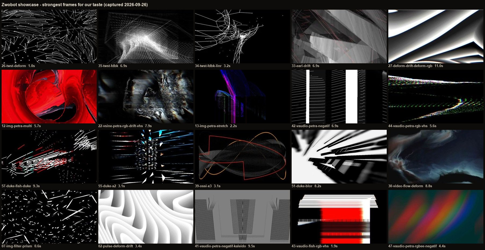

## טבלת סיכום מהירה

| # | שרשרת | מקור | רלוונטיות | הערה |
|---|---|---|---|---|
| [01](#01) | `PULSE / CRUNCH / RGB / CANDY` | fx / fx / fx / fx | נמוך |  |
| [02](#02) | `PULSE / DEFORM / DRIFT` | fx / fx / fx | בינוני-גבוה | רעיון סצנה: Folds (קפלי נייר) ב-bone על warm black |
| [03](#03) | `OFFSET / DEFORM / REFLUX / ROTA / FLOW / FILTER / CANDY` | image / fx / fx / fx / fx/ fx / fx / fx | נמוך |  |
| [04](#04) | `IMG / PATTERN / ROTARY` | image / fx / fx | בינוני-נמוך | הטכניקה (מקור מבעד למסכה גאומטרית) טובה, הצבעים לא שלנו |
| [05](#05) | `VID / CRUNCH / KETA` | video / fx / fx | נמוך | וידאו מצולם |
| [06](#06) | `VID / FDBK / 3D / FLUX` | video / fx / fx / fx / fx | בינוני | הצבע (אדום + סלמון + קונטרה קרה) קרוב לבעלים |
| [07](#07) | `IMG / FILTER / PRISM` | image / fx / fx | גבוה | יכול לשמש כשכבת dust מעל כל סצנה שלנו |
| [08](#08) | `IMG / DEFORM / PLURAL` | image / fx / fx | נמוך בצבע, גבוה בטכניקה | חלוקת מסך על ביט היא כלי עריכה מעולה גם במונו |
| [09](#09) | `IMG / FLUX / SHUTTER` | image / fx / fx | בינוני | אותו zebra warp מהטריילר |
| [10](#10) | `VIDEO / PETRA / STRETCH / ROTARY` | video / fx / fx / fx / fx | בינוני-נמוך | ה-STRETCH שווה כאפקט מעבר |
| [11](#11) | `IMG / FLOW / KETA` | image / fx / fx | נמוך |  |
| [12](#12) | `IMG / PETRA / MULTI` | image / fx / fx | גבוה | זה ה-red-mono התעשייתי של הבעלים: אדום, צפחה ושחור |
| [13](#13) | `IMG / PETRA / STRETCH` | image / fx / fx | גבוה | קווים דקים על שחור |
| [14](#14) | `IMG / TWST / SHUTTER / DRIFT / ABC / COULEUR` | image / generative / fx / fx / fx / fx | בינוני | הפלטה העמומה יפה, והשיטה של מילה לכל ביט חזקה |
| [15](#15) | `IMG / TWST / KETA / SHUTTER/ STRETCH / COULEUR` | image / generative / fx / fx / fx / fx | בינוני | הפלטה (נייבי-קרם) טובה, הקצב לא |
| [16](#16) | `VIDEO / KETA / RGB` | video / fx / fx | בינוני | הטכניקה טובה, המקור (וידאו של אנשים) לא שלנו |
| [17](#17) | `IMG / PETRA / DEFORM / KETA` | image / generative / fx / fx | בינוני | זהירות: גוף אנושי |
| [18](#18) | `IMG / STROBO / DEFORM / TWST/ FILTER/ KETA` | image / fx /fx / generative / fx / fx | נמוך |  |
| [19](#19) | `PETRA / FISH / MULTI` | video / generative / fx | בינוני | זהירות: הסימטריה סביב המרכז יוצרת לפעמים "מסכה" |
| [20](#20) | `LINR / DRIFT / ERRQ / SCAN` | video / generative / fx | נמוך |  |
| [21](#21) | `PETRA / DRIFT` | video / generative / fx | בינוני-גבוה | 1-bit חד עם הרבה שחור |
| [22](#22) | `VSINE / PETRA / RGB / DRIFT / VHS` | generative / fx | גבוה | זהירות: בפריים של 4 |
| [23](#23) | `VSINE / RGB / FLOW` | generative / fx | נמוך |  |
| [24](#24) | `VSINE / PETRA / RGB / DRIFT / FLOW` | generative / fx | בינוני |  |
| [25](#25) | `DEFORM / FDBK / KALEIDO` | VIDEO / fx | להימנע | הדוגמה הכי ברורה לכך שסימטריה ימין-שמאל מייצרת פנים |
| [26](#26) | `TWST / DEFORM` | generative / fx | גבוה מאוד | The Noise Diary |
| [27](#27) | `DEFORM / DRIFT / DEFORM / RGB` | Image / fx | גבוה | Liquid Chrome במונו |
| [28](#28) | `TWST / DEFORM / GLITCH` | generative / fx | בינוני-גבוה | הצבע (נחושת ו-bone) מתאים |
| [29](#29) | `TWST / FLOW` | generative / fx | נמוך |  |
| [30](#30) | `VIDEO / FLOW / DEFORM` | Video / fx | גבוה | אמביינט טהור |
| [31](#31) | `EARL / DRIFT` | SR / generative / fx | בינוני | שיעור ב-UX: כש-SR לא מכויל, המסך מת |
| [32](#32) | `EARL x2 / BLOR / KALEIDO` | SR / generative / fx | בינוני | המצב של "קו אחד בשקט" מצוין לאמביינט |
| [33](#33) | `EARL / DRIFT` | SR / generative / fx | גבוה מאוד | אפור תעשייתי עם קו אדום |
| [34](#34) | `TWST / FDBK / LINR` | SR / generative / fx | גבוה | קווים ובלוקים במונו |
| [35](#35) | `TWST / FDBK` | SR / generative / fx | גבוה מאוד | הכי קרוב ל-Noise Diary |
| [36](#36) | `TWST / MULTI` | SR / generative / fx | בינוני | זהירות: טבעת עם אישון (8 |
| [37](#37) | `VAUDIO / SCAN / DRIFT` | video / generative / fx | נמוך | וידאו מצולם וקלישאת DJ |
| [38](#38) | `OSSI / VAUDIO / SCAN / COLOEUR` | SR / generative / fx | בינוני-נמוך | הרעיון (הגל האמיתי כקו) חשוב, הביצוע צבעוני מדי |
| [39](#39) | `OSSI x3` | SR / generative | גבוה | קו אחד שהוא הסאונד עצמו |
| [40](#40) | `VSINE x2 / RGBEE` | SR / generative / fx | גבוה | איפוק כגישה |
| [41](#41) | `VAUDIO / PETRA / NEGATIF / KALEIDO` | SR / generative / fx | גבוה | רקע אפור הוא כלי שעוד לא ניצלנו |
| [42](#42) | `VAUDIO / PETRA / NEGATIF` | SR / generative | גבוה | Ikeda פוגש Rutt-Etra |
| [43](#43) | `VAUDIO / FISH / RGB / VHS` | SR / generative / fx | בינוני-גבוה | שחור, לבן ואדום טהור |
| [44](#44) | `VAUDIO / PETRA / RGB / VHS` | SR / generative / fx | גבוה | קווי נקודות דקים על שחור |
| [45](#45) | `VAUDIO / PETRA / VHS / LINR` | SR / generative / fx | בינוני | איפוק קיצוני, אולי יותר מדי |
| [46](#46) | `EARL / BLUR / COULEUR` | SR / generative / fx | נמוך | הטכניקה: טשטוש וגוון יחיד הופכים גרפיקה לאור |
| [47](#47) | `VAUDIO / PETRA / RGBEE / NEGATIF` | SR / generative / fx | בינוני-גבוה | light leak על מכה, בדיוק מה שחסר ב-look chain שלנו |
| [48](#48) | `VSINE / PETRA / OFFSET / COULEUR` | SR / generative / fx | נמוך |  |
| [49](#49) | `VAUDIO / LINR` | SR / generative / fx | בינוני-גבוה | מינימלי ומונו |
| [50](#50) | `EARL / BLOR` | SR / generative / fx | בינוני-גבוה | קרוב ל-Corridor שלנו, אבל מופיע רק על המכה |
| [51](#51) | `DUKE / BLOR` | SR / generative | גבוה | תעשייתי ומונו |
| [52](#52) | `VSINE / DRIFT` | generative / fx | בינוני | ריסוס האבקה של DRIFT נותן חומר |
| [53](#53) | `VSINE / COULEUR` | video / generative / fx | בינוני-גבוה | פלטת bone-סלמון-שחור |
| [54](#54) | `VSINE / NEGATIVE / COULEUR / FDBK` | video / generative / fx | בינוני-גבוה | מתאים לאמביינט |
| [55](#55) | `DUKE x2` | video / generative | גבוה | מבנה ברור: מכה = פיצוץ, שקט = גריד |
| [56](#56) | `DUKE / MULTI / DRIFT / COULEUR` | SR / generative / fx | להימנע חלקית | שני עיגולים זה ליד זה (0 |
| [57](#57) | `DUKE / FISH / DUKE` | SR / generative / fx | גבוה | לבן ואדום על שחור, רק קווים |

---

## הקליפים, אחד אחד

### 01. PULSE / CRUNCH / RGB / CANDY

- **קרדיט:** Zwobot (אין קרדיט לאמן בעמוד). **מקור:** fx / fx / fx / fx. **אורך:** 6 שנ'.
- **וידאו:** https://www.zwobotmax.com/showcase/Showcase_21_01.mp4
- **פריימים בודדים:** `images/zwobot-showcase/01-pulse-crunch-rgb-candy-t004.jpg` … `01-pulse-crunch-rgb-candy-t057.jpg`

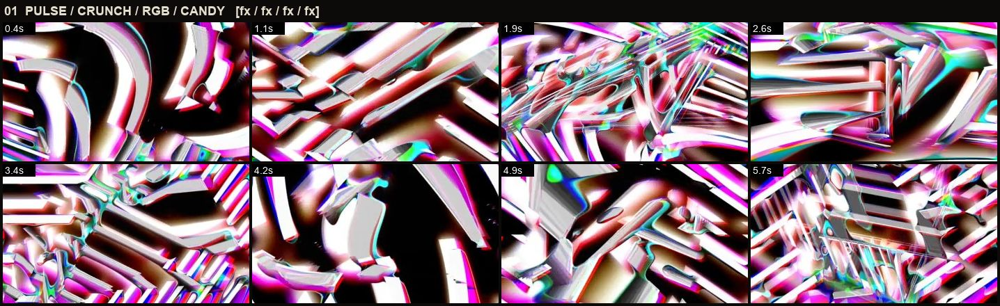

| | |
|---|---|
| **מה רואים** | לוחות "כרום" לבנים-אפורים מוחצנים, שבורים ומשוכפלים כמו מראה מנופצת, עם שוליים מג'נטה-ציאן. בין השברים שחור. המסך מלא לגמרי, אין אוויר. |
| **פלטה** | לבן, ורוד-מג'נטה, שחור-סגלגל, ספקל ירוק/ציאן. נמדד: `#170D14` 26%, `#943E63` 22%, `#BBA5B2` 19%, `#FDF7FA` 18% |
| **טכניקה ותגובה לסאונד** | אין מקור: PULSE (דפוס פסים שפועם לפי BPM) הוא הגנרטור, CRUNCH ("crashed mirror") מנפץ, RGB מפצל ערוצים, CANDY נותן את הברק הנוזלי. הפולס פועם על ה-BPM והשבירה מתחלפת במכות. |
| **תנועה ועריכה** | כאוטי: שינוי חד כמעט בכל פריים. אין בנייה. נמדד: בהירות ממוצעת 130/255, 0% מהזמן כמעט שחור, 8.0 קאטים לשנייה. |
| **רלוונטיות לבעלים** | **נמוך** |

### 02. PULSE / DEFORM / DRIFT

- **קרדיט:** Zwobot (אין קרדיט לאמן בעמוד). **מקור:** fx / fx / fx. **אורך:** 6 שנ'.
- **וידאו:** https://www.zwobotmax.com/showcase/Showcase_21_02.mp4
- **פריימים בודדים:** `images/zwobot-showcase/02-pulse-deform-drift-t004.jpg` … `02-pulse-deform-drift-t057.jpg`

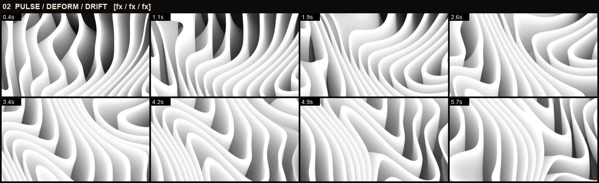

| | |
|---|---|
| **מה רואים** | פסים לבנים עבים שמתקפלים כמו נייר או סרט, עם הצללה רכה מלבן לאפור כהה. תבליט פיסולי נקי, בלי צבע בכלל. |
| **פלטה** | לבן עד אפור בינוני, צללים עמוקים. רוויה 0. נמדד: `#CECECE` 28%, `#EBEBEB` 22%, `#818181` 20%, `#FFFFFF` 17% |
| **טכניקה ותגובה לסאונד** | PULSE (פסים) → DEFORM (domain warp) → DRIFT (גרעין עדין). ההצללה היא פרופיל בהירות בתוך כל פס ולא תאורה אמיתית: "פס עם בליטה". הפולס מזיז את הקיפולים בקצב. |
| **תנועה ועריכה** | זרימה רציפה, בלי קאטים. נמדד: בהירות ממוצעת 206/255, 0% מהזמן כמעט שחור, 0.0 קאטים לשנייה. |
| **רלוונטיות לבעלים** | **בינוני-גבוה**. רעיון סצנה: Folds (קפלי נייר) ב-bone על warm black. |

### 03. OFFSET / DEFORM / REFLUX / ROTA / FLOW / FILTER / CANDY

- **קרדיט:** Zwobot (אין קרדיט לאמן בעמוד). **מקור:** image / fx / fx / fx / fx/ fx / fx / fx. **אורך:** 6 שנ'.
- **וידאו:** https://www.zwobotmax.com/showcase/Showcase_21_03.mp4
- **פריימים בודדים:** `images/zwobot-showcase/03-offset-deform-reflux-rota-flow-filter-ca-t004.jpg` … `03-offset-deform-reflux-rota-flow-filter-ca-t057.jpg`

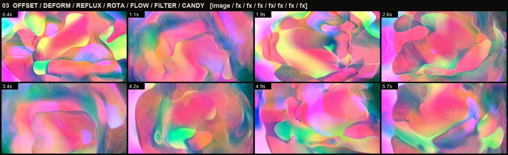

| | |
|---|---|
| **מה רואים** | כתמים נוזליים בפסטל (ורוד, ליים, ציאן, לילך) עם טקסטורה גרעינית שנשארה מהתמונה. שבעה אפקטים בשרשרת על תמונה אחת, והמקור כמעט לא מזוהה. |
| **פלטה** | ורוד-ממתק, סגול עמום, ירוק-אפור. נמדד: `#F387A1` 24%, `#F2629E` 23%, `#85678D` 23%, `#90A39D` 17% |
| **טכניקה ותגובה לסאונד** | OFFSET, DEFORM, REFLUX (feedback diffusion), ROTA (סיבוב לפי צליל/ביט), FLOW (זרימה לפי ניגודיות), FILTER, CANDY. |
| **תנועה ועריכה** | זרימה רכה. נמדד: בהירות ממוצעת 150/255, 0% מהזמן כמעט שחור, 0.7 קאטים לשנייה. |
| **רלוונטיות לבעלים** | **נמוך** |

### 04. IMG / PATTERN / ROTARY

- **קרדיט:** Zwobot (אין קרדיט לאמן בעמוד). **מקור:** image / fx / fx. **אורך:** 7 שנ'.
- **וידאו:** https://www.zwobotmax.com/showcase/Showcase_20_04.mp4
- **פריימים בודדים:** `images/zwobot-showcase/04-img-pattern-rotary-t004.jpg` … `04-img-pattern-rotary-t065.jpg`

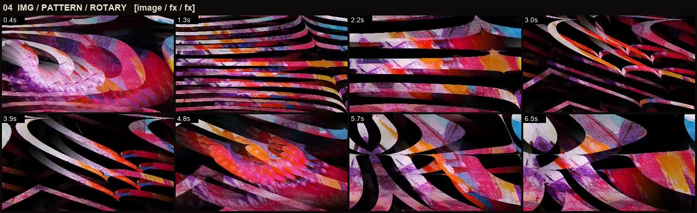

| | |
|---|---|
| **מה רואים** | תמונה ציורית (מג'נטה, כתום, כחול) חתוכה לרצועות וחרמשים מעוקלים על שחור. שכבה אחת מסתובבת. |
| **פלטה** | שחור, בורדו, ורוד-אפרפר, אדום כהה. נמדד: `#020102` 25%, `#7E2E4B` 24%, `#B2808E` 23%, `#0F050A` 17% |
| **טכניקה ותגובה לסאונד** | PATTERN (דפוס שמגיב לסאונד ולביט) משמש כמסכה שחותכת את התמונה, ו-ROTARY מסובב שכבה לפי ביט. זה masking של מקור דרך גנרטור. |
| **תנועה ועריכה** | ריתמי, בערך שתי החלפות בשנייה. נמדד: בהירות ממוצעת 58/255, 0% מהזמן כמעט שחור, 2.5 קאטים לשנייה. |
| **רלוונטיות לבעלים** | **בינוני-נמוך**. הטכניקה (מקור מבעד למסכה גאומטרית) טובה, הצבעים לא שלנו. |

### 05. VID / CRUNCH / KETA

- **קרדיט:** Zwobot (אין קרדיט לאמן בעמוד). **מקור:** video / fx / fx. **אורך:** 7 שנ'.
- **וידאו:** https://www.zwobotmax.com/showcase/Showcase_20_05.mp4
- **פריימים בודדים:** `images/zwobot-showcase/05-vid-crunch-keta-t005.jpg` … `05-vid-crunch-keta-t069.jpg`

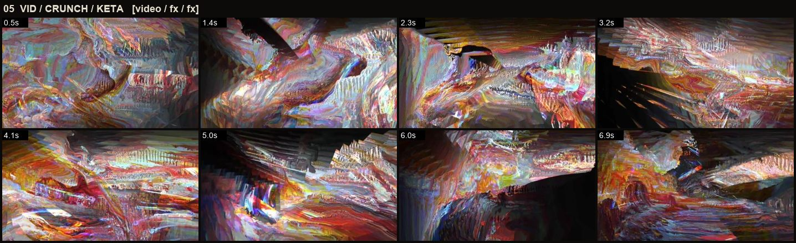

| | |
|---|---|
| **מה רואים** | וידאו שנמרח לגליץ' צבעוני: מריחות אופקיות, זיגזגים, מוזאיקה. |
| **פלטה** | חום, שחור, בז'. נמדד: `#643F3D` 24%, `#1F191A` 24%, `#8B6B67` 22%, `#A28D89` 17% |
| **טכניקה ותגובה לסאונד** | CRUNCH ואחריו KETA (אדוות feedback לפי ניגודיות). |
| **תנועה ועריכה** | בינוני, כשתי קפיצות בשנייה. נמדד: בהירות ממוצעת 95/255, 0% מהזמן כמעט שחור, 1.5 קאטים לשנייה. |
| **רלוונטיות לבעלים** | **נמוך**. וידאו מצולם. |

### 06. VID / FDBK / 3D / FLUX

- **קרדיט:** Zwobot (אין קרדיט לאמן בעמוד). **מקור:** video / fx / fx / fx / fx. **אורך:** 7 שנ'.
- **וידאו:** https://www.zwobotmax.com/showcase/Showcase_20_06.mp4
- **פריימים בודדים:** `images/zwobot-showcase/06-vid-fdbk-3d-flux-t005.jpg` … `06-vid-fdbk-3d-flux-t069.jpg`

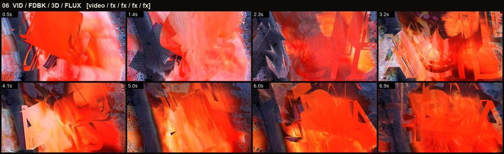

| | |
|---|---|
| **מה רואים** | שדה אדום-כתום בוער, בתוכו שברים ואותיות מוחצנים בתלת-ממד, feedback כבד. בשוליים אפור-כחלחל עם נקודות. |
| **פלטה** | אדום רווי, סגול-חום, סלמון. נמדד: `#E62A12` 33%, `#45232C` 29%, `#E46C51` 15%, `#EE977F` 12% |
| **טכניקה ותגובה לסאונד** | FDBK, 3D (אובייקט/טקסט מוחצן), FLUX (feedback diffusion שזורם לפי ניגודיות הקלט). |
| **תנועה ועריכה** | רציף, מרוח, בלי קאטים. נמדד: בהירות ממוצעת 94/255, 0% מהזמן כמעט שחור, 0.0 קאטים לשנייה. |
| **רלוונטיות לבעלים** | **בינוני**. הצבע (אדום + סלמון + קונטרה קרה) קרוב לבעלים. הצורה עמוסה. |

### 07. IMG / FILTER / PRISM

- **קרדיט:** Zwobot (אין קרדיט לאמן בעמוד). **מקור:** image / fx / fx. **אורך:** 10 שנ'.
- **וידאו:** https://www.zwobotmax.com/showcase/Showcase_20_02.mp4
- **פריימים בודדים:** `images/zwobot-showcase/07-img-filter-prism-t006.jpg` … `07-img-filter-prism-t093.jpg`

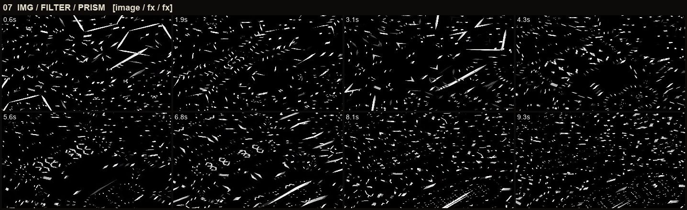

| | |
|---|---|
| **מה רואים** | שחור מוחלט ועליו רסיסים לבנים קטנים (קווים, משולשים) בסידור קליידוסקופי. נראה כמו אבק זכוכית. |
| **פלטה** | 85% שחור, מעט אפור ולבן. נמדד: `#000000` 49%, `#010101` 37%, `#373737` 14%, `#020001` 0% |
| **טכניקה ותגובה לסאונד** | FILTER קיצוני משאיר רק את ההבהרות של תמונה עשירה, ו-PRISM פורס אותן בקליידוסקופ. תמונה מלאה הופכת לאבק. |
| **תנועה ועריכה** | רציף, סיבוב איטי. נמדד: בהירות ממוצעת 13/255, 29% מהזמן כמעט שחור, 0.0 קאטים לשנייה. |
| **רלוונטיות לבעלים** | **גבוה**. יכול לשמש כשכבת dust מעל כל סצנה שלנו. |

### 08. IMG / DEFORM / PLURAL

- **קרדיט:** Zwobot (אין קרדיט לאמן בעמוד). **מקור:** image / fx / fx. **אורך:** 7 שנ'.
- **וידאו:** https://www.zwobotmax.com/showcase/Showcase_20_01.mp4
- **פריימים בודדים:** `images/zwobot-showcase/08-img-deform-plural-t004.jpg` … `08-img-deform-plural-t065.jpg`

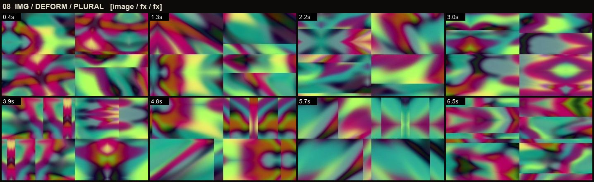

| | |
|---|---|
| **מה רואים** | המסך מחולק רקורסיבית לריבועים ומלבנים (2x2, 4x4, חלוקות לא שוות). בכל אריח מראה אחרת של אותו מקור מטושטש. |
| **פלטה** | מג'נטה, טורקיז, ליים. נמדד: `#952851` 29%, `#578474` 20%, `#40AC88` 19%, `#41324A` 18% |
| **טכניקה ותגובה לסאונד** | DEFORM ואז PLURAL: quadtree tiling עם mirror בכל אריח. החלוקה מתחלפת על הביט. |
| **תנועה ועריכה** | בערך שתי חלוקות חדשות בשנייה, כלומר על כל ביט ב-120 BPM. נמדד: בהירות ממוצעת 100/255, 0% מהזמן כמעט שחור, 2.0 קאטים לשנייה. |
| **רלוונטיות לבעלים** | **נמוך בצבע, גבוה בטכניקה**. חלוקת מסך על ביט היא כלי עריכה מעולה גם במונו. |

### 09. IMG / FLUX / SHUTTER

- **קרדיט:** Zwobot (אין קרדיט לאמן בעמוד). **מקור:** image / fx / fx. **אורך:** 7 שנ'.
- **וידאו:** https://www.zwobotmax.com/showcase/Showcase_20_03.mp4
- **פריימים בודדים:** `images/zwobot-showcase/09-img-flux-shutter-t004.jpg` … `09-img-flux-shutter-t065.jpg`

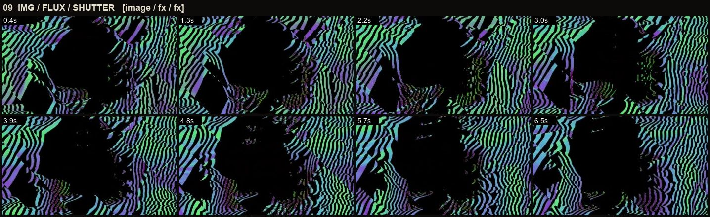

| | |
|---|---|
| **מה רואים** | פסי זברה ירוקים-סגולים-טורקיז מתפתלים, ובמרכז חור שחור גדול. |
| **פלטה** | שחור, טורקיז אפרפר, כחול-אפור. נמדד: `#000000` 34%, `#5E8E8C` 25%, `#242D36` 20%, `#030306` 15% |
| **טכניקה ותגובה לסאונד** | FLUX על תמונה בניגודיות גבוהה יוצר קווי קונטור (zebra), SHUTTER חותך אזורים לשחור. |
| **תנועה ועריכה** | רציף. נמדד: בהירות ממוצעת 44/255, 0% מהזמן כמעט שחור, 0.0 קאטים לשנייה. |
| **רלוונטיות לבעלים** | **בינוני**. אותו zebra warp מהטריילר. במונו או באדום זה יכול להיות חזק. |

### 10. VIDEO / PETRA / STRETCH / ROTARY

- **קרדיט:** Zwobot (אין קרדיט לאמן בעמוד). **מקור:** video / fx / fx / fx / fx. **אורך:** 6 שנ'.
- **וידאו:** https://www.zwobotmax.com/showcase/Showcase_19_11.mp4
- **פריימים בודדים:** `images/zwobot-showcase/10-video-petra-stretch-rotary-t004.jpg` … `10-video-petra-stretch-rotary-t059.jpg`

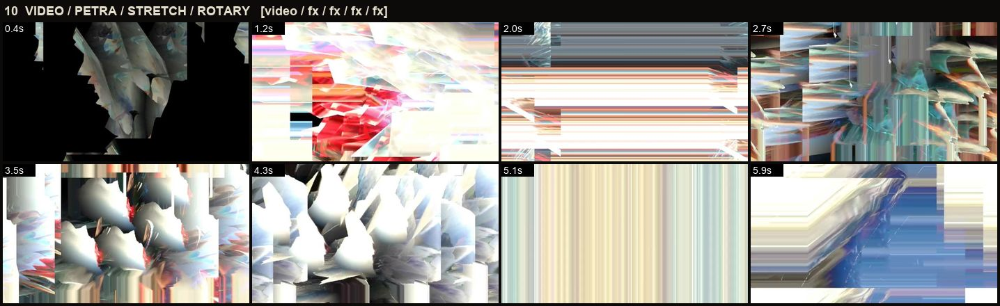

| | |
|---|---|
| **מה רואים** | רסיסים לבנים-כסופים מעוותים, מריחות אנכיות ואופקיות שנמתחות עד קצה המסך, ובסוף שדה של פסים אנכיים כמו slit-scan. |
| **פלטה** | אפור, קרם, לבן, ניצוץ אדום. נמדד: `#8F8F93` 28%, `#D6D8CC` 22%, `#382F31` 20%, `#FEFFFB` 19% |
| **טכניקה ותגובה לסאונד** | PETRA (Rutt-Etra) על וידאו, STRETCH (משיכת שורה או עמודה עד הקצה), ROTARY. |
| **תנועה ועריכה** | מהיר מאוד, כחמש קפיצות בשנייה. נמדד: בהירות ממוצעת 153/255, 2% מהזמן כמעט שחור, 4.9 קאטים לשנייה. |
| **רלוונטיות לבעלים** | **בינוני-נמוך**. ה-STRETCH שווה כאפקט מעבר. |

### 11. IMG / FLOW / KETA

- **קרדיט:** Zwobot (אין קרדיט לאמן בעמוד). **מקור:** image / fx / fx. **אורך:** 8 שנ'.
- **וידאו:** https://www.zwobotmax.com/showcase/Showcase_19_10.mp4
- **פריימים בודדים:** `images/zwobot-showcase/11-img-flow-keta-t005.jpg` … `11-img-flow-keta-t077.jpg`

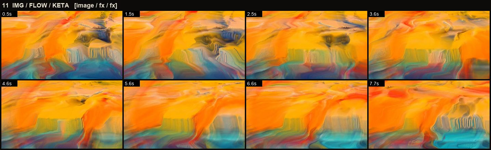

| | |
|---|---|
| **מה רואים** | נוף ציורי צהוב-כתום-טורקיז שנמס ומתנפח, עם אדוות אנכיות קטנות. |
| **פלטה** | כתום, ענבר, חאקי. נמדד: `#6C655A` 26%, `#FC981D` 22%, `#EC7912` 21%, `#C09B47` 17% |
| **טכניקה ותגובה לסאונד** | FLOW (זרימה לפי ניגודיות) ו-KETA (אדוות). |
| **תנועה ועריכה** | רך מאוד, בלי קאטים. נמדד: בהירות ממוצעת 144/255, 0% מהזמן כמעט שחור, 0.0 קאטים לשנייה. |
| **רלוונטיות לבעלים** | **נמוך** |

### 12. IMG / PETRA / MULTI

- **קרדיט:** Zwobot (אין קרדיט לאמן בעמוד). **מקור:** image / fx / fx. **אורך:** 6 שנ'.
- **וידאו:** https://www.zwobotmax.com/showcase/Showcase_19_12.mp4
- **פריימים בודדים:** `images/zwobot-showcase/12-img-petra-multi-t004.jpg` … `12-img-petra-multi-t057.jpg`

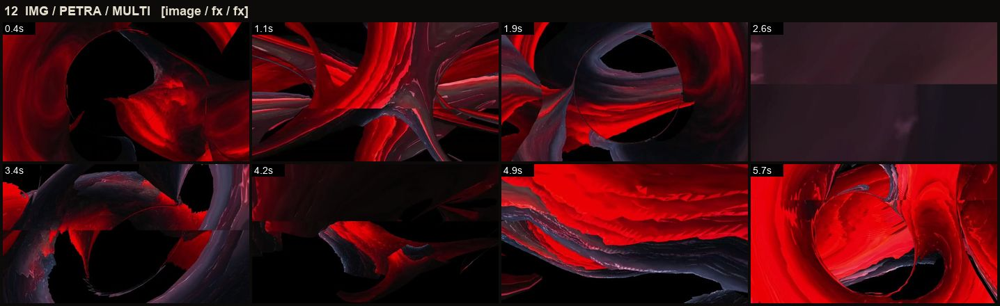

| | |
|---|---|
| **מה רואים** | צינורות וסרטים אדומים עמוקים ואפור-צפחה, טבעת מנהרה אחת, והמסך מתפצל לחצאים. פריים אחד כמעט כולו בורדו כהה. |
| **פלטה** | שחור-אדמדם, אדום רווי, צפחה, בורדו. נמדד: `#0E0102` 33%, `#960107` 24%, `#271A23` 18%, `#2D0A0E` 17% |
| **טכניקה ותגובה לסאונד** | PETRA מחצין את בהירות התמונה לתבליט, MULTI פורס אותו לתבנית ומפצל. |
| **תנועה ועריכה** | רציף, 8% מהזמן כמעט שחור. נמדד: בהירות ממוצעת 24/255, 8% מהזמן כמעט שחור, 0.0 קאטים לשנייה. |
| **רלוונטיות לבעלים** | **גבוה**. זה ה-red-mono התעשייתי של הבעלים: אדום, צפחה ושחור. אין פנים. |

### 13. IMG / PETRA / STRETCH

- **קרדיט:** Zwobot (אין קרדיט לאמן בעמוד). **מקור:** image / fx / fx. **אורך:** 5 שנ'.
- **וידאו:** https://www.zwobotmax.com/showcase/Showcase_19_07.mp4
- **פריימים בודדים:** `images/zwobot-showcase/13-img-petra-stretch-t003.jpg` … `13-img-petra-stretch-t048.jpg`

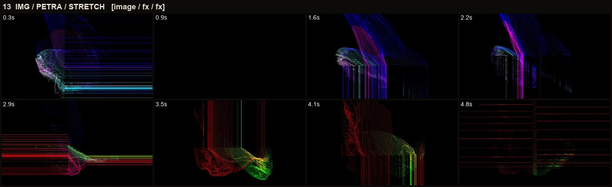

| | |
|---|---|
| **מה רואים** | אובייקט (נראה כמו נעל או פסל) מצויר בקווי סריקה דקים וצבעוניים על שחור, וקווים שנמתחים אופקית ואנכית עד הקצה. פריים שחור לגמרי באמצע. |
| **פלטה** | 95% שחור. קווים כחול-מג'נטה, אחר כך אדום-ירוק. נמדד: `#000000` 63%, `#07020D` 15%, `#241620` 12%, `#020000` 7% |
| **טכניקה ותגובה לסאונד** | PETRA הוא Rutt-Etra קלאסי: כל שורת סריקה מוזזת לפי הבהירות. STRETCH מותח. |
| **תנועה ועריכה** | רציף ומאוד כהה. נמדד: בהירות ממוצעת 7/255, 95% מהזמן כמעט שחור, 0.0 קאטים לשנייה. |
| **רלוונטיות לבעלים** | **גבוה**. קווים דקים על שחור. אצלנו ב-bone ובאדום בלבד. זה Rutt-Etra אמיתי, וחסר לנו. |

### 14. IMG / TWST / SHUTTER / DRIFT / ABC / COULEUR

- **קרדיט:** Zwobot (אין קרדיט לאמן בעמוד). **מקור:** image / generative / fx / fx / fx / fx. **אורך:** 6 שנ'.
- **וידאו:** https://www.zwobotmax.com/showcase/Showcase_19_08.mp4
- **פריימים בודדים:** `images/zwobot-showcase/14-img-twst-shutter-drift-abc-couleur-t004.jpg` … `14-img-twst-shutter-drift-abc-couleur-t055.jpg`

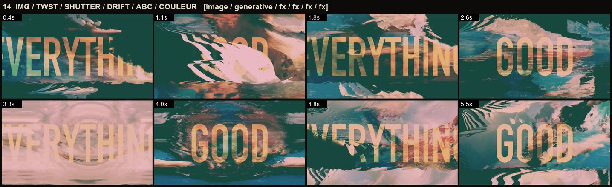

| | |
|---|---|
| **מה רואים** | המילים EVERYTHING ו-GOOD מתחלפות, מילה לכל ביט, בפונט condensed עבה מעל צילום ים ועננים עם שברים וגרעין. |
| **פלטה** | ירוק-כהה, אפור-ירוק, אפרסק. נמדד: `#174840` 31%, `#465955` 20%, `#D2A08F` 19%, `#928980` 16% |
| **טכניקה ותגובה לסאונד** | ABC (טקסט), COULEUR (grading לדואוטון), TWST, SHUTTER, DRIFT. |
| **תנועה ועריכה** | המילה מתחלפת בערך פעם בשנייה. נמדד: בהירות ממוצעת 110/255, 0% מהזמן כמעט שחור, 0.9 קאטים לשנייה. |
| **רלוונטיות לבעלים** | **בינוני**. הפלטה העמומה יפה, והשיטה של מילה לכל ביט חזקה. אפשר להשתמש במילים מתוך CONCEPT של Before It Disappears. |

### 15. IMG / TWST / KETA / SHUTTER/ STRETCH / COULEUR

- **קרדיט:** Zwobot (אין קרדיט לאמן בעמוד). **מקור:** image / generative / fx / fx / fx / fx. **אורך:** 8 שנ'.
- **וידאו:** https://www.zwobotmax.com/showcase/Showcase_19_09.mp4
- **פריימים בודדים:** `images/zwobot-showcase/15-img-twst-keta-shutter-stretch-couleur-t005.jpg` … `15-img-twst-keta-shutter-stretch-couleur-t072.jpg`

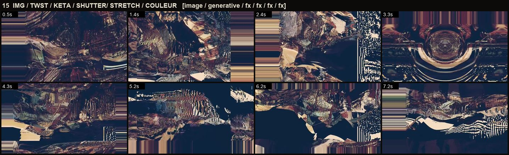

| | |
|---|---|
| **מה רואים** | קולאז' כהה של שברים ופסים מתוחים, וטבעת אדווה מעגלית במרכז. |
| **פלטה** | נייבי, קרם, חום-אפור. נמדד: `#4A414E` 26%, `#0F233D` 24%, `#97867C` 20%, `#312A41` 16% |
| **טכניקה ותגובה לסאונד** | TWST, KETA, SHUTTER, STRETCH, COULEUR. |
| **תנועה ועריכה** | עצבני, כארבע קפיצות בשנייה. נמדד: בהירות ממוצעת 69/255, 0% מהזמן כמעט שחור, 4.1 קאטים לשנייה. |
| **רלוונטיות לבעלים** | **בינוני**. הפלטה (נייבי-קרם) טובה, הקצב לא. |

### 16. VIDEO / KETA / RGB

- **קרדיט:** Zwobot (אין קרדיט לאמן בעמוד). **מקור:** video / fx / fx. **אורך:** 13 שנ'.
- **וידאו:** https://www.zwobotmax.com/showcase/Showcase_19_04.mp4
- **פריימים בודדים:** `images/zwobot-showcase/16-video-keta-rgb-t008.jpg` … `16-video-keta-rgb-t119.jpg`

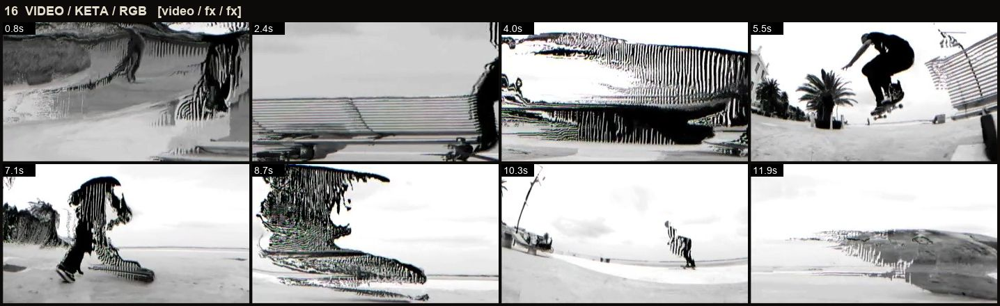

| | |
|---|---|
| **מה רואים** | וידאו סקייטבורד בשחור-לבן. האדוות הופכות את הקצוות לפסי זברה שנמרחים ומטפטפים מהדמויות. |
| **פלטה** | מונו: אפורים ולבן. נמדד: `#AFAFAF` 24%, `#434444` 22%, `#E0E0E0` 21%, `#FFFFFF` 20% |
| **טכניקה ותגובה לסאונד** | KETA הוא feedback ripple לפי ניגודיות: כל קצה חזק פולט פסים. RGB מוסיף שוליים. |
| **תנועה ועריכה** | בעיקר רציף, עם כשתי קפיצות בשנייה. נמדד: בהירות ממוצעת 183/255, 0% מהזמן כמעט שחור, 2.1 קאטים לשנייה. |
| **רלוונטיות לבעלים** | **בינוני**. הטכניקה טובה, המקור (וידאו של אנשים) לא שלנו. |

### 17. IMG / PETRA / DEFORM / KETA

- **קרדיט:** Zwobot (אין קרדיט לאמן בעמוד). **מקור:** image / generative / fx / fx. **אורך:** 15 שנ'.
- **וידאו:** https://www.zwobotmax.com/showcase/Showcase_19_05.mp4
- **פריימים בודדים:** `images/zwobot-showcase/17-img-petra-deform-keta-t010.jpg` … `17-img-petra-deform-keta-t144.jpg`

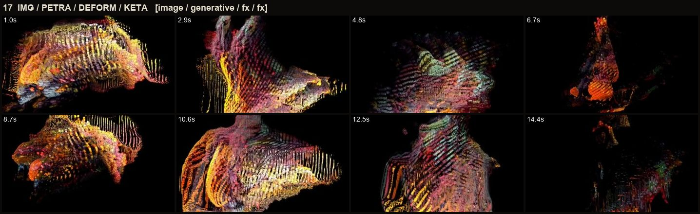

| | |
|---|---|
| **מה רואים** | טורסו או פסל (כתפיים וצוואר) שמפורק לענן נקודות ופסים בכתום-ורוד-טורקיז על שחור. |
| **פלטה** | שחור, כתום-חום, חום כהה. נמדד: `#000000` 48%, `#94684D` 23%, `#23100F` 17%, `#050001` 8% |
| **טכניקה ותגובה לסאונד** | PETRA על תמונת גוף, DEFORM, KETA. |
| **תנועה ועריכה** | רציף. נמדד: בהירות ממוצעת 33/255, 21% מהזמן כמעט שחור, 0.1 קאטים לשנייה. |
| **רלוונטיות לבעלים** | **בינוני**. זהירות: גוף אנושי. אין פנים, אבל זה קרוב. |

### 18. IMG / STROBO / DEFORM / TWST/ FILTER/ KETA

- **קרדיט:** Zwobot (אין קרדיט לאמן בעמוד). **מקור:** image / fx /fx / generative / fx / fx. **אורך:** 7 שנ'.
- **וידאו:** https://www.zwobotmax.com/showcase/Showcase_19_06.mp4
- **פריימים בודדים:** `images/zwobot-showcase/18-img-strobo-deform-twst-filter-keta-t004.jpg` … `18-img-strobo-deform-twst-filter-keta-t064.jpg`

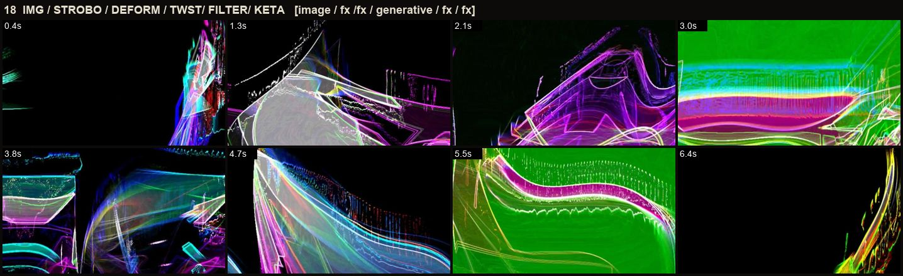

| | |
|---|---|
| **מה רואים** | קווי ניאון (מג'נטה, ציאן, ירוק) בתנועה, ומסכי סטרובו ירוקים מלאים. |
| **פלטה** | שחור, ירוק, סגול-אפור. נמדד: `#000000` 34%, `#4EAB57` 29%, `#534C5E` 18%, `#000205` 10% |
| **טכניקה ותגובה לסאונד** | STROBO (סטרובו צבעוני לפי ביט), DEFORM, TWST, FILTER, KETA. |
| **תנועה ועריכה** | כארבע קפיצות בשנייה. נמדד: בהירות ממוצעת 50/255, 4% מהזמן כמעט שחור, 3.8 קאטים לשנייה. |
| **רלוונטיות לבעלים** | **נמוך** |

### 19. PETRA / FISH / MULTI

- **קרדיט:** Zwobot (אין קרדיט לאמן בעמוד). **מקור:** video / generative / fx. **אורך:** 15 שנ'.
- **וידאו:** https://www.zwobotmax.com/showcase/Showcase_19_01.mp4
- **פריימים בודדים:** `images/zwobot-showcase/19-petra-fish-multi-t009.jpg` … `19-petra-fish-multi-t141.jpg`

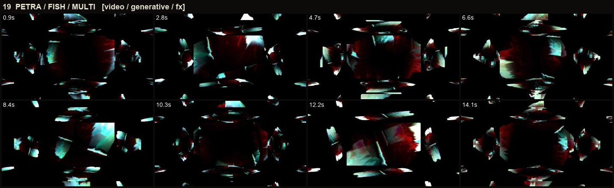

| | |
|---|---|
| **מה רואים** | רסיסים מנטה-לבן ואדום כהה, מסודרים סימטרית סביב מלבן מרכזי. |
| **פלטה** | שחור, ירוק-אפור, אדום כהה. נמדד: `#000000` 59%, `#090101` 16%, `#45524E` 10%, `#000002` 10% |
| **טכניקה ותגובה לסאונד** | PETRA, FISHEYE, MULTI (תבנית). |
| **תנועה ועריכה** | רציף ואיטי. נמדד: בהירות ממוצעת 15/255, 26% מהזמן כמעט שחור, 0.0 קאטים לשנייה. |
| **רלוונטיות לבעלים** | **בינוני**. זהירות: הסימטריה סביב המרכז יוצרת לפעמים "מסכה". |

### 20. LINR / DRIFT / ERRQ / SCAN

- **קרדיט:** Zwobot (אין קרדיט לאמן בעמוד). **מקור:** video / generative / fx. **אורך:** 13 שנ'.
- **וידאו:** https://www.zwobotmax.com/showcase/Showcase_19_02.mp4
- **פריימים בודדים:** `images/zwobot-showcase/20-linr-drift-errq-scan-t008.jpg` … `20-linr-drift-errq-scan-t118.jpg`

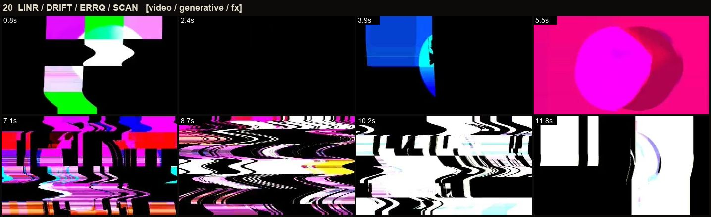

| | |
|---|---|
| **מה רואים** | בלוקים בניאון מג'נטה-ירוק-כחול, עיגול ורוד, רצועות scan גליות, ופריימים שחורים. |
| **פלטה** | שחור, לבן-אפור, מג'נטה. נמדד: `#000000` 45%, `#D1D0D6` 22%, `#860086` 17%, `#000004` 9% |
| **טכניקה ותגובה לסאונד** | LINR (שורות ועמודות בצבעי הקלט), DRIFT, ERRQUAKE (רעידה), SCAN. |
| **תנועה ועריכה** | כאוס, שבע קפיצות בשנייה. נמדד: בהירות ממוצעת 76/255, 2% מהזמן כמעט שחור, 7.3 קאטים לשנייה. |
| **רלוונטיות לבעלים** | **נמוך** |

### 21. PETRA / DRIFT

- **קרדיט:** Zwobot (אין קרדיט לאמן בעמוד). **מקור:** video / generative / fx. **אורך:** 13 שנ'.
- **וידאו:** https://www.zwobotmax.com/showcase/Showcase_19_03.mp4
- **פריימים בודדים:** `images/zwobot-showcase/21-petra-drift-t008.jpg` … `21-petra-drift-t118.jpg`

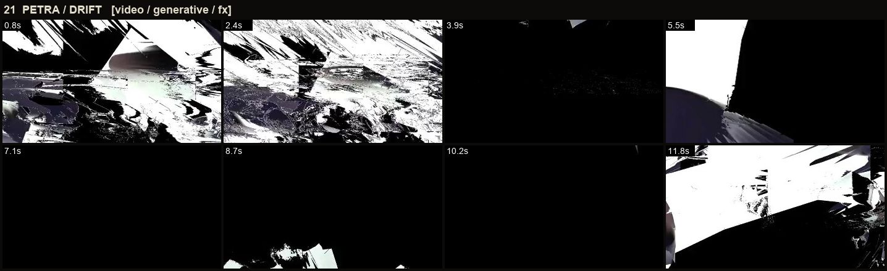

| | |
|---|---|
| **מה רואים** | שברים בשחור-לבן בניגודיות קיצונית, ופריימים שחורים לגמרי (רבע מהזמן). כתם לבן ענק מופיע ונעלם. |
| **פלטה** | שחור ולבן בלבד. נמדד: `#000000` 61%, `#F5F6F6` 22%, `#403E43` 10%, `#010002` 7% |
| **טכניקה ותגובה לסאונד** | PETRA על וידאו, DRIFT. הרגעים השקטים הופכים לשחור. |
| **תנועה ועריכה** | קופץ, כחמש קפיצות בשנייה. נמדד: בהירות ממוצעת 67/255, 26% מהזמן כמעט שחור, 5.4 קאטים לשנייה. |
| **רלוונטיות לבעלים** | **בינוני-גבוה**. 1-bit חד עם הרבה שחור. אצלנו רק לדרופים. |

### 22. VSINE / PETRA / RGB / DRIFT / VHS

- **קרדיט:** Zwobot (אין קרדיט לאמן בעמוד). **מקור:** generative / fx. **אורך:** 14 שנ'.
- **וידאו:** https://www.zwobotmax.com/showcase/Showcase_18_37.mp4
- **פריימים בודדים:** `images/zwobot-showcase/22-vsine-petra-rgb-drift-vhs-t009.jpg` … `22-vsine-petra-rgb-drift-vhs-t131.jpg`

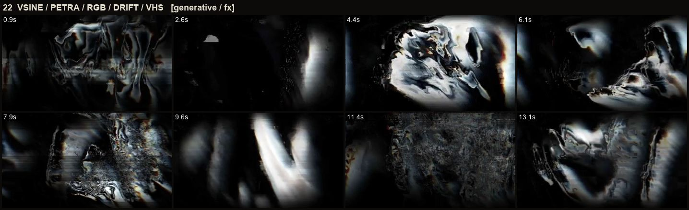

| | |
|---|---|
| **מה רואים** | צורות של "כסף נוזלי" שמתפתלות בחושך, עם וינייט כבד, פסי VHS, גרעין וספקל כתום זעיר. |
| **פלטה** | שחור-פחם, אפור-כסף. נמדד: `#1B1C1E` 27%, `#060606` 19%, `#000000` 19%, `#6A6F70` 18% |
| **טכניקה ותגובה לסאונד** | VSINE (גנרטור סינוסים) → PETRA (תבליט) → RGB → DRIFT → VHS. כלומר גנרטור רך ואחריו טיפול של פילם ווידאו. |
| **תנועה ועריכה** | בעיקר זורם, כשתי קפיצות בשנייה. נמדד: בהירות ממוצעת 31/255, 2% מהזמן כמעט שחור, 1.9 קאטים לשנייה. |
| **רלוונטיות לבעלים** | **גבוה**. זהירות: בפריים של 4.4 שנ' מסה חיוורת עם חללים כהים נקראת כמו גולגולת. לכן בגיליון המגע השתמשתי ב-7.9 שנ'. |

### 23. VSINE / RGB / FLOW

- **קרדיט:** Zwobot (אין קרדיט לאמן בעמוד). **מקור:** generative / fx. **אורך:** 16 שנ'.
- **וידאו:** https://www.zwobotmax.com/showcase/Showcase_18_35.mp4
- **פריימים בודדים:** `images/zwobot-showcase/23-vsine-rgb-flow-t010.jpg` … `23-vsine-rgb-flow-t150.jpg`

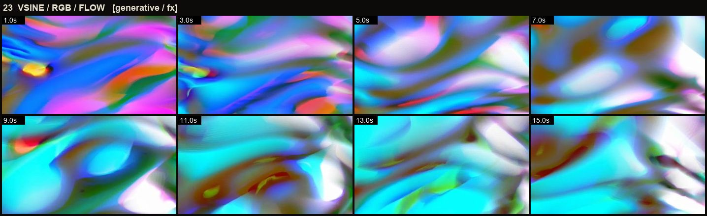

| | |
|---|---|
| **מה רואים** | זרימה פסטלית בציאן, לבנדר וורוד. |
| **פלטה** | ציאן, לבנדר, כחול. נמדד: `#21CADD` 26%, `#655373` 25%, `#5F76A4` 22%, `#96A2C8` 14% |
| **טכניקה ותגובה לסאונד** | VSINE, RGB, FLOW. |
| **תנועה ועריכה** | רך, בלי קאטים. נמדד: בהירות ממוצעת 141/255, 0% מהזמן כמעט שחור, 0.0 קאטים לשנייה. |
| **רלוונטיות לבעלים** | **נמוך** |

### 24. VSINE / PETRA / RGB / DRIFT / FLOW

- **קרדיט:** Zwobot (אין קרדיט לאמן בעמוד). **מקור:** generative / fx. **אורך:** 13 שנ'.
- **וידאו:** https://www.zwobotmax.com/showcase/Showcase_18_36.mp4
- **פריימים בודדים:** `images/zwobot-showcase/24-vsine-petra-rgb-drift-flow-t008.jpg` … `24-vsine-petra-rgb-drift-flow-t120.jpg`

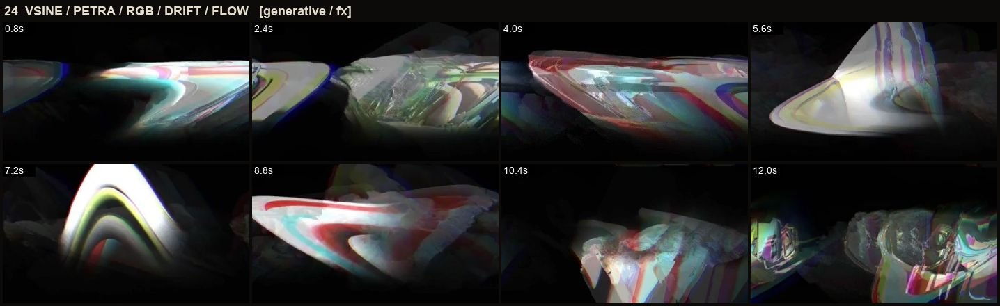

| | |
|---|---|
| **מה רואים** | סנפירים או כנפיים לבנים-קשתיים מבריקים על שחור, עם פיצול RGB ושובל feedback. |
| **פלטה** | שחור, אפור, קשת דקה בשוליים. נמדד: `#020202` 24%, `#2B282A` 23%, `#8D928E` 21%, `#09090A` 21% |
| **טכניקה ותגובה לסאונד** | VSINE → PETRA (הופך את הגלים לסנפירים) → RGB → DRIFT → FLOW. |
| **תנועה ועריכה** | רציף. נמדד: בהירות ממוצעת 47/255, 1% מהזמן כמעט שחור, 0.4 קאטים לשנייה. |
| **רלוונטיות לבעלים** | **בינוני** |

### 25. DEFORM / FDBK / KALEIDO

- **קרדיט:** Zwobot (אין קרדיט לאמן בעמוד). **מקור:** VIDEO / fx. **אורך:** 10 שנ'.
- **וידאו:** https://www.zwobotmax.com/showcase/Showcase_18_30.mp4
- **פריימים בודדים:** `images/zwobot-showcase/25-deform-fdbk-kaleido-t006.jpg` … `25-deform-fdbk-kaleido-t095.jpg`

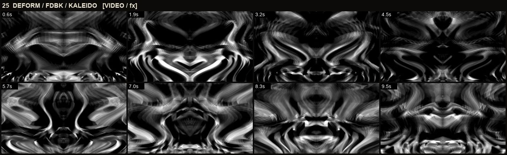

| | |
|---|---|
| **מה רואים** | feedback בשחור-לבן עם מראה סימטרית כפולה. בכמה פריימים נוצר בבירור פרצוף או מסכה, עם עיניים, אף ופה. |
| **פלטה** | מונו. נמדד: `#010101` 29%, `#3F3F3F` 23%, `#181818` 21%, `#686868` 17% |
| **טכניקה ותגובה לסאונד** | DEFORM, FDBK, KALEIDO על וידאו. |
| **תנועה ועריכה** | כקפיצה אחת בשנייה. נמדד: בהירות ממוצעת 55/255, 0% מהזמן כמעט שחור, 1.0 קאטים לשנייה. |
| **רלוונטיות לבעלים** | **להימנע**. הדוגמה הכי ברורה לכך שסימטריה ימין-שמאל מייצרת פנים. |

### 26. TWST / DEFORM

- **קרדיט:** Zwobot (אין קרדיט לאמן בעמוד). **מקור:** generative / fx. **אורך:** 16 שנ'.
- **וידאו:** https://www.zwobotmax.com/showcase/Showcase_18_31.mp4
- **פריימים בודדים:** `images/zwobot-showcase/26-twst-deform-t010.jpg` … `26-twst-deform-t151.jpg`

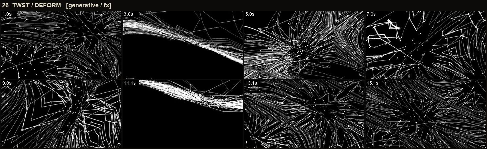

| | |
|---|---|
| **מה רואים** | plexus: קווים לבנים דקים בין נקודות, צרורות קווים שנשטפים באלכסון ורשתות משולשים. ברגעים מסוימים חצי מסך שחור ופס צפוף של קווים. |
| **פלטה** | שחור, אפורים, לבן. נמדד: `#000000` 35%, `#020202` 19%, `#404040` 18%, `#1B1B1B` 18% |
| **טכניקה ותגובה לסאונד** | TWST הוא גנרטור SR של נקודות וקווים, ו-DEFORM מעוות אותו. על מכה הצרור מתכווץ לפס אחד. |
| **תנועה ועריכה** | קפיצות על מכות (כ-2.7 בשנייה) וזרימה ביניהן. נמדד: בהירות ממוצעת 32/255, 0% מהזמן כמעט שחור, 2.7 קאטים לשנייה. |
| **רלוונטיות לבעלים** | **גבוה מאוד**. The Noise Diary. באותו מקום שבו נמצאים Mesh Body ו-Fibers שלנו. |

### 27. DEFORM / DRIFT / DEFORM / RGB

- **קרדיט:** Zwobot (אין קרדיט לאמן בעמוד). **מקור:** Image / fx. **אורך:** 25 שנ'.
- **וידאו:** https://www.zwobotmax.com/showcase/Showcase_18_29.mp4
- **פריימים בודדים:** `images/zwobot-showcase/27-deform-drift-deform-rgb-t016.jpg` … `27-deform-drift-deform-rgb-t235.jpg`

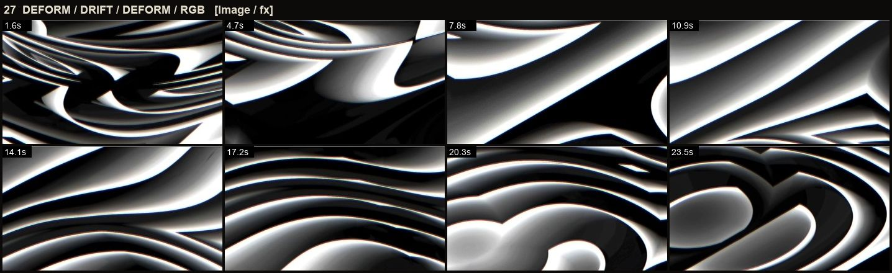

| | |
|---|---|
| **מה רואים** | סרטי כרום רחבים בשחור-לבן, עם שוליים דקים בסלמון וציאן. איטי ומלכותי, 25 שניות. |
| **פלטה** | לבן-אפור, שחור, אפור בינוני. נמדד: `#D8D9D6` 24%, `#040406` 23%, `#616162` 22%, `#16181D` 16% |
| **טכניקה ותגובה לסאונד** | תמונה → DEFORM → DRIFT → DEFORM → RGB. המתכתיות מגיעה מהתמונה, ה-DEFORM מותח אותה. |
| **תנועה ועריכה** | הקליפ הכי איטי בשואוקייס, בלי קאטים. נמדד: בהירות ממוצעת 88/255, 0% מהזמן כמעט שחור, 0.0 קאטים לשנייה. |
| **רלוונטיות לבעלים** | **גבוה**. Liquid Chrome במונו. ה-rim הסלמון הדק מקביל ל-halation שלנו. |

### 28. TWST / DEFORM / GLITCH

- **קרדיט:** Zwobot (אין קרדיט לאמן בעמוד). **מקור:** generative / fx. **אורך:** 11 שנ'.
- **וידאו:** https://www.zwobotmax.com/showcase/Showcase_18_32.mp4
- **פריימים בודדים:** `images/zwobot-showcase/28-twst-deform-glitch-t007.jpg` … `28-twst-deform-glitch-t102.jpg`

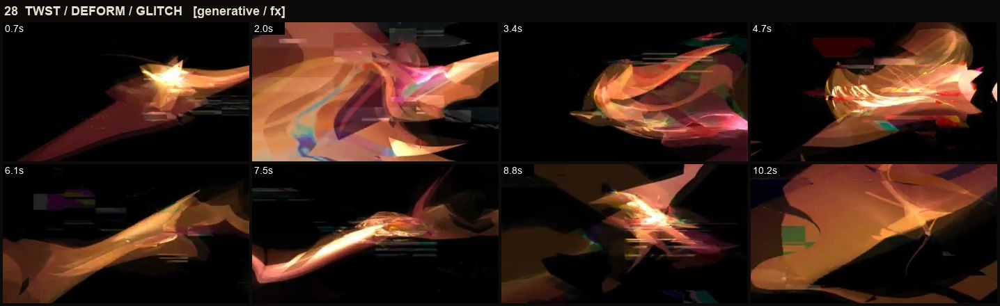

| | |
|---|---|
| **מה רואים** | סרטים שקופים בנחושת-אפרסק על שחור, זוהר לבן במרכז ובלוקים של גליץ'. |
| **פלטה** | שחור, נחושת, חום כהה. נמדד: `#000000` 36%, `#AF6A47` 23%, `#391B14` 21%, `#060203` 12% |
| **טכניקה ותגובה לסאונד** | TWST, DEFORM, GLITCH. |
| **תנועה ועריכה** | כקפיצה אחת בשנייה. נמדד: בהירות ממוצעת 40/255, 13% מהזמן כמעט שחור, 1.0 קאטים לשנייה. |
| **רלוונטיות לבעלים** | **בינוני-גבוה**. הצבע (נחושת ו-bone) מתאים. |

### 29. TWST / FLOW

- **קרדיט:** Zwobot (אין קרדיט לאמן בעמוד). **מקור:** generative / fx. **אורך:** 10 שנ'.
- **וידאו:** https://www.zwobotmax.com/showcase/Showcase_18_33.mp4
- **פריימים בודדים:** `images/zwobot-showcase/29-twst-flow-t006.jpg` … `29-twst-flow-t096.jpg`

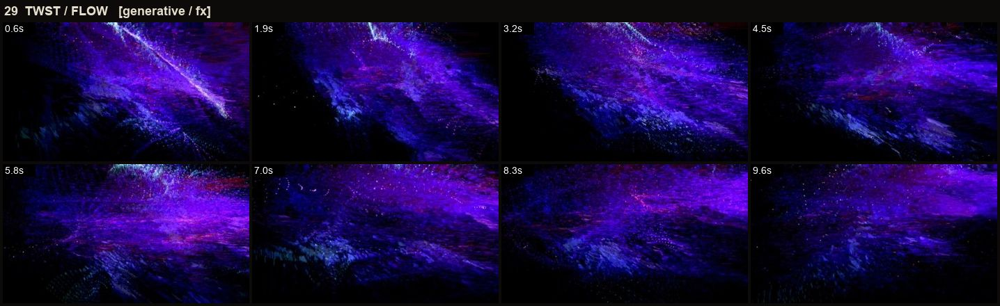

| | |
|---|---|
| **מה רואים** | ערפילית של חלקיקים בסגול-כחול. |
| **פלטה** | סגול, אינדיגו. נמדד: `#000003` 36%, `#401D99` 20%, `#0F0139` 18%, `#290771` 14% |
| **טכניקה ותגובה לסאונד** | TWST, FLOW. |
| **תנועה ועריכה** | רציף. נמדד: בהירות ממוצעת 17/255, 4% מהזמן כמעט שחור, 0.0 קאטים לשנייה. |
| **רלוונטיות לבעלים** | **נמוך** |

### 30. VIDEO / FLOW / DEFORM

- **קרדיט:** Zwobot (אין קרדיט לאמן בעמוד). **מקור:** Video / fx. **אורך:** 13 שנ'.
- **וידאו:** https://www.zwobotmax.com/showcase/Showcase_18_34.mp4
- **פריימים בודדים:** `images/zwobot-showcase/30-video-flow-deform-t008.jpg` … `30-video-flow-deform-t119.jpg`

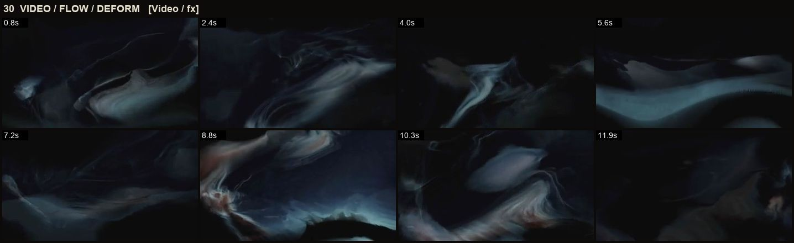

| | |
|---|---|
| **מה רואים** | עשן כהה, כמעט שחור, באפור-כחול עם נגיעות סלמון ושובלים איטיים. |
| **פלטה** | פחם-כחלחל, סלמון עמום. נמדד: `#13151B` 31%, `#0D0D0F` 24%, `#0D0B0D` 23%, `#2C363E` 18% |
| **טכניקה ותגובה לסאונד** | FLOW ו-DEFORM על וידאו (כנראה עשן או דיו במים). |
| **תנועה ועריכה** | הקליפ הכי שקט בשואוקייס. נמדד: בהירות ממוצעת 24/255, 0% מהזמן כמעט שחור, 0.0 קאטים לשנייה. |
| **רלוונטיות לבעלים** | **גבוה**. אמביינט טהור. אפשר לשחזר גנרטיבית, Signal Fog ו-Ink שלנו קרובים. |

### 31. EARL / DRIFT

- **קרדיט:** Zwobot (אין קרדיט לאמן בעמוד). **מקור:** SR / generative / fx. **אורך:** 10 שנ'.
- **וידאו:** https://www.zwobotmax.com/showcase/Showcase_01_2018.mp4
- **פריימים בודדים:** `images/zwobot-showcase/31-earl-drift-t006.jpg` … `31-earl-drift-t094.jpg`

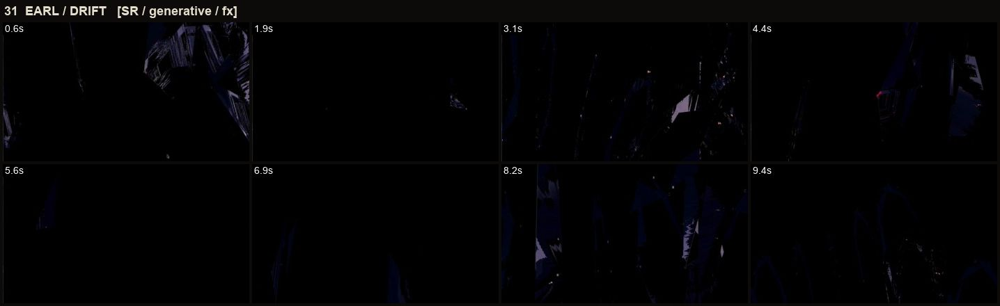

| | |
|---|---|
| **מה רואים** | כמעט שחור לגמרי. רסיסים סגולים עמומים מופיעים רק על צליל חזק. |
| **פלטה** | שחור. נמדד: `#000000` 82%, `#000002` 6%, `#010007` 5%, `#0C0B15` 4% |
| **טכניקה ותגובה לסאונד** | EARL הוא גנרטור SR של צורות, ובלי צליל חזק אין תמונה. |
| **תנועה ועריכה** | מת. נמדד: בהירות ממוצעת 1/255, 100% מהזמן כמעט שחור, 0.0 קאטים לשנייה. |
| **רלוונטיות לבעלים** | **בינוני**. שיעור ב-UX: כש-SR לא מכויל, המסך מת. |

### 32. EARL x2 / BLOR / KALEIDO

- **קרדיט:** Zwobot (אין קרדיט לאמן בעמוד). **מקור:** SR / generative / fx. **אורך:** 10 שנ'.
- **וידאו:** https://www.zwobotmax.com/showcase/Showcase_02_2018.mp4
- **פריימים בודדים:** `images/zwobot-showcase/32-earl-x2-blor-kaleido-t006.jpg` … `32-earl-x2-blor-kaleido-t098.jpg`

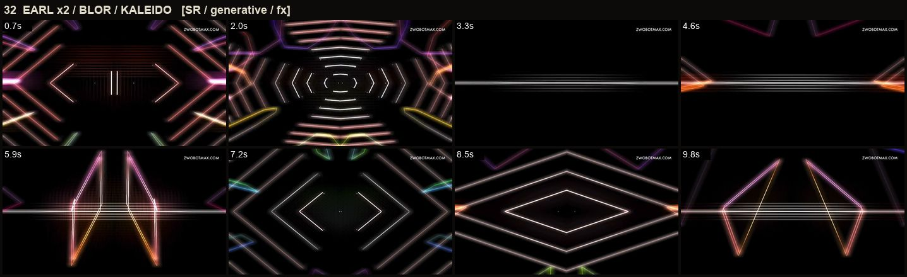

| | |
|---|---|
| **מה רואים** | גאומטריה של קווי ניאון עם bloom: שברונים, יהלומים, וקו אופקי יחיד על שחור. בפינה סימן מים ZWOBOTMAX.COM. |
| **פלטה** | שחור, חום-אדמדם, ניאון ורוד, כתום וסגול. נמדד: `#000000` 51%, `#0C0707` 23%, `#4E3C3C` 16%, `#040001` 8% |
| **טכניקה ותגובה לסאונד** | EARL פעמיים, BLOR (bloom/blur), KALEIDO. |
| **תנועה ועריכה** | פחות מקפיצה אחת בשנייה. במנוחה נשאר קו אופקי אחד. נמדד: בהירות ממוצעת 18/255, 26% מהזמן כמעט שחור, 0.8 קאטים לשנייה. |
| **רלוונטיות לבעלים** | **בינוני**. המצב של "קו אחד בשקט" מצוין לאמביינט. |

### 33. EARL / DRIFT

- **קרדיט:** Zwobot (אין קרדיט לאמן בעמוד). **מקור:** SR / generative / fx. **אורך:** 10 שנ'.
- **וידאו:** https://www.zwobotmax.com/showcase/Showcase_03_2018.mp4
- **פריימים בודדים:** `images/zwobot-showcase/33-earl-drift-t006.jpg` … `33-earl-drift-t094.jpg`

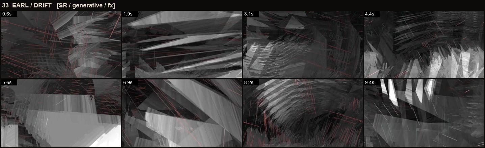

| | |
|---|---|
| **מה רואים** | רסיסים של זכוכית או פלדה אפורה, שקופים למחצה וחופפים, עם שריטות אדומות דקות באלכסון. |
| **פלטה** | אפורים מפחם עד בהיר, אדום בקווים בלבד. נמדד: `#312F2F` 29%, `#1D1B1B` 24%, `#484747` 21%, `#6A6A6A` 14% |
| **טכניקה ותגובה לסאונד** | EARL (לוחות SR) ו-DRIFT. |
| **תנועה ועריכה** | כקפיצה אחת בשנייה. נמדד: בהירות ממוצעת 65/255, 0% מהזמן כמעט שחור, 1.0 קאטים לשנייה. |
| **רלוונטיות לבעלים** | **גבוה מאוד**. אפור תעשייתי עם קו אדום. כמעט בדיוק הרפרנס של הבעלים. |

### 34. TWST / FDBK / LINR

- **קרדיט:** Zwobot (אין קרדיט לאמן בעמוד). **מקור:** SR / generative / fx. **אורך:** 10 שנ'.
- **וידאו:** https://zwobotmax.com/showcase/Showcase_2018_23.mp4
- **פריימים בודדים:** `images/zwobot-showcase/34-twst-fdbk-linr-t006.jpg` … `34-twst-fdbk-linr-t095.jpg`

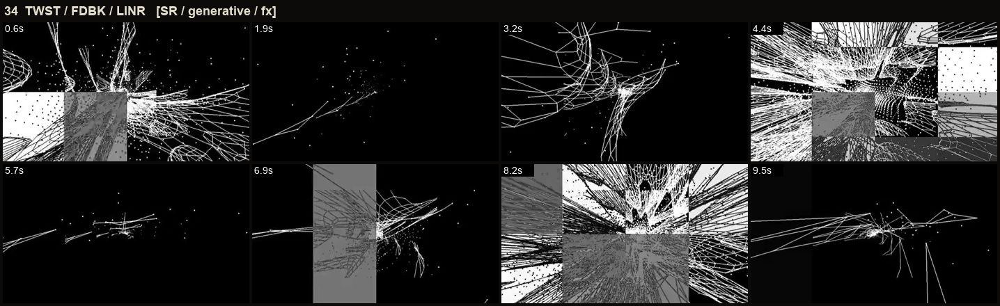

| | |
|---|---|
| **מה רואים** | wireframe לבן (רשתות, מניפות קווים, נקודות), ו-LINR מוסיף אריחים אפורים ולבנים בגריד. |
| **פלטה** | שחור, אפורים, לבן. נמדד: `#000000` 56%, `#6D6D6D` 15%, `#424242` 11%, `#C6C6C6` 10% |
| **טכניקה ותגובה לסאונד** | TWST, FDBK, LINR. |
| **תנועה ועריכה** | חזק, כחמש קפיצות בשנייה. נמדד: בהירות ממוצעת 44/255, 42% מהזמן כמעט שחור, 5.2 קאטים לשנייה. |
| **רלוונטיות לבעלים** | **גבוה**. קווים ובלוקים במונו. הקצב מהיר מדי לאמביינט, ועל downbeat בלבד זה יעבוד. |

### 35. TWST / FDBK

- **קרדיט:** Zwobot (אין קרדיט לאמן בעמוד). **מקור:** SR / generative / fx. **אורך:** 10 שנ'.
- **וידאו:** https://zwobotmax.com/showcase/Showcase_2018_24.mp4
- **פריימים בודדים:** `images/zwobot-showcase/35-twst-fdbk-t006.jpg` … `35-twst-fdbk-t095.jpg`

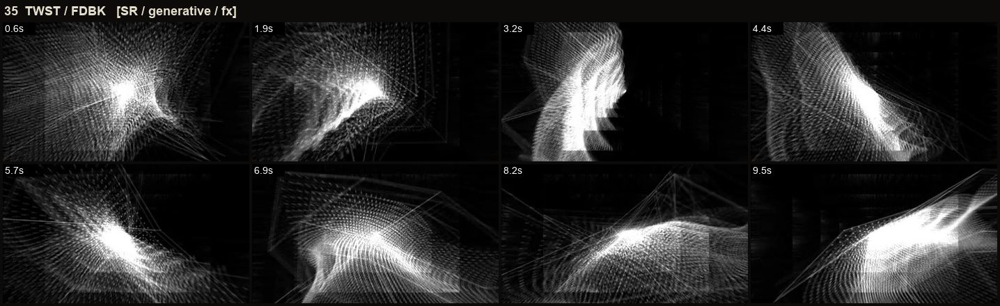

| | |
|---|---|
| **מה רואים** | ענן צפוף של רשת לבנה (אלפי קווים ונקודות) עם שובלי feedback, בד שמתקפל. |
| **פלטה** | פחם, אפור, לבן. נמדד: `#232323` 28%, `#000000` 21%, `#858585` 18%, `#0A0A0A` 17% |
| **טכניקה ותגובה לסאונד** | TWST (plexus) ו-FDBK (trails). |
| **תנועה ועריכה** | זרימה רציפה, בלי קאטים. נמדד: בהירות ממוצעת 45/255, 0% מהזמן כמעט שחור, 0.0 קאטים לשנייה. |
| **רלוונטיות לבעלים** | **גבוה מאוד**. הכי קרוב ל-Noise Diary. ההבדל מ-Mesh Body: אין כאן גוף סגור, זה בד פתוח. |

### 36. TWST / MULTI

- **קרדיט:** Zwobot (אין קרדיט לאמן בעמוד). **מקור:** SR / generative / fx. **אורך:** 10 שנ'.
- **וידאו:** https://zwobotmax.com/showcase/Showcase_2018_25.mp4
- **פריימים בודדים:** `images/zwobot-showcase/36-twst-multi-t006.jpg` … `36-twst-multi-t098.jpg`

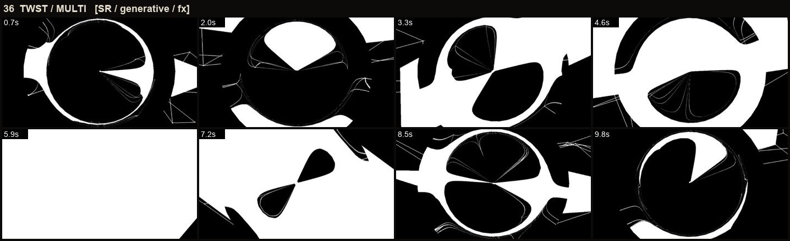

| | |
|---|---|
| **מה רואים** | 1-bit שחור-לבן: טבעת לבנה גדולה עם טריז שחור, צורות טיפה, פריים לבן מלא וקווים דקים. |
| **פלטה** | שחור ולבן. נמדד: `#000000` 47%, `#FFFFFF` 43%, `#040404` 5%, `#2C2C2C` 4% |
| **טכניקה ותגובה לסאונד** | TWST ו-MULTI (צורה). |
| **תנועה ועריכה** | כארבע וחצי קפיצות בשנייה. נמדד: בהירות ממוצעת 102/255, 6% מהזמן כמעט שחור, 4.5 קאטים לשנייה. |
| **רלוונטיות לבעלים** | **בינוני**. זהירות: טבעת עם אישון (8.5 שנ') נקראת כמו עין. |

### 37. VAUDIO / SCAN / DRIFT

- **קרדיט:** Zwobot (אין קרדיט לאמן בעמוד). **מקור:** video / generative / fx. **אורך:** 10 שנ'.
- **וידאו:** https://zwobotmax.com/showcase/Showcase_04_2018.mp4
- **פריימים בודדים:** `images/zwobot-showcase/37-vaudio-scan-drift-t006.jpg` … `37-vaudio-scan-drift-t094.jpg`

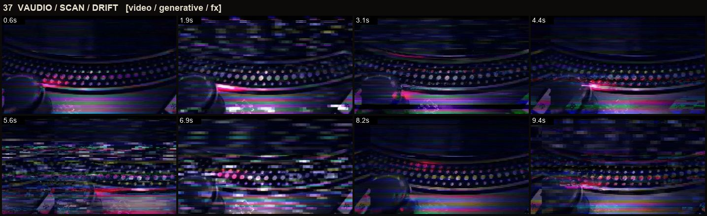

| | |
|---|---|
| **מה רואים** | וידאו של פטיפון (צלחת עם נקודות) עם שורות scan צבעוניות מהבהבות. |
| **פלטה** | כחול-לילה, מג'נטה. נמדד: `#18152E` 25%, `#010312` 21%, `#4B4561` 19%, `#05071A` 19% |
| **טכניקה ותגובה לסאונד** | VAUDIO, SCAN, DRIFT על וידאו. |
| **תנועה ועריכה** | רציף. נמדד: בהירות ממוצעת 31/255, 0% מהזמן כמעט שחור, 0.1 קאטים לשנייה. |
| **רלוונטיות לבעלים** | **נמוך**. וידאו מצולם וקלישאת DJ. |

### 38. OSSI / VAUDIO / SCAN / COLOEUR

- **קרדיט:** Zwobot (אין קרדיט לאמן בעמוד). **מקור:** SR / generative / fx. **אורך:** 12 שנ'.
- **וידאו:** https://zwobotmax.com/showcase/Showcase_05_2018.mp4
- **פריימים בודדים:** `images/zwobot-showcase/38-ossi-vaudio-scan-coloeur-t007.jpg` … `38-ossi-vaudio-scan-coloeur-t111.jpg`

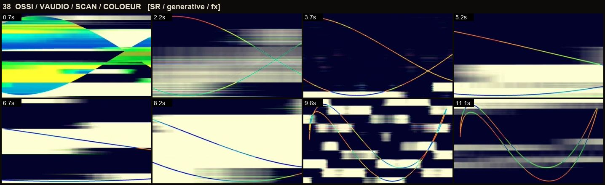

| | |
|---|---|
| **מה רואים** | עקומות אוסצילוסקופ (סינוסים בכתום, ירוק וכחול) על נייבי, עם פסי קרם מטושטשים שקופצים. |
| **פלטה** | נייבי, קרם, ירוק-אפור. נמדד: `#03022A` 39%, `#EFFBC4` 28%, `#768B86` 19%, `#0F0C2E` 8% |
| **טכניקה ותגובה לסאונד** | OSSI (צורת הגל האמיתית), VAUDIO (פסים לפי אודיו), SCAN, COLOEUR. |
| **תנועה ועריכה** | הפסים קופצים כמעט בכל פריים. נמדד: בהירות ממוצעת 85/255, 0% מהזמן כמעט שחור, 7.8 קאטים לשנייה. |
| **רלוונטיות לבעלים** | **בינוני-נמוך**. הרעיון (הגל האמיתי כקו) חשוב, הביצוע צבעוני מדי. |

### 39. OSSI x3

- **קרדיט:** Zwobot (אין קרדיט לאמן בעמוד). **מקור:** SR / generative. **אורך:** 10 שנ'.
- **וידאו:** https://www.zwobotmax.com/showcase/Showcase_06_2018.mp4
- **פריימים בודדים:** `images/zwobot-showcase/39-ossi-x3-t006.jpg` … `39-ossi-x3-t094.jpg`

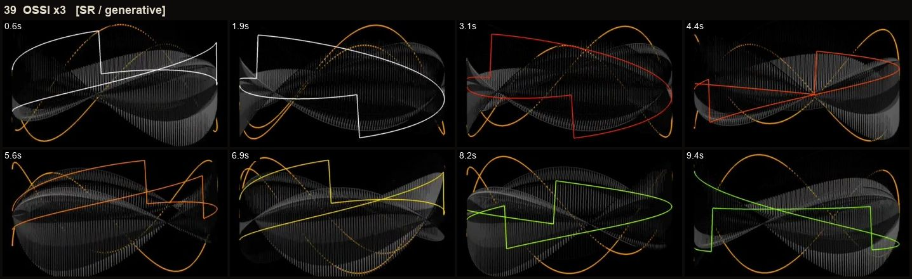

| | |
|---|---|
| **מה רואים** | שלוש שכבות אוסצילוסקופ: קו XY שצבעו מתחלף (לבן, אדום, כתום, צהוב, ירוק), סינוס מנוקד בכתום, וסרט אפור צפוף של קווים אנכיים. |
| **פלטה** | שחור, חום-אפור, כתום, אדום. נמדד: `#000000` 31%, `#100F0E` 26%, `#39352D` 21%, `#030202` 17% |
| **טכניקה ותגובה לסאונד** | OSSI בשלושה מצבים. הקו הוא האודיו עצמו, ערוץ L כ-X וערוץ R כ-Y. |
| **תנועה ועריכה** | רציף וקריא מאוד. נמדד: בהירות ממוצעת 18/255, 2% מהזמן כמעט שחור, 0.0 קאטים לשנייה. |
| **רלוונטיות לבעלים** | **גבוה**. קו אחד שהוא הסאונד עצמו. אצלנו ב-bone ובאדום בלבד. |

### 40. VSINE x2 / RGBEE

- **קרדיט:** Zwobot (אין קרדיט לאמן בעמוד). **מקור:** SR / generative / fx. **אורך:** 10 שנ'.
- **וידאו:** https://www.zwobotmax.com/showcase/Showcase_2018_10.mp4
- **פריימים בודדים:** `images/zwobot-showcase/40-vsine-x2-rgbee-t006.jpg` … `40-vsine-x2-rgbee-t094.jpg`

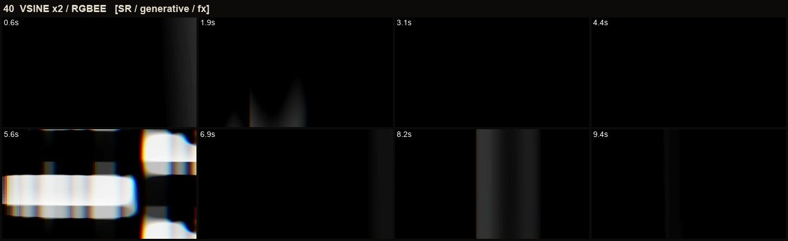

| | |
|---|---|
| **מה רואים** | כמעט שחור, עמודות אור אפורות ורכות, ופיצוץ אחד של פס לבן עם שוליים RGB. |
| **פלטה** | שחור, אפור. נמדד: `#000000` 81%, `#0C0B0B` 10%, `#80807E` 5%, `#040003` 2% |
| **טכניקה ותגובה לסאונד** | VSINE פעמיים ו-RGBEE. שקט = כהה, מכה = פס. |
| **תנועה ועריכה** | הבהובים על מכות. נמדד: בהירות ממוצעת 28/255, 49% מהזמן כמעט שחור, 4.1 קאטים לשנייה. |
| **רלוונטיות לבעלים** | **גבוה**. איפוק כגישה. |

### 41. VAUDIO / PETRA / NEGATIF / KALEIDO

- **קרדיט:** Zwobot (אין קרדיט לאמן בעמוד). **מקור:** SR / generative / fx. **אורך:** 10 שנ'.
- **וידאו:** https://www.zwobotmax.com/showcase/Showcase_2018_08.mp4
- **פריימים בודדים:** `images/zwobot-showcase/41-vaudio-petra-negatif-kaleido-t006.jpg` … `41-vaudio-petra-negatif-kaleido-t095.jpg`

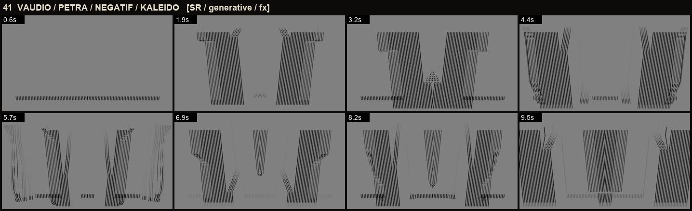

| | |
|---|---|
| **מה רואים** | רקע אפור בינוני, לא שחור. עליו צורות V ו-Y מקווים שחורים אנכיים וצפופים כמו תחריט, בסימטריה. |
| **פלטה** | אפור בינוני ופחם. נמדד: `#808080` 64%, `#525252` 17%, `#606060` 11%, `#747474` 4% |
| **טכניקה ותגובה לסאונד** | VAUDIO (פסים) → PETRA (קווים) → NEGATIF → KALEIDO. |
| **תנועה ועריכה** | בלי קאטים, הצורות צומחות. נמדד: בהירות ממוצעת 114/255, 0% מהזמן כמעט שחור, 0.0 קאטים לשנייה. |
| **רלוונטיות לבעלים** | **גבוה**. רקע אפור הוא כלי שעוד לא ניצלנו. נראה כמו הדפס. |

### 42. VAUDIO / PETRA / NEGATIF

- **קרדיט:** Zwobot (אין קרדיט לאמן בעמוד). **מקור:** SR / generative. **אורך:** 10 שנ'.
- **וידאו:** https://www.zwobotmax.com/showcase/Showcase_2018_09.mp4
- **פריימים בודדים:** `images/zwobot-showcase/42-vaudio-petra-negatif-t006.jpg` … `42-vaudio-petra-negatif-t094.jpg`

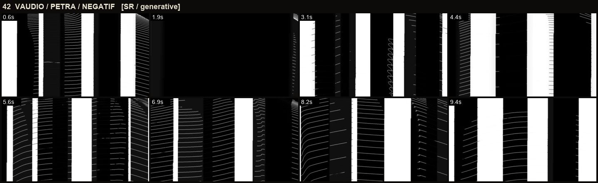

| | |
|---|---|
| **מה רואים** | עמודות לבנות מלאות כמו ברקוד, וקווי שיער דקים ומתעקלים ביניהן, על שחור. |
| **פלטה** | שחור ולבן. נמדד: `#000000` 43%, `#FFFFFF` 22%, `#040404` 19%, `#262626` 12% |
| **טכניקה ותגובה לסאונד** | VAUDIO (עמודות לפי הסאונד) → PETRA (קווי סריקה) → NEGATIF. |
| **תנועה ועריכה** | העמודות קופצות כמעט בכל פריים. נמדד: בהירות ממוצעת 78/255, 2% מהזמן כמעט שחור, 8.0 קאטים לשנייה. |
| **רלוונטיות לבעלים** | **גבוה**. Ikeda פוגש Rutt-Etra. Terminal ו-One Bit שלנו קרובים. |

### 43. VAUDIO / FISH / RGB / VHS

- **קרדיט:** Zwobot (אין קרדיט לאמן בעמוד). **מקור:** SR / generative / fx. **אורך:** 10 שנ'.
- **וידאו:** https://www.zwobotmax.com/showcase/Showcase_2018_26.mp4
- **פריימים בודדים:** `images/zwobot-showcase/43-vaudio-fish-rgb-vhs-t006.jpg` … `43-vaudio-fish-rgb-vhs-t095.jpg`

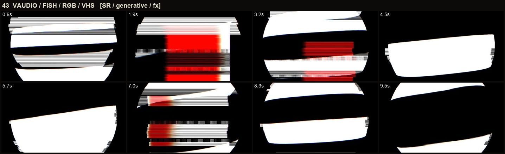

| | |
|---|---|
| **מה רואים** | רצועות לבנות בתוך עיגול fisheye, ובלוקים אדומים טהורים עם קריעת VHS. |
| **פלטה** | שחור, לבן, אדום. נמדד: `#000000` 48%, `#FFFFFF` 34%, `#916A69` 10%, `#040001` 5% |
| **טכניקה ותגובה לסאונד** | VAUDIO, FISHEYE, RGB, VHS. |
| **תנועה ועריכה** | כשבע קפיצות בשנייה. נמדד: בהירות ממוצעת 92/255, 5% מהזמן כמעט שחור, 7.4 קאטים לשנייה. |
| **רלוונטיות לבעלים** | **בינוני-גבוה**. שחור, לבן ואדום טהור. |

### 44. VAUDIO / PETRA / RGB / VHS

- **קרדיט:** Zwobot (אין קרדיט לאמן בעמוד). **מקור:** SR / generative / fx. **אורך:** 10 שנ'.
- **וידאו:** https://www.zwobotmax.com/showcase/Showcase_2018_27.mp4
- **פריימים בודדים:** `images/zwobot-showcase/44-vaudio-petra-rgb-vhs-t006.jpg` … `44-vaudio-petra-rgb-vhs-t094.jpg`

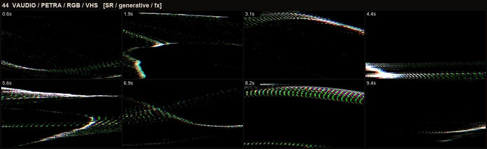

| | |
|---|---|
| **מה רואים** | קווי סריקה מנוקדים (Rutt-Etra מנקודות) בגלים על שחור, עם שוליים RGB. רוב המסך ריק. |
| **פלטה** | שחור. נמדד: `#000000` 71%, `#020202` 16%, `#323B31` 7%, `#000002` 3% |
| **טכניקה ותגובה לסאונד** | VAUDIO → PETRA → RGB → VHS. |
| **תנועה ועריכה** | זורם, בלי קאטים. נמדד: בהירות ממוצעת 8/255, 81% מהזמן כמעט שחור, 0.0 קאטים לשנייה. |
| **רלוונטיות לבעלים** | **גבוה**. קווי נקודות דקים על שחור. |

### 45. VAUDIO / PETRA / VHS / LINR

- **קרדיט:** Zwobot (אין קרדיט לאמן בעמוד). **מקור:** SR / generative / fx. **אורך:** 10 שנ'.
- **וידאו:** https://www.zwobotmax.com/showcase/Showcase_2018_28.mp4
- **פריימים בודדים:** `images/zwobot-showcase/45-vaudio-petra-vhs-linr-t006.jpg` … `45-vaudio-petra-vhs-linr-t094.jpg`

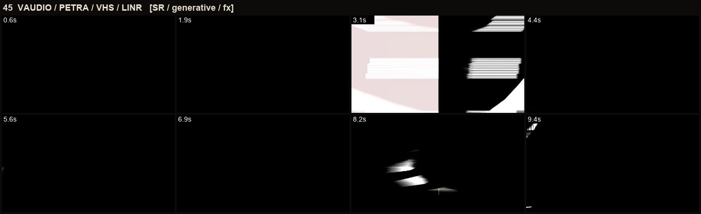

| | |
|---|---|
| **מה רואים** | 90% שחור. פריים אחד של בלוק ורוד-חיוור ולבן עם שורות, ועוד רסיסים לבנים קטנים. |
| **פלטה** | שחור, ורוד-לבן. נמדד: `#000000` 91%, `#F5EFEF` 7%, `#A0999A` 1%, `#000002` 1% |
| **טכניקה ותגובה לסאונד** | VAUDIO, PETRA, VHS, LINR. |
| **תנועה ועריכה** | הבזקים. נמדד: בהירות ממוצעת 40/255, 52% מהזמן כמעט שחור, 4.3 קאטים לשנייה. |
| **רלוונטיות לבעלים** | **בינוני**. איפוק קיצוני, אולי יותר מדי. |

### 46. EARL / BLUR / COULEUR

- **קרדיט:** Zwobot (אין קרדיט לאמן בעמוד). **מקור:** SR / generative / fx. **אורך:** 10 שנ'.
- **וידאו:** https://www.zwobotmax.com/showcase/Showcase_2018_14.mp4
- **פריימים בודדים:** `images/zwobot-showcase/46-earl-blur-couleur-t006.jpg` … `46-earl-blur-couleur-t094.jpg`

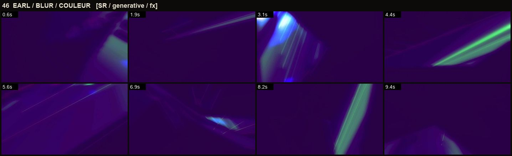

| | |
|---|---|
| **מה רואים** | שדה סגול עמוק עם רסיסי אור מטושטשים בירוק ובכחול. |
| **פלטה** | סגול. נמדד: `#290044` 52%, `#2C014E` 18%, `#2C004E` 13%, `#433C78` 9% |
| **טכניקה ותגובה לסאונד** | EARL, BLUR, COULEUR (גוון אחד על כל המסך). |
| **תנועה ועריכה** | כקפיצה אחת בשנייה. נמדד: בהירות ממוצעת 25/255, 0% מהזמן כמעט שחור, 1.1 קאטים לשנייה. |
| **רלוונטיות לבעלים** | **נמוך**. הטכניקה: טשטוש וגוון יחיד הופכים גרפיקה לאור. |

### 47. VAUDIO / PETRA / RGBEE / NEGATIF

- **קרדיט:** Zwobot (אין קרדיט לאמן בעמוד). **מקור:** SR / generative / fx. **אורך:** 10 שנ'.
- **וידאו:** https://www.zwobotmax.com/showcase/Showcase_2018_11.mp4
- **פריימים בודדים:** `images/zwobot-showcase/47-vaudio-petra-rgbee-negatif-t006.jpg` … `47-vaudio-petra-rgbee-negatif-t093.jpg`

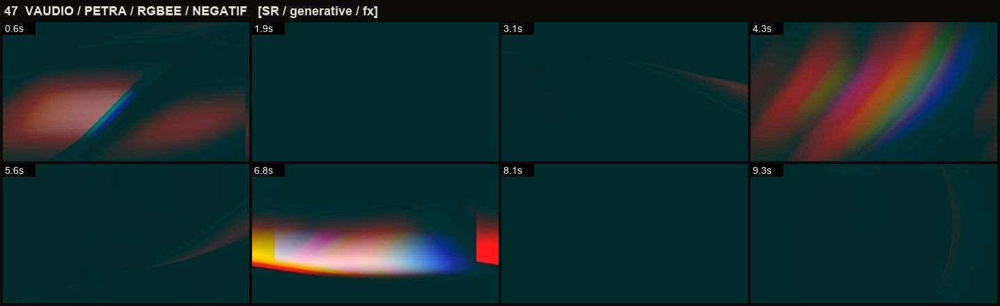

| | |
|---|---|
| **מה רואים** | שדה טורקיז-כהה אחיד. על מכות מופיעות דליפות אור רכות באדום ובצבעי קשת, ונעלמות. |
| **פלטה** | טורקיז-כהה, חום-אדמדם. נמדד: `#012B2A` 70%, `#48282A` 11%, `#002B2B` 8%, `#323C3C` 6% |
| **טכניקה ותגובה לסאונד** | VAUDIO → PETRA → RGBEE → NEGATIF. אחרי ה-negative הכהה הופך לרקע, והפסים המטושטשים הופכים לדליפות אור. |
| **תנועה ועריכה** | רציף עם פולסים. נמדד: בהירות ממוצעת 39/255, 0% מהזמן כמעט שחור, 0.4 קאטים לשנייה. |
| **רלוונטיות לבעלים** | **בינוני-גבוה**. light leak על מכה, בדיוק מה שחסר ב-look chain שלנו. |

### 48. VSINE / PETRA / OFFSET / COULEUR

- **קרדיט:** Zwobot (אין קרדיט לאמן בעמוד). **מקור:** SR / generative / fx. **אורך:** 10 שנ'.
- **וידאו:** https://www.zwobotmax.com/showcase/Showcase_2018_12.mp4
- **פריימים בודדים:** `images/zwobot-showcase/48-vsine-petra-offset-couleur-t006.jpg` … `48-vsine-petra-offset-couleur-t094.jpg`

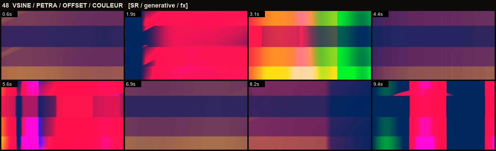

| | |
|---|---|
| **מה רואים** | פסים אופקיים רחבים במאוב, נייבי, ורוד חם וירוק. ה-offset מזיז אותם. |
| **פלטה** | סגול, ורוד חם, מאוב. נמדד: `#3A2360` 31%, `#F8135C` 28%, `#794655` 21%, `#4D2C5D` 11% |
| **טכניקה ותגובה לסאונד** | VSINE, PETRA, OFFSET, COULEUR. |
| **תנועה ועריכה** | כקפיצה וחצי בשנייה. נמדד: בהירות ממוצעת 65/255, 0% מהזמן כמעט שחור, 1.6 קאטים לשנייה. |
| **רלוונטיות לבעלים** | **נמוך** |

### 49. VAUDIO / LINR

- **קרדיט:** Zwobot (אין קרדיט לאמן בעמוד). **מקור:** SR / generative / fx. **אורך:** 10 שנ'.
- **וידאו:** https://www.zwobotmax.com/showcase/Showcase_2018_13.mp4
- **פריימים בודדים:** `images/zwobot-showcase/49-vaudio-linr-t006.jpg` … `49-vaudio-linr-t094.jpg`

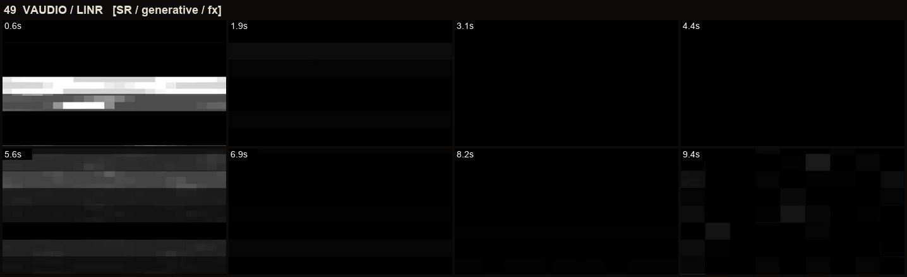

| | |
|---|---|
| **מה רואים** | 85% שחור. שורות פיקסלים אפורות-לבנות (בר-גרף מקוונטז) מופיעות לרגע. |
| **פלטה** | שחור, אפור. נמדד: `#000000` 66%, `#060606` 10%, `#131313` 10%, `#020202` 8% |
| **טכניקה ותגובה לסאונד** | VAUDIO → LINR: הסאונד הופך לשורות ועמודות. |
| **תנועה ועריכה** | הבזקים. נמדד: בהירות ממוצעת 9/255, 85% מהזמן כמעט שחור, 1.4 קאטים לשנייה. |
| **רלוונטיות לבעלים** | **בינוני-גבוה**. מינימלי ומונו. |

### 50. EARL / BLOR

- **קרדיט:** Zwobot (אין קרדיט לאמן בעמוד). **מקור:** SR / generative / fx. **אורך:** 10 שנ'.
- **וידאו:** https://www.zwobotmax.com/showcase/Showcase_2018_16.mp4
- **פריימים בודדים:** `images/zwobot-showcase/50-earl-blor-t006.jpg` … `50-earl-blor-t094.jpg`

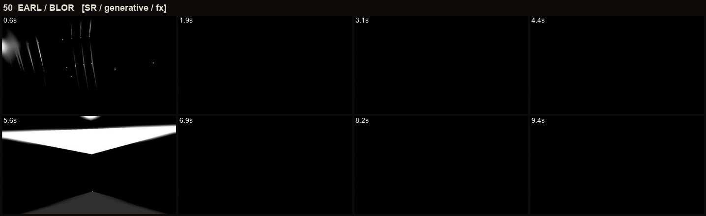

| | |
|---|---|
| **מה רואים** | 94% שחור. פסי אור לבנים דקים עם נקודות, ועל מכה מישור לבן בפרספקטיבה (תקרה או רצפה). |
| **פלטה** | שחור ולבן. נמדד: `#000000` 94%, `#FFFFFF` 2%, `#111111` 2%, `#010101` 2% |
| **טכניקה ותגובה לסאונד** | EARL ו-BLOR. |
| **תנועה ועריכה** | כשני הבזקים בשנייה. נמדד: בהירות ממוצעת 17/255, 79% מהזמן כמעט שחור, 1.8 קאטים לשנייה. |
| **רלוונטיות לבעלים** | **בינוני-גבוה**. קרוב ל-Corridor שלנו, אבל מופיע רק על המכה. |

### 51. DUKE / BLOR

- **קרדיט:** Zwobot (אין קרדיט לאמן בעמוד). **מקור:** SR / generative. **אורך:** 10 שנ'.
- **וידאו:** https://www.zwobotmax.com/showcase/Showcase_2018_17.mp4
- **פריימים בודדים:** `images/zwobot-showcase/51-duke-blor-t006.jpg` … `51-duke-blor-t095.jpg`

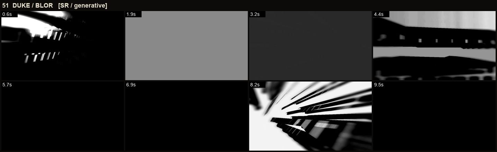

| | |
|---|---|
| **מה רואים** | מבנה תלת-ממדי בשחור-לבן (גשר או מגדל ברוטליסטי) בזום עם motion blur, פריימים אפורים אחידים ושחור. |
| **פלטה** | שחור, אפור אחיד, אפור בהיר. נמדד: `#000000` 58%, `#898989` 17%, `#323232` 15%, `#CFCFCF` 8% |
| **טכניקה ותגובה לסאונד** | DUKE (גנרטור SR בתלת-ממד) ו-BLOR. |
| **תנועה ועריכה** | שחור → אפור אחיד → מבנה, כקפיצה בשנייה. נמדד: בהירות ממוצעת 32/255, 69% מהזמן כמעט שחור, 1.2 קאטים לשנייה. |
| **רלוונטיות לבעלים** | **גבוה**. תעשייתי ומונו. |

### 52. VSINE / DRIFT

- **קרדיט:** Zwobot (אין קרדיט לאמן בעמוד). **מקור:** generative / fx. **אורך:** 10 שנ'.
- **וידאו:** https://www.zwobotmax.com/showcase/Showcase_2018_15.mp4
- **פריימים בודדים:** `images/zwobot-showcase/52-vsine-drift-t006.jpg` … `52-vsine-drift-t094.jpg`

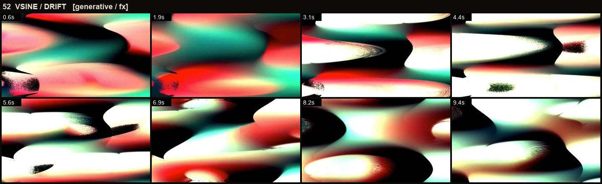

| | |
|---|---|
| **מה רואים** | כתמים רכים באלמוג, טורקיז וקרם, עם כתמי ריסוס של פיקסלים מפוזרים. |
| **פלטה** | קרם, בורדו כהה, אלמוג, ירוק-אפור. נמדד: `#FEF7EE` 29%, `#2D0809` 23%, `#CA5851` 17%, `#BACAA6` 16% |
| **טכניקה ותגובה לסאונד** | VSINE ו-DRIFT (grain distortion, הזזת פיקסלים). |
| **תנועה ועריכה** | רך. נמדד: בהירות ממוצעת 139/255, 0% מהזמן כמעט שחור, 0.0 קאטים לשנייה. |
| **רלוונטיות לבעלים** | **בינוני**. ריסוס האבקה של DRIFT נותן חומר. |

### 53. VSINE / COULEUR

- **קרדיט:** Zwobot (אין קרדיט לאמן בעמוד). **מקור:** video / generative / fx. **אורך:** 13 שנ'.
- **וידאו:** https://www.zwobotmax.com/showcase/Showcase_2018_21.mp4
- **פריימים בודדים:** `images/zwobot-showcase/53-vsine-couleur-t008.jpg` … `53-vsine-couleur-t122.jpg`

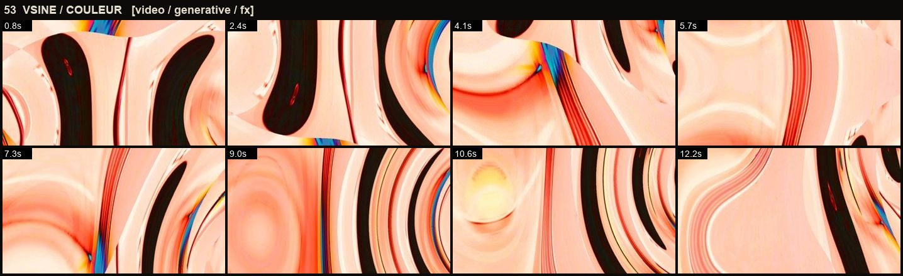

| | |
|---|---|
| **מה רואים** | סרטים עבים בשחור-חום על אפרסק-סלמון, קווים אדומים דקים וניצוצות קשת. |
| **פלטה** | אפרסק, סלמון, חום-אדום. נמדד: `#FBB492` 28%, `#FFCFB3` 20%, `#823D2C` 18%, `#FFE2CA` 16% |
| **טכניקה ותגובה לסאונד** | VSINE ו-COULEUR (מיפוי גרדיאנט). |
| **תנועה ועריכה** | רך. נמדד: בהירות ממוצעת 177/255, 0% מהזמן כמעט שחור, 0.0 קאטים לשנייה. |
| **רלוונטיות לבעלים** | **בינוני-גבוה**. פלטת bone-סלמון-שחור. זהירות קלה: אליפסות שחורות עם חור אדום קטן. |

### 54. VSINE / NEGATIVE / COULEUR / FDBK

- **קרדיט:** Zwobot (אין קרדיט לאמן בעמוד). **מקור:** video / generative / fx. **אורך:** 10 שנ'.
- **וידאו:** https://www.zwobotmax.com/showcase/Showcase_2018_22.mp4
- **פריימים בודדים:** `images/zwobot-showcase/54-vsine-negative-couleur-fdbk-t006.jpg` … `54-vsine-negative-couleur-fdbk-t094.jpg`

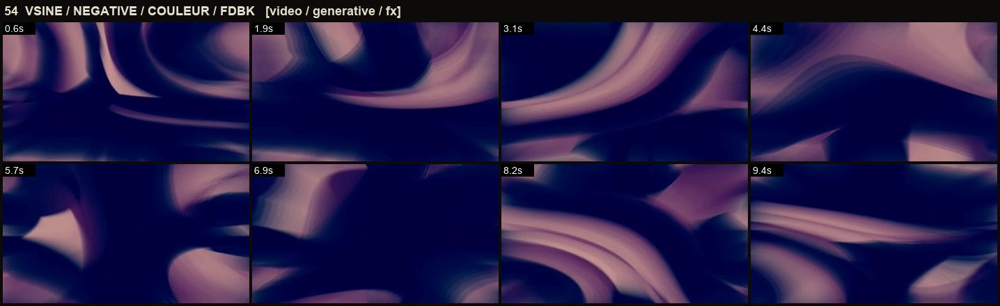

| | |
|---|---|
| **מה רואים** | קפלים רכים בנייבי ובמאוב מאובק, כמו משי בחושך. |
| **פלטה** | נייבי, מאוב. נמדד: `#01013E` 26%, `#825B74` 26%, `#040442` 17%, `#261F53` 16% |
| **טכניקה ותגובה לסאונד** | VSINE → NEGATIVE → COULEUR → FDBK. |
| **תנועה ועריכה** | זרימה איטית בלי קאטים. נמדד: בהירות ממוצעת 38/255, 0% מהזמן כמעט שחור, 0.0 קאטים לשנייה. |
| **רלוונטיות לבעלים** | **בינוני-גבוה**. מתאים לאמביינט. להחליף את הפלטה ל-warm black ו-bone. |

### 55. DUKE x2

- **קרדיט:** Zwobot (אין קרדיט לאמן בעמוד). **מקור:** video / generative. **אורך:** 10 שנ'.
- **וידאו:** https://www.zwobotmax.com/showcase/Showcase_2018_18.mp4
- **פריימים בודדים:** `images/zwobot-showcase/55-duke-x2-t006.jpg` … `55-duke-x2-t094.jpg`

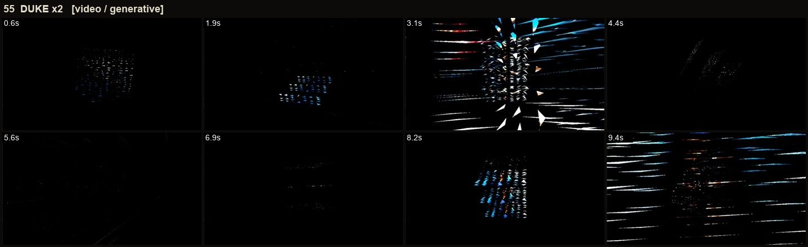

| | |
|---|---|
| **מה רואים** | קובייה של רסיסים ונקודות קטנות (גריד בתלת-ממד) בחלל שחור. על מכה הכל מתפוצץ לפסי אור אופקיים ולמשולשים. |
| **פלטה** | שחור, כחול ונחושת בנקודות. נמדד: `#000000` 81%, `#020203` 8%, `#2D3439` 5%, `#020001` 4% |
| **טכניקה ותגובה לסאונד** | DUKE פעמיים (instancing שמגיב לסאונד). |
| **תנועה ועריכה** | כפיצוץ אחד בשנייה. נמדד: בהירות ממוצעת 7/255, 89% מהזמן כמעט שחור, 0.9 קאטים לשנייה. |
| **רלוונטיות לבעלים** | **גבוה**. מבנה ברור: מכה = פיצוץ, שקט = גריד. |

### 56. DUKE / MULTI / DRIFT / COULEUR

- **קרדיט:** Zwobot (אין קרדיט לאמן בעמוד). **מקור:** SR / generative / fx. **אורך:** 10 שנ'.
- **וידאו:** https://www.zwobotmax.com/showcase/Showcase_2018_20.mp4
- **פריימים בודדים:** `images/zwobot-showcase/56-duke-multi-drift-couleur-t006.jpg` … `56-duke-multi-drift-couleur-t094.jpg`

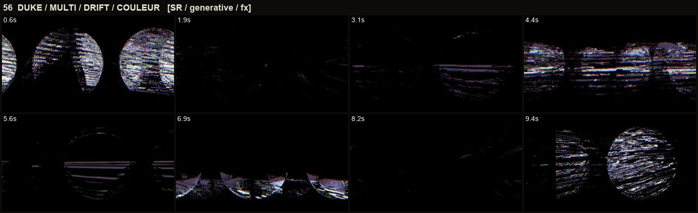

| | |
|---|---|
| **מה רואים** | כדורים ועיגולים עם טקסטורת פסי גליץ', בשורה על שחור. |
| **פלטה** | שחור, אפור-סגול. נמדד: `#000000` 72%, `#060508` 10%, `#4D4954` 9%, `#020002` 5% |
| **טכניקה ותגובה לסאונד** | DUKE, MULTI (עיגולים), DRIFT, COULEUR. |
| **תנועה ועריכה** | הבזקים. נמדד: בהירות ממוצעת 11/255, 70% מהזמן כמעט שחור, 1.4 קאטים לשנייה. |
| **רלוונטיות לבעלים** | **להימנע חלקית**. שני עיגולים זה ליד זה (0.6 ו-9.4 שנ') נקראים כעיניים. |

### 57. DUKE / FISH / DUKE

- **קרדיט:** Zwobot (אין קרדיט לאמן בעמוד). **מקור:** SR / generative / fx. **אורך:** 10 שנ'.
- **וידאו:** https://www.zwobotmax.com/showcase/Showcase_2018_19.mp4
- **פריימים בודדים:** `images/zwobot-showcase/57-duke-fish-duke-t006.jpg` … `57-duke-fish-duke-t093.jpg`

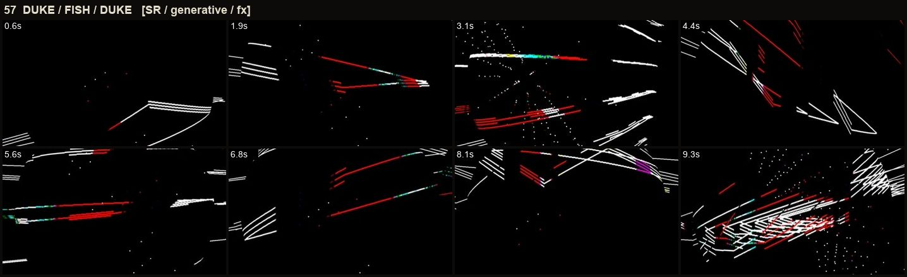

| | |
|---|---|
| **מה רואים** | צרורות של קווים מקווקווים לבנים ואדומים ונקודות, עם fisheye, על שחור. |
| **פלטה** | שחור, אדום, לבן. נמדד: `#000000` 78%, `#635354` 7%, `#000002` 7%, `#040202` 6% |
| **טכניקה ותגובה לסאונד** | DUKE פעמיים ו-FISHEYE. |
| **תנועה ועריכה** | רציף. נמדד: בהירות ממוצעת 9/255, 74% מהזמן כמעט שחור, 0.1 קאטים לשנייה. |
| **רלוונטיות לבעלים** | **גבוה**. לבן ואדום על שחור, רק קווים. |

---

## סינתזה: מה חוזר לאורך השואוקייס

### במספרים

| מדד | ערך |
|---|---|
| קליפים | 57 |
| סוג מקור | SR/generative 22, image 13, video 13, generative 7, fx בלבד 2 |
| כמעט מונוכרום (רוויה ממוצעת נמוכה מ-12) | **30 מתוך 57** |
| קליפי SR שהם מונוכרום | **18 מתוך 22** |
| כהים (בהירות ממוצעת נמוכה מ-35 מתוך 255) | 22 מתוך 57 |
| זורמים (פחות מחצי קאט בשנייה) | 25 |
| כאוטיים (יותר מ-4 קאטים בשנייה) | 12 |
| המודולים הנפוצים ביותר | PETRA 14, DRIFT 12, DEFORM 11, TWST 9, VAUDIO 9, RGB 8, VSINE 8, COULEUR 7 |

### דפוסים

1. **שרשרת קצרה עם תפקידים קבועים.** כמעט כל קליפ טוב בנוי מאותם ארבעה תפקידים, בסדר הזה:
   **מקור או גנרטור** (IMG / VSINE / VAUDIO / TWST / EARL / DUKE / OSSI) → **עיוות או הזזה** (PETRA / DEFORM / FLOW / KETA) → **צבע אחד** (COULEUR / NEGATIF / RGB) → **נזק אחד** (DRIFT / VHS / BLOR).
   שרשראות של 6 או 7 אפקטים (3, 14, 15, 18) יוצאות עמוסות ובלי זהות. זה מאשר את העיקרון מהטריילר, "טיפול אחד חזק לכל סצנה", ומוסיף לו מבנה של 4 משבצות.
2. **PETRA (Rutt-Etra) הוא סוס העבודה.** הוא מופיע ב-14 קליפים ומייצר גם תבליט (12, 24), גם קווי סריקה על שחור (13, 44), גם ברקוד (42) וגם תחריט על אפור (41). זה אפקט אחד שעובד על כל מקור. **אין לנו אותו.** Dot Relief שלנו הוא גנרטור, לא אפקט על מקור, ו-media_lines מוצא קונטורים ולא מזיז שורות.
3. **קליפי ה-SR מנצחים באיפוק.** 18 מתוך 22 קליפי ה-SR הם מונו. הרבה מהם נמצאים רוב הזמן בשחור, 70% עד 94% מהזמן (44, 49, 50, 55, 56, 57), ומתעוררים רק על מכה. **בשקט המסך כהה, ועל מכה יש אירוע.** זה בדיוק האמביינט והדאונטמפו של הבעלים. אבל לאיפוק יש גבול: ב-31 המסך כמעט מת, כי ה-SR לא מכויל.
4. **קווים על שחור הם הז'אנר החזק ביותר.** 26, 34, 35 (plexus), 13 ו-44 (קווי סריקה), 39 (אוסצילוסקופ), 57 (צרורות). כולם לבן או לבן+אדום על שחור, והם הכי קרובים ל-The Noise Diary.
5. **הצבע עובד כשיש צבע אחד.** שלוש משפחות צבע עובדות: מונו מלא; מונו ועוד **אדום בקו דק בלבד** (33, 57, 12, 43); וגוון יחיד על כל המסך דרך COULEUR (46, 47, 54). הקליפים הצבעוניים באמת (1, 3, 8, 11, 18, 20, 23, 48) הם החלשים ביותר.
6. **סימטריה יוצרת פנים.** 25 (kaleido עם מראה ימין-שמאל) מייצר פרצופים ומסכות בכמה פריימים. 36 מייצר עין. 56 מייצר זוג עיניים. 19 ו-53 קרובים לזה. אצל הבעלים זה פוסל.
7. **שלושה משטרי תנועה ברורים:** *זרימה* (0 קאטים: 2, 27, 30, 35, 39, 54), *מכות* (1 עד 2 בשנייה, כלומר על הביט ב-120 BPM: 8, 26, 33, 51, 55), ו*כאוס* (יותר מ-4 בשנייה: 1, 20, 38, 42, 43). הטובים ביותר לטעם שלנו הם זרימה עם אירועים בודדים על מכה.
8. **הבזק לאפור, לא רק לשחור.** ב-51 יש פריים של אפור אחיד (#898989) בין שחור לתמונה, וב-41 כל הרקע אפור בינוני. זו דרך רכה יותר מ-blackout ומ-white flash, והיא מתאימה ל"חדר חושך".

### איפה אנחנו חזקים ואיפה מאחור

| תחום | אנחנו | Zwobot בשואוקייס |
|---|---|---|
| טקסטורת פילם (grain, halation, weave, dust, dither, flicker) | **חזקים.** LookPass מלא | אין. רק DRIFT (פיזור פיקסלים), VHS ו-RGB. שום קליפ לא נראה פילמי |
| plexus וסיבים (26, 35) | Mesh Body, Fibers | שווה. אצלם יותר פתוח ופחות "גוף" |
| מסדרון ופרספקטיבה (50) | Corridor | שווה |
| 1-bit וברקוד (36, 42) | One Bit, Terminal | שווה |
| **Rutt-Etra על כל מקור** | אין | PETRA, בכל מקום |
| **אוסצילוסקופ מהגל האמיתי** | אין (יש לנו רק envelopes) | OSSI |
| **פיצול מסך וריצוף על ביט** | אין | MULTI, PLURAL |
| **אדוות לפי ניגודיות** (קצוות פולטים פסים) | אין | KETA, FLUX |
| **דליפות אור על מכה** | halation קבוע בלבד | 47 |
| **מצב מנוחה מוגדר לכל סצנה** | לא באופן שיטתי | בפועל בכל קליפי ה-SR |
| **שרשרת שמית וגלויה (מתכון)** | סצנה + look, בלי שם למתכון | כל קליפ הוא מתכון עם שם |

---

## המלצות לפי סדר עדיפות (ברמה שמהנדס יכול לממש)

### 1. אפקט `Scan Lines` (Rutt-Etra) כ-pass על כל מקור: עדיפות עליונה
- **קלט:** הטקסטורה של הסצנה הנוכחית או של מדיה (IMG slot).
- **שיידר (fragment, ISF effect):** N שורות אופקיות (`lines` 40 עד 240). לכל פיקסל עוברים על השורות הקרובות (k בטווח ±`maxShift`/spacing). לכל שורה מחשבים `y_k' = y_k - depth * luma(x, y_k)` ואת המרחק האנכי של הפיקסל מ-`y_k'`. הכיסוי הוא `smoothstep` של עובי של 1 עד 1.5 פיקסלים, והצבע הוא bone כפול luma. מצב `dots`: מכפילים ב-`step(fract(x/dotPitch), duty)`, כמו ב-44.
- **אודיו:** `depth` מה-bass envelope; `lines` מתחלף בצעדים (60/120/180) על bar; על kick יש מתיחה (`stretch`) של שורה אחת עד קצה המסך למשך 1/16, כמו ב-13.
- **למה:** אפקט אחד שנותן 4 מראות (תבליט, קווים, ברקוד, תחריט) לכל סצנה ולכל תמונה. זה החור הכי גדול שלנו.

### 2. סצנת `Scope`: אוסצילוסקופ מהגל האמיתי
- **דורש הרחבה של הפרוטוקול:** היום המנוע מקבל דרך `FeatureBus` רק envelopes וספקטרום של 32 פסים (`/v2/frame`, `/v2/spectrum`), בלי צורת גל. צריך הודעה חדשה, למשל `/v2/wave`: 256 עד 512 דגימות L/R, מדוללות ומנורמלות, פעם בפריים, ב-OSC blob. בצד ה-plugin: ring buffer שה-audio thread כותב אליו lock-free ו-timer ששולח ממנו. בצד המנוע: texture בגודל Nx1 (RG float) שמתעדכן ב-`takeSnapshot`, ו-uniform בשם `waveTex` לשיידרים.
- **מצבים:** `Y` (הגל לאורך הזמן), `XY` (L מול R, ליסז'ו, כמו ב-39) ו-`Ring` (הגל על מעגל).
- **ציור:** מרחק לקו פוליגוני בשיידר, בערך 256 מקטעים, או geometry של line strip. זרחן: feedback עם decay של 0.85 עד 0.93 לפריים.
- **פלטה:** קו bone. האדום מופיע רק על transient, בעובי כפול למשך בערך 80ms. בלי קשת.
- **למה:** זה הדבר היחיד שהוא *הסאונד עצמו* ולא תגובה לסאונד. באמביינט עם סינתים איטיים ליסז'ו יפה מאוד.

### 3. כלל "מצב מנוחה" לכל סצנה, ורצפה שלא נותנת למסך למות
- לכל סצנה מגדירים מצב idle ברור: קו אחד (כמו ב-32), גריד שקט (55) או כמעט-שחור עם גרעין.
- פרמטר גלובלי `rest` בין 0 ל-1, שמחושב מה-envelope עם hysteresis (כניסה אחרי שנייה וחצי של שקט, יציאה על onset).
- **רצפה:** אסור שיהיו יותר משתי שניות של שחור מלא בלי כוונה. auto-gain של ה-SR צריך להבטיח שמשהו עדיין זז (הלקח מ-31). כך השקט יהיה כהה ולא מת.

### 4. מעבר ופוסט `Split` על ביט (MULTI / PLURAL)
- pass שמחלק את המסך ל-2, 4 או quad-tree של אריחים. כל אריח מציג את אותו פריים עם offset, זום או **השהיה בזמן** (history buffer של 4 עד 8 פריימים).
- החלוקה מתחלפת על bar, או על beat כש-`energy` גבוה. אפשר גם "חצאים" (12), כלומר חתך אחד שזז.
- **מראה רק בציר אחד או עם סיבוב, לעולם לא ימין-שמאל על מרכז המסך** (ראו המלצה 5).

### 5. מעקה נגד פנים (anti-face) ככלל קוד וכרשימת בדיקה
- kaleidoscope מותר רק עם 6 פלחים או יותר, או עם סימטריה סיבובית. mirror ימין-שמאל אסור כש-content מכיל כתמים או חללים.
- אסור שני עיגולים או חורים דומים באותו גובה.
- טבעת עם "אישון" במרכז אסורה.
- להוסיף לבדיקת כל סצנה חדשה: לסרוק 20 פריימים ולשאול "יש פה עיניים?". הדוגמאות לכשל: 25, 36, 56, וגם הפריים של 4.4 שנ' ב-22.

### 6. שלוש תוספות ל-look chain
- **a. Light Leak על מכה (47):** 1 עד 3 כתמים גדולים ורכים (gaussian, רדיוס 30% עד 60% מהמסך) באדום-ענבר, מחוברים ב-screen. הם נדלקים על transient, דועכים ב-0.6 עד 1.2 שניות ונודדים מעט. פרמטר `leak` בין 0 ל-1. באים אחרי ה-palette ולפני ה-grain.
- **b. Scatter (DRIFT, 52/22):** פיזור פיקסלים באזורים: מסכת רעש בקנה מידה גס קובעת איפה, ושם כל פיקסל לוקח דגימה מ-offset אקראי של 2 עד 12 פיקסלים שמתחלף כל פריים. נותן ריסוס אבקתי בקצוות. הכמות קשורה ל-hi-hat או ל-high band.
- **c. Print (NEGATIF על אפור, 41):** מצב שבו הרקע הוא אפור-bone (`#8A847A` בערך) והקווים כהים. בפועל זה invert אחרי ה-palette עם remap ל-[0.15, 0.55]. זה מראה "הדפס" ו"נייר", ומגוון את הרצף בלי לשבור את הפלטה.

### 7. כלל פלטה: "אדום רק בקו"
- לפי 33, 57 ו-12: העולם אפור או bone, והאדום מופיע רק בקווים דקים (שריטות, קו XY, קווים מקווקווים) או בגוש אחד של הדרופ.
- לממש כהגדרה ב-palette: `accentMode = hairline`. האדום מותר רק בפיקסלים שה-coverage של הקו בהם בין 0 ל-1 (אנטי-אליאס) או שה-mask של האלמנט מסומן כ-accent. זה אותו עיקרון כמו בדוסייה ("red only for live"), הפעם על התמונה.

### 8. סצנה חדשה `Shard Grid` (לפי 55)
- גריד תלת-ממדי של 8x8x8 רסיסים או נקודות קטנות (instancing, או ray-march של גריד עם `mod`) בשחור, בסיבוב איטי.
- **על kick:** כל רסיס עף לאורך z עם motion stretch (קו במקום נקודה, באורך שתלוי במהירות) ומתאסף בחזרה בתוך bar אחד.
- bone עם אדום נדיר. בשקט: הגריד בלבד, כהה. זו סצנה שבנויה על מבנה של מכה מול שקט.

### 9. סצנה חדשה `Plates` (לפי 33)
- 20 עד 40 מלבנים או משולשים גדולים, שקופים למחצה (alpha 0.15 עד 0.35), באפורים וחופפים, עם טקסטורה של שריטות אנכיות (רעש שנמתח בציר אחד).
- מעליהם 5 עד 15 קווים אדומים דקים באלכסון.
- על מכה: seed חדש לחצי מהלוחות. על bass: היסט איטי.
- זה ה-industrial red-mono הכי ישיר שראיתי בשואוקייס.

### 10. workflow ו-UI: המתכון כשם
- Zwobot קורא לכל מראה בשם השרשרת שלו ומתייג אותו בסוג המקור ("SR / generative / fx"). זה מלמד את המשתמש איך המראה בנוי.
- אצלנו: להציג ב-cue ובתצוגה מקדימה של NEXT שורה אחת של מתכון, למשל `Mesh Body · Scan Lines · Film/Print`, ולאפשר לשמור אותה כ-preset. תג קטן `SR` ליד כל ידית שמונעת מאודיו (כבר יש לנו modulation rings, וצריך רק מילה אחת).
- **חשוב:** בשואוקייס אין אף קליפ שמראה את ה-UI של Zwobot בתוך Live, ולכן אין כאן השוואת UI.

## השוואה לטריילר V3

הטריילר הראה ש-Zwobot חזק כשיש **חומר גלם חזק** (סטילס, תלת-ממד, טקסט). השואוקייס מראה צד שני: **הגנרטורים שמגיבים לסאונד** (TWST, EARL, DUKE, OSSI, VAUDIO) כמעט תמיד במונו, רוב הזמן בחושך, ועם אירוע אחד על מכה. לנו זה חדשות טובות, כי הצד הזה הוא הטעם של הבעלים והוא לגמרי גנרטיבי. מה שחסר לנו כדי להתחרות בו הוא לא עוד סצנות, אלא **אפקטים שעובדים על כל סצנה** (Scan Lines, Split, Scatter, Light Leak) ו**גל אודיו אמיתי** (Scope).
