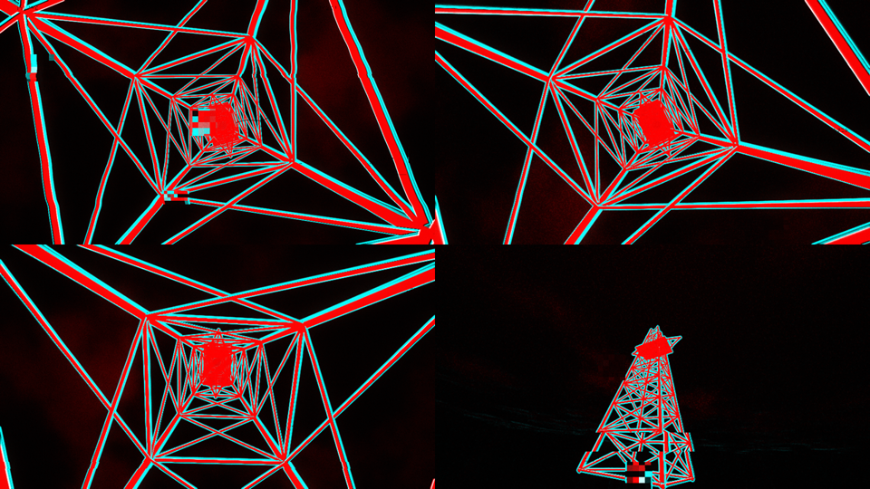
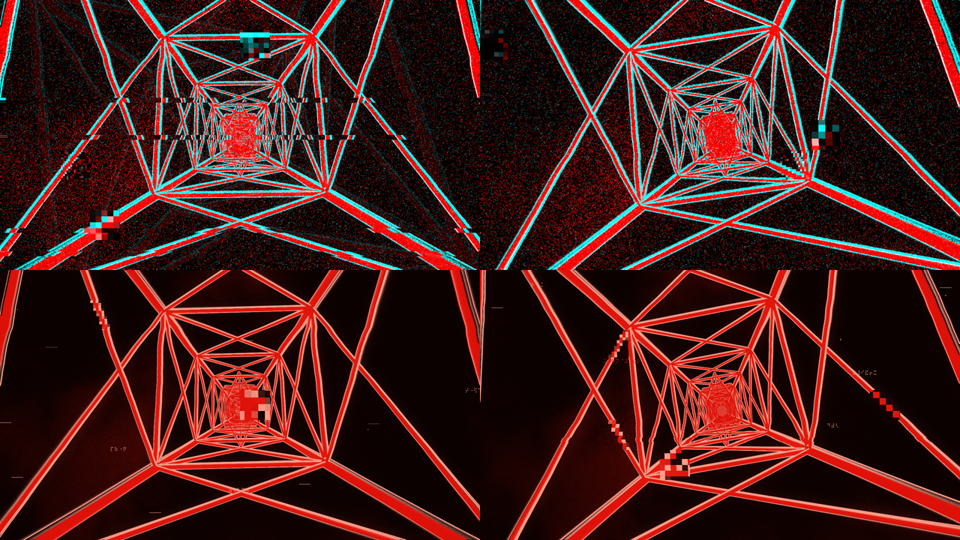

# סקירה ותוכנית: תגובה, נגטיב, מדיה, קאטים ושליטה (24.9.2026)

המסמך מסכם את הסבב הזה: שלושה סוכני מחקר שרצו במקביל (מהירות תגובה, מערכת השליטה, טעינת מדיה), ניתוח הסרטון של un_source ושתי תמונות הנגטיב, ומה שכבר נבנה. בסוף יש החלטות שמחכות לך.

---

## 0. מה כבר נעשה בסבב הזה

| מה | מצב |
|---|---|
| **סצנה 13: Negative** (עמוד חשמל בנגטיב, אדום/ציאן, "סערת" פיקסלים על הקיק) | נבנתה, נבדקה על המסך, 48 FPS ברזולוציה מלאה |
| **מצב פלטה "duo"** במנוע: הפלטה צובעת שתי שכבות (גוף ופרטים) במקום גרדיאנט אחד | נבנה |
| **פלטה חדשה Split** (שחור/אדום/ציאן), בסוף רשימת הפלטות | נבנתה, הפלאגין הותקן מחדש |
| **Corridor** (הפריסט ש"טס"): Motion=0 עוצר אותו לגמרי, מהירות מקסימלית מוגבלת, הקיק כבר לא מוסיף מהירות | תוקן ונבדק |
| **שני באגים של השהיה**: מכה מוצגת בעוצמה מלאה בפריים שבו היא נוחתת (קודם הוצגו רק 30-70% ממנה); הפלאגין שולח את פריים הניתוח **החדש** בכל מנה ולא את הישן | תוקנו |
| בדיקות: 13/13 פריסטים עוברים, self-test של הפלאגין 6/6, בדיקה מקצה לקצה פלאגין←מנוע | עוברות |

---

## 1. מהירות תגובה

### איפה הזמן הולך (מדידה + קוד)

| שלב | טיפוסי | הערה |
|---|---|---|
| Live מעבד את האודיו לפני שאתה שומע אותו | **-26 ms** (יתרון) | ASIO4ALL, באפר 512, 20 ms השהיית יציאה |
| זיהוי מכה (נמדד על קבצי בדיקה) | קיק 12 ms, סנר/האט 8-10 ms | הקיק מזוהה בשיא ולא בעלייה |
| שליחה ← קבלה במנוע ← הפריים הבא | 8-10 ms | |
| **תור הפריימים של כרטיס המסך + Windows** | **25-65 ms (הערכה)** | אין הגבלה על מספר הפריימים בתור |
| מסך/מקרן | 13-67 ms | תלוי במכשיר |
| **סה"כ למכה** | **כ-45-60 ms אחרי הצליל** | סביב הסף שבו מתחילים להרגיש |
| **תנועה רציפה** (מה שהבס דוחף) | **83-100 ms** עד 90% מהתנועה, ועוד הרינדור | החלקה של 30 ms על כל נתיב אודיו, על גבי חלון FFT של 46 ms |
| החלפת סצנה | עד ביט שלם | הסצנה ממתינה לביט הבא, ורק אז נבנית |

### המסקנה
הזיהוי עצמו מהיר. התחושה של "איטי" באה משלושה דברים:
1. **התנועה הרציפה מוחלקת**, ולכן לוקח לה כ-100 ms להגיע לשיא.
2. **תור הפריימים** בכרטיס המסך.
3. **(תוקן היום)** הפריים הראשון של כל מכה כבר היה חצי דועך כשהוצג.

### מה עוד אפשר לעשות (לפי סדר השפעה)
1. **"ראייה קדימה" דרך פיצוי ההשהיה של Ableton.** הפלאגין משהה את האודיו שעובר דרכו ב-L מילישניות ומדווח על כך ל-Live. הניתוח רואה את הצליל L מילישניות לפני שהוא נשמע, והוויזואל יכול אפילו להקדים את הסאונד.
   - **הרווח:** עד L (למשל 60 ms). זה מספיק לבטל את כל השרשרת, כולל המקרן.
   - **המחיר:** כל מה שעובר דרך Live נשמע L מילישניות מאוחר יותר. מצוין לסט DJ או פלייבק; לא טוב אם מנגנים או שרים חי דרך Live. **צריך את ההחלטה שלך (סעיף 7).**
2. **להפריד בין נתיב המכות לנתיב התנועה.** מכות: מיידיות ובלי החלקה. תנועה: עלייה מהירה (5 ms) וירידה איטית, כך שהיא מגיבה מהר בלי לרעוד. את זה כדאי לבנות **יחד** עם שדרוג השליטה (סעיף 5), כדי שתגובה מהירה לא תהפוך לקפיצות.
3. **הגבלת תור הפריימים** (fence ב-OpenGL). חוסך 17-33 ms אם הדרייבר של Intel אכן מחזיק 2-3 פריימים. צריך למדוד קודם.
4. **בניית הסצנה הבאה מראש**, לפני הביט, והחלפה על הביט. בקשה שמגיעה עד 100 ms אחרי ביט נחשבת לביט הזה.
5. **זיהוי קיק בעלייה ולא בשיא**: עוד 5-10 ms.

### מה אפשר כבר היום, בלי קוד
- להשאיר את הבאפר על 512. היתרון של Live על פני הרמקולים כבר מקזז את המנוע.
- לשים את VJ Analyzer **ראשון** בשרשרת של המאסטר, לפני לימיטר או כל פלאגין עם lookahead.
- אם התופים הם MIDI: לנתב אותם (MIDI To) לאנלייזר עם תפקיד KICK או SNARE. אין זיהוי, אין פספוסים, וחוסכים 6-23 ms.
- טריק "ראייה קדימה" ידני: ערוץ העתק של התופים או המיקס, מנותב ל-Sends Only (בלי צליל), עם האנלייזר עליו ו-**Track Delay שלילי** (למשל 40- ms).
- מנוע במסך מלא (F). מקרן או טלוויזיה במצב Game / Low latency.
- Trails על 0.1 או פחות.
- לחבר את הלפטופ לחשמל עם תוכנית חשמל "ביצועים" בזמן הופעה (היום הוא עבד על סוללה).

---

## 2. הנגטיב: ניתוח ופריסט

### מה יש בשתי התמונות
- **הפריים הנקי (2):** התמונה המקורית (עמוד חשמל על רקע שמיים) **הפוכה**. השמיים הבהירים נהיים שחורים והפלדה הכהה אדומה. **השוליים המוארים** של הקורות, והפרטים הבהירים והדקים, יוצאים **ציאן**. הסריג של הפלטפורמה הופך לקווים אדומים מנוקדים.
- **הפריים המדותר (1):** אותה תמונה, אבל כל ערוץ צבע נשבר **בנפרד** לרעש של ביט אחד. יוצא פסיפס של 4 צבעים בלבד: שחור, אדום, ציאן ולבן (לבן = אדום וציאן באותו פיקסל). זה מזכיר פלטת CGA.
- הסרטון **מתחלף** בין שני המצבים. לכן בפריסט זה "היפוך מצב" על המכה.

### איך זה בנוי
1. **`pylon.fs`**: עמוד חשמל גנרטיבי (רגליים, חיזוקי X, זרועות, פלטפורמת סריג, שמיים עם עננים), מצויר כמו **צילום יום**.
2. **`negative_split.fs`**: הטיפול. הוא **כללי**, ויעבוד גם על תמונה או וידאו שלך כשתהיה טעינת מדיה. מפצל כל תמונה לשתי שכבות:
   - **BODY**: הנגטיב עם עקומת קונטרסט (אדום).
   - **DETAIL**: מה שבהיר ודק מהסביבה שלו (ציאן).
   - **STORM**: דיתור של ביט אחד לכל ערוץ בנפרד.
3. **מצב duo בשכבת ה-LOOK:** הגרעין וה-Crush פועלים על כל שכבה לחוד. לכן Grain ו-Crush גבוהים ב-LOOK נותנים את הפסיפס של תמונה 1 על כל הפריים.

### הנובים ב-Negative

| נוב | מה הוא עושה כאן |
|---|---|
| Intensity | כמה מהתמונה "גוף" אדום |
| Motion | מהירות סיבוב המצלמה סביב העמוד. **0 = עצירה** |
| Color | כמות הציאן: שוליים וקווי מתאר |
| Space | רוחב העדשה |
| Impact | עוצמת התגובה למכות, **וגם כמה קיקים עד שהמצלמה קופצת לזווית חדשה** (0 = אף פעם, 1 = כל קיק) |
| Gravity | לאיזה גובה המצלמה מסתכלת |
| Viscosity | גודל הפיקסלים ב"סערה" |
| Detail | מספר הקומות בסריג, וקורות דקות יותר |

**המכות בסצנה:**
- קיק ← סערת פיקסלים, ולפי Impact גם קאט של מצלמה.
- סנר ← הבזק ציאן.
- בילד-אפ ← רעש שגדל בהדרגה.
- גבוהים ← קווי מתאר.

*למעלה: רגע הסערה אחרי קיק. למטה: אותה סצנה עם פלטת Blood (אדום עם שוליים ורודים).*

---

## 3. טעינת תמונה/וידאו: מחקר והמלצה

### מצב קיים (ממצא חשוב)
**וידאו שגוררים היום לחלון המנוע לא מופיע באף אחת מ-12 הסצנות.** הוא מגיע רק לשרשרות הגליץ' הישנות (legacy).
- **תמונות:** נכנסות רק דרך תיקיות מוגדרות מראש.
- **פענוח:** בתוכנה, בלי שליטה במהירות, בלי רוורס, בלי הקפאה ובלי סנכרון ל-BPM.
- **באגים נוספים:** יחס הרוחב-גובה של הקליפ לא נשמר, ויש חוסר התאמה בכיוון (למעלה/למטה) בין וידאו לתמונות.

### איך המקצוענים עושים את זה
| תוכנה | עיקרון |
|---|---|
| Resolume | קודק DXV/HAP שמפוענח בכרטיס המסך. BPM Sync (קליפ = N ביטים), cue points, Beat Looper |
| TouchDesigner | HAP/NotchLC, גישה אקראית לכל פריים, מהירות שלילית, מטמון פריימים |
| VDMX | טעינה מראש של הקליפים ל-RAM |
| Synesthesia | "מדיה גלובלית" אחת שכל סצנה יכולה להשתמש בה (syn_Media). פשוט וחזק |

**נמדד על המחשב שלך:** קליפ H.264 גרעיני ב-1080p (בדיוק הסגנון שלך) מפוענח בתוכנה, על ליבה אחת, ב-**9 FPS** בלבד. בפענוח חומרה (d3d11va) הוא מגיע לכ-100 FPS.
**המסקנה:** את הקליפ הקצר מפענחים **פעם אחת** לזיכרון, ואז הקודק לא משנה בזמן ההופעה.

**כמה נכנס בזיכרון** (תקציב של 1.5GB מתוך הזיכרון המשותף):

| פורמט | 1080p30 | 720p30 |
|---|---|---|
| NV12 | 16 שניות | 36 שניות |
| BC1 (כמו HAP) | 48 שניות | 108 שניות |

### הארכיטקטורה המומלצת
- **Media Bin של 8 משבצות.** טוענים בגרירה לחלון המנוע, בכפתור **Load…** בפלאגין, או מתיקייה שנבדקת אוטומטית. **נשמר עם הסט של Live.**
- **פענוח ברקע** לזיכרון, עם חלון התקדמות. הקליפ ניתן לניגון כבר בזמן הטעינה.
- **"Media pass":** מתקן כיוון, יחס רוחב-גובה ומרחב צבע, כך שכל סצנה מקבלת תמונה נכונה.
- **טרנספורט:** מהירות (כולל 0 = הקפאה אמיתית, ושלילית = רוורס), לופ, פינג-פונג, פעם אחת והחזקה, **סנכרון BPM** (קליפ = N ביטים) ו-scrub.
- **אירועים:** קפיצה ל-1 מתוך 8 או 16 "פרוסות" על מכה, stutter, החזקה ל-N ביטים.
- **הכל נחשף כפרמטרים רגילים**, כך שמאקרו, ראוטים, מכות וסנאפשוטים עובדים על המדיה בלי קוד חדש.
- **שני שימושים:**
  - **USE MEDIA:** Dot Relief, One Bit ו-Emergence לוקחות את המדיה שלך במקום הצורות המובנות.
  - **משפחת סצנות MEDIA:** מדיה ← טיפולים. למשל Media Negative (הטיפול מסעיף 2) ו-Media Lines.
- **היסטוריית פריימים** (שלב 3): מאפשרת slit-scan והזזת זמן.

**הטיפולים שהכי מתאימים לטעם שלך:** נגטיב אדום/ציאן, קווים דקים (XDoG), נקודות לפי בהירות (stipple), חלחול ושחיקה (feedback erosion), slit-scan, הלפטון בשני מסכים.
**ברירת המחדל תמיד מפשטת** (אתה לא אוהב פנים).

### שלבים
| שלב | תוכן | הערכה |
|---|---|---|
| **1** | משבצת אחת. תמונה או קליפ עד 20 שניות. טרנספורט מלא + BPM. Media Negative, Media Lines, USE MEDIA | ~4 ימי עבודה של הסוכן |
| 2 | 8 משבצות, UI בפלאגין עם שמירה בסט, פענוח חומרה, פרוסות ו-stutter | ~4 |
| 3 | היסטוריית פריימים: slit-scan, הלפטון, stipple, שחיקה | ~3 |
| 4 | קליפים ארוכים (BC1), ייבוא עם FFmpeg (ProRes/HAP), חלקיקים אמיתיים | ~3-4 |

---

## 4. הסרטון של un_source: מה מיוחד בקאטים ובצורות

פריימים: `references/un_source/` (לוקאלי, לא נכנס ל-git).

**מדדים:**
- 9.8 שניות, כ-20 אירועי חיתוך. המרווחים בין החיתוכים: 0.2-1.2 שניות.
- הצלבתי מול ניתוח האודיו של הקליפ: **רוב הקאטים נוחתים על מכה אמיתית (בטווח של כ-±60 ms), אבל לא כל מכה מקבלת קאט.** יש בחירה.
- האודיו לא ישר: הביט שבור, בסגנון IDM/גליץ'. הקאטים הולכים אחרי המכות בפועל, לא אחרי רשת של ביטים.

### מה עושה את זה יפה
1. **ניגוד מהירויות.** בתוך שוט כמעט כלום לא זז: סחף איטי, נשימה, עומק שדה רדוד. **כל האנרגיה נמצאת בקאטים.** התנועה איטית ורציפה, האירועים חדים ורגעיים. זה בדיוק ההפך ממה שקורה אצלנו היום, שם מכות מוסיפות מהירות ורעש. זה גם מסביר את התחושה שלך ש"השליטה היא בקפיצות ולא בתנועה".
2. **אובייקט אחד, הרבה נקודות מבט.** כל הקאטים הם על אותו אובייקט תלת-ממדי (ממברנה או "שטח" של ענן נקודות) ממצלמות, מרחקים ומיקודים שונים. יש רציפות ויש גיוון. כל זווית **מוחזקת** עד האירוע הבא.
3. **אוצר מילים של 5 סוגי קאטים**, כולם קצרים מאוד (1-4 פריימים, 33-130 ms), ואז חזרה:
   - **א. קאט קשה** למצלמה אחרת (הכי נפוץ).
   - **ב. הבזק נגטיב:** 2-4 פריימים הפוכים לגמרי (רקע לבן, קווים שחורים).
   - **ג. "אגרוף" גאומטרי:** דיסק, סהר, **עדשה** (החיתוך בין שני עיגולים) או חצי דיסק, ל-1-3 פריימים. הצורה מלאה בלבן, **או כחלון** לאותו אובייקט בחשיפה או בזום אחרים.
   - **ד. פריים שחור אחד.**
   - **ה. צורה שגדלה** לאורך 2-3 פריימים רצופים.
4. **שכבת HUD:** קווים דקים של פיקסל אחד שמחברים ריבועים קטנים וצלבים (+), ועיגולים גדולים ושקופים מאוד (5-15% לבן). זה נותן תחושה של מכשיר מדידה. ה-HUD מתחלף עם הקאטים ונשאר סטטי ביניהם.
5. **החומר:** ענן נקודות צפוף על משטח מקומט. איפה שהמשטח מתקפל "על הצד", הנקודות נערמות ויוצרות **רכסים בהירים**, ומזה באים הקווים. מסביב יש טשטוש עומק (בוקה מלפנים ומאחור) ואובך. מונוכרום, לבן על שחור.

### איך בונים את זה אצלנו
- **A. "דקדוק קאטים" (SHOTS), שכבה גלובלית.** על מכות **נבחרות** (החזקות, או לפי צפיפות שאתה קובע) המנוע מבצע אחד מסוגי הקאטים למעלה:
  - **הסוגים:** קפיצת מצלמה, הבזק נגטיב, אגרוף צורה (עיגול, סהר או עדשה, שמראה עותק הפוך, מוגדל או מוזז בזמן), פריים שחור.
  - **נובים:** Cut Density, Cut Types, Hold (זמן מינימלי בין קאטים), Shape Size. הכל בתוך המגבלה של 3 לשנייה.
- **B. שכבת HUD** ב-LOOK: צלבים, ריבועים מקושרים וקווים דקים, ועיגולים עמומים. מתחלפת בכל קאט ונצמדת לנקודות בהירות בתמונה.
- **C. סצנה חדשה, "Membrane":** משטח של ענן נקודות עם רכסים ועומק שדה. בני הדודים הכי קרובים שלה היום הם Mesh Body ו-Signal Fog.
- **D. מערכת "פוזות" לכל סצנה:** מיקום, זום וזווית שנבחרים בכל קאט, עם סחף איטי ביניהם. זה הבסיס ל"תנועה איטית + קאטים חדים". Negative כבר עובדת כך: ה-Impact קובע כמה קיקים עד קפיצת מצלמה.

---

## 5. מערכת השליטה: ביקורת והצעה

### מה נמצא (התחושה שלך מדויקת)
- **Motion:**
  - לא עצר את Corridor (תוקן היום).
  - ב-Hot Blobs המסה נופלת בלי סוף, בלי קשר ל-Motion.
  - Morphogen לא יכולה לעצור, והמהירות שלה תלויה ב-FPS.
  - **בארבע סצנות Motion=0 מריץ אחורה.** המהירות עוברת דרך אפס בערך ב-0.25-0.3.
- **Color:** אף פעם לא משנה צבע. הוא עושה 12 דברים שונים ב-12 סצנות.
- **Gravity:** גם הוא 12 דברים שונים.
- **Viscosity:** לא עושה כלום בשתי סצנות, ובשאר הוא "Motion הפוך".
- **Space:** הפוך בשלוש סצנות (One Bit, Terminal, Emergence).
- **LOOK/FILM:** מתוך 13 הנובים **אף אחד לא שולט בתנועה**. 8 מהם רעש או קפיצות, ו-7 מאלה דלוקים כברירת מחדל.
- **קפיצות מכל מכה:**
  - כל קיק "מערבב מחדש" (reseed) את הסצנה, וזה נראה כקפיצה.
  - הדעיכה של המכות קצרה: 70-180 ms. המחקר המליץ על 300-900 ms לאמביינט.
- **שעונים בשיידרים:** הרבה שיידרים רצים על שעון גולמי, ואי אפשר להקפיא אותם.
- **מה שאין בכלל:** אין שליטה ב-**הקפאה**, **כיוון**, **מסלול מצלמה**, **מהירות מסונכרנת לטמפו** או **אינרציה**.
- **שמות לנובים לפי סצנה:** המחקר המליץ עליהם, וזה לא מומש.
- **הקורג לא מגיע לכל מה שצריך:** HIT והסנאפשוטים לא ניתנים למיפוי. פרמטר ה-Preset רץ מ-0 עד 64, כך שסיבוב נוב אחד עובר על הסצנות 5 פעמים.

### ההצעה: 4 קבוצות, וכלל אחד לכל קבוצה

| קבוצה | הכלל | נובים |
|---|---|---|
| **MOVE** (תנועה) | **0 = עומד** | **Speed:** אקספוננציאלי; 0.5 = המהירות המתוכננת, 1 = פי 4, מתחת ל-2% = קפוא; מניע שעון סצנה גלובלי, כך שהכל נעצר. **Glide:** אינרציה, 0-4 תיבות. **Drift:** תנועת מצלמה איטית של כל התמונה, נעולה על פראזות. **Push:** כמה המוזיקה מאיצה, עד פי 2, כפל ולא חיבור. **Sync:** Free/Tempo. **Reverse. Freeze:** התנועה עוצרת, הגרעין ממשיך |
| **REACT** (מכות) | **מכות אף פעם לא נוגעות במהירות** | Impact. **Softness:** אורך הדעיכה, פי 0.5-4. **Cuts:** דקדוק הקאטים מסעיף 4 |
| **DIRT** (לכלוך) | **פילם מופרד מדיגיטלי** | פילם: גרעין, אבק, רעידה, הילה, שחורים. דיגיטלי: גליץ', smear, סמלים, פלאש. בברירת מחדל אמביינט, הדיגיטלי על 0 |
| **SHAPE** (צורה) | **כל נוב עושה משהו גלוי בכל סצנה, תמיד באותו כיוון** | Intensity. **Form** (היה Color). **Scale** (היה Space, תמיד גדל כשמעלים). **Erode** (היה Gravity). Detail |

**בממשק:**
- הפלאגין מציג את השם של כל נוב בסצנה הנוכחית, למשל "FORM · fur", יחד עם ערך אמיתי כמו "0.5× · 1.6 u/s".
- טבעת סביב כל נוב מראה כמה האודיו מזיז אותו.
- tooltips על כל נוב, דף עזר קצר לכל סצנה, ונורית FROZEN.

**מיפוי לקורג** (בהנחה שיש לו 8 נובים ו-8 פיידרים; צריך את הדגם):

| בקר | מה ממופה |
|---|---|
| פיידרים | Speed, Drift, Glide, Push, Impact, Reactivity, Film, Intensity |
| נובים | Form, Scale, Erode, Detail, Halation, Dust, Glitch, Trails |
| כפתורים | Freeze, Reverse, HIT, CALM, Snap A-D, סצנה ‎-/+‎, Blackout. **צריך קודם להפוך אותם לפרמטרים של Live** |

ב-Live כדאי לכוון **Takeover Mode = Value Scaling**, כדי שהנובים לא יקפצו אחרי שמחזירים סנאפשוט.

**השפעה על מה שכבר שמור:** מספרי המאקרו נשארים, כך שאוטומציה ומיפויי MIDI קיימים ממשיכים לעבוד. **סנאפשוטים ישנים** יחזרו עם המשמעות החדשה של מאקרו 3, 6 ו-7.

### סדר עבודה מוצע
| # | משימה | גודל |
|---|---|---|
| 1 | Hot Blobs (קפיץ שמחזיר את המסה) ו-Morphogen (שתוכל לעצור) | S |
| 2 | HIT, סנאפשוטים, סצנה ‎-/+‎ ו-Freeze כפרמטרים של Live, שניתנים למיפוי | S |
| 3 | Speed גלובלי, שעון סצנה, Freeze, Glide, Sync | M |
| 4 | חוקי המחולל: אודיו מכפיל מהירות ולא מוסיף, מכות לא נוגעות במהירות, כיוון כמתג, Space בכיוון אחיד, שינויי שמות | S-M |
| 5 | שמות לפי סצנה, tooltips וערכים בפלאגין | M |
| 6 | מצלמת Drift | M |
| 7 | Softness וברירות מחדל לאמביינט | S |
| 8 | בדיקות אוטומטיות: עומד ב-Speed 0, וכל נוב גלוי וחד-כיווני | S |

---

## 6. צוות סוכנים

**מה עשיתי בסבב הזה:** שלושה סוכני מחקר רצו במקביל, כ-14 דקות כל אחד: מהירות תגובה, שליטה, מדיה. בזמן הזה בניתי את Negative. את הטענות המרכזיות אימתתי בעצמי: את החישוב של Corridor שחזרתי והוא יצא זהה, ובדקתי את התיקון בצילומי מסך.

**להמשך אני ממליץ על צוות לבנייה, עם הפרדה ברורה:**

| סוכן | מסלול | נוגע ב- |
|---|---|---|
| A | מדיה, שלב 1 | VideoPlayer → MediaBin, media pass, סצנות MEDIA |
| B | שליטה, ליבת MOVE + חוקי המחולל | Modulation, build_instrument_presets, שיידרים (vj_time) |
| C | ההשהיה: ראייה קדימה, fence, בניית סצנה מראש | הפלאגין, MainComponent, PresetManager |
| D (אחרי B) | דקדוק קאטים + HUD + Membrane | LookPass, PresetManager, שיידר חדש |

- כל סוכן עובד ב-**git worktree** נפרד, כדי שלא יתנגשו. אני משמש כמאחד: עובר על הקוד, ממזג, מאמת ויזואלית עם צילומים ומריץ את כל הבדיקות.
- **B ו-D** נוגעים באותם קבצים, ולכן הם ברצף ולא במקביל. **A ו-C** בלתי תלויים, ויכולים לרוץ במקביל ל-B.
- **החלטות עיצוב נשארות אצלך.** סוכנים לא מחליטים על הטעם.

---

## 7. החלטות שמחכות לך
1. **דגם הקורג** (בשביל המיפוי).
2. **שינוי משמעות המאקרו:** Color→Form, Space→Scale, Gravity→Erode, Viscosity→Glide, ונובי MOVE חדשים. מאשר?
3. **"ראייה קדימה" (Latency Compensation):** אתה מנגן או שר חי דרך Live, או שזה סט של פלייבק/DJ?
4. **מדיה:** להתחיל בשלב 1? איזה אורך ורזולוציה של קליפים אתה צופה?
5. **סדר:** ההמלצה שלי היא B (שליטה בתנועה, הכי משפיע על התחושה) במקביל ל-A (מדיה) ול-C (השהיה), ואחר כך D (הקאטים מהסרטון).
