# Before It Disappears: מסמך קונספט לווידאו ארט

**מופע מחול עכשווי. מוזיקה מקורית ווידאו ארט גנרטיבי: רועי. טקסט: הכוריאוגרפית.**
נכתב ב-24.9.2026 לפי [ART-DIRECTOR-BRIEF.md](ART-DIRECTOR-BRIEF.md). זו טיוטה לדיון עם הכוריאוגרפית ועם מעצב/ת התאורה.

**איך לקרוא את המסמך**
- **סעיף 1** הוא התקציר. **סעיף 3** מציג את שלושת הכיוונים ואת ההמלצה. **סעיף 12** מרכז את ההחלטות שמחכות לך ולכוריאוגרפית.
- **הנחות מהשיחה איתך:**
  - הקרנה **מאחורי המסך** (rear), על מסך אחד מאחורי הרקדנים.
  - המוזיקה **מעורבת**: יש חלקים עם קצב ויש חלקים דלילים.
  - **אתה מפעיל גם את הסאונד וגם את הוויזואל**: Ableton, קונטרולר Korg, וטיימליין נעול לקיוז.
  - הסיום הוא **"Because" של הביטלס, ההקלטה המקורית בהאטה**, כחמש דקות.
- **מה לא ידוע עדיין** ומסומן כ-*placeholder*: רשימת החלקים והזמנים, המקרן, גודל המסך, האולם ושם הכוריאוגרפית. גם קבצי המוזיקה לא היו זמינים, ולכן **ניתוח האודיו (`analyze_wav`) עוד לא רץ**.
- **על המקורות:** סביבת העבודה חסמה פתיחה ישירה של אתרים. כל מקור רשת במסמך נמצא דרך מנוע חיפוש, מסומן **[search]**, והטענה מבוססת על תקציר החיפוש. לפני שמצטטים משהו כלפי חוץ (תוכנייה, בקשת מענק, עיתונות), צריך ללחוץ על הלינק ולוודא. הסקות שלי מסומנות *(הסקה)*.
- **מילות השיר "Because" לא מופיעות כאן בכלל.** הן מוגנות בזכויות יוצרים, ולכן מתארים אותן רק בפרפרזה.
- **התמונות** בתיקייה [`stills/`](stills/) צולמו מהשיידרים האמיתיים של המנוע, דרך כלי סטילס שבניתי לסבב הזה ([`tools/`](tools/)). חלק מהן הן **סקיצות** של יכולות שעוד לא קיימות במנוע, וכך הן מסומנות.
- **המחקר המלא** (באנגלית) נמצא ב-[`research/`](research/): מדע הזיכרון (A), רפרנסים ממחול ומ-AV ‏(B1), זיכרון ושחיקה באמנות (B2), ועבודה על במה (C).

---

## 1. תקציר מנהלים

1. **הרעיון בשורה אחת:** המסך הוא הזיכרון של הערב. כל תמונה שהוא מראה חוזרת אליו מאוחר יותר, משתנה מעצם ההיזכרות, עד שנשאר רק סימן.
2. **המפתח לטקסט:** מה ש"נעלם" בטקסט הוא **הרגע והתנועה**, כלומר הריקוד עצמו. הזיכרון לא נעלם: הוא מחכה, נכתב מחדש ומשנה אותנו. לכן **הרקדנים הם הרגע, והמסך הוא מה שנשאר ממנו.** הסוף הוא לא החשכה אלא **סימן**.
3. **ההמלצה: כיוון 1, "ארכיון שנכתב מחדש".** בתחילת הערב המנוע "שומר" כמה מהתמונות של עצמו. בהמשך הן חוזרות, ובכל חזרה משהו הולך לאיבוד ומשהו נברא. בסיום כולן מתכנסות לצורה אחת: טבעת. מכיוון 2 לוקחים את **"האור המוכר"** כמוטיב חוזר, ואת כלל הצלליות.
4. **זה בנוי על המדע של הזיכרון, לא על מטאפורה בלבד.**
   - **היזכרות משכתבת את הזיכרון** (reconsolidation, ‏Nader 2000).
   - **כל העתקה מושכת את הזיכרון לאותה צורה** (Bartlett; ‏Langlois 2021).
   - **הזיכרון ממציא את מה שמעבר לשוליים** (boundary extension, ‏Intraub 1989).
   - **הזיכרון הישן נראה הכי חד**, אבל הוא הכי פחות נאמן (Talarico & Rubin 2003).

   כל אחד מהממצאים האלה הופך לתהליך תמונה שהמנוע יכול להריץ.
5. **המסך הוא שדה, לא דמות.** ב-80% מהזמן הבהירות הממוצעת של המסך נשמרת **עד 8% מהשיא**. האזור שמאחורי גופי הרקדנים (25-65% מגובה המסך) נשאר כמעט שחור. האור יושב **למעלה ובשוליים**, וזה בדיוק הטעם שלך. [הסבר ותרשים](#91-תקציב-בהירות-ואזור-הגוף).
6. **תגובה למוזיקה מעורבת לפי הכלל של Robert Henke:** מעט צלילים "מחוברים" לתמונה, והשאר, במיוחד הקצב, לא נוגעים בה. **אין הבזקים, אין קאטים אוטומטיים ואין גליץ'** לאורך כל המופע. התנועה מגיעה מהשעון ולא מהמכות.
7. **הסיום ("Because") הוא השורה האחרונה של הטקסט:** "סימן שהשאיר כל מה שהזיז אותנו". השיר עצמו הוא רשימה של דברים בעולם שמזיזים את הזמר: העולם העגול, הרוח והשמיים הכחולים.
   - הזיכרונות של הערב מתנגנים **לאחור**, ואז מתכנסים ל**טבעת**.
   - הטבעת נושבת ברוח, ואז נפתחים **השמיים הכחולים**. זה הכחול היחיד בכל המופע.
   - בסוף נשאר **הסימן**, שממשיך להאיר גם אחרי שהמוזיקה נגמרת.
8. **12 פריסטים למופע**, בשמות של פעלים מהטקסט (WAIT, LEAVE, REPLAY, REWRITE, CREATE...). השם אומר למפעיל מה התמונה *עושה לזיכרון*, ולא איך היא נראית. 9 מהם אפשר לבנות **בלי שורת קוד**: קבצי JSON, פלטות וסנאפשוטים בלבד.
9. **מה צריך לבנות, לפי סדר:**
   1. **בטיחות במה:** מסכה למסך, "אזור גוף", מגביל הבזקים מאוחד, ושליחה מחדש של הפריסט אחרי קריסה. גודל S.
   2. **Cue Bank:** בנק של 32 מצבים, שנקראים מהטיימליין. גודל M.
   3. **MemoryBank:** זיכרון המופע. גודל M.
   4. **Residue:** שכבת הסימן המצטבר. גודל S.

   גרסת v0 של הזיכרון אפשרית **כבר היום**, בלי קוד: מרנדרים את הזיכרונות מראש כתמונות, ומזינים אותן לסצנות שכבר יודעות לקחת תיקיית תמונות.
10. **שלוש החלטות דחופות:**
    - **זכויות "Because"**: להתחיל עכשיו. יש צורך באישור גם על הלחן וגם על ההקלטה, וייתכן שגם על השינוי בה.
    - **איך ההאטה נעשתה:** האם הגובה ירד, או שנשמר?
    - **המידות:** מידות המסך, והעומק שיש מאחוריו.

---

## 2. קריאה בטקסט

### 2.1 המבנה והצורה

- **כ-100 שורות קצרות**, כמעט כל משפט בבית נפרד. **אין "אני" ואין "אתה"**. יש רק "אנחנו", ולכן הקהל נכלל בזיכרון.
- **שלוש מערכות:**
  1. **להחזיק** ("We think memories fade" עד "Only the memory does"). ניסיון לאחוז, שנכשל.
  2. **להיכתב מחדש** ("A memory lives inside a frame" עד "hoping to find the moment / exactly as we left it"). הזיכרון כתהליך: מסגרת, שכתוב, נקודת המפנה, ענן, צל.
  3. **להינשא** ("But nothing stays still" עד הסוף). הזיכרון נושא אותנו, משנה אותנו, ומשאיר סימן.
- **מוודאות לספק, ובחזרה לוודאות קטנה.**
  - הטקסט נפתח בקביעה חדה: "They don't. / They wait."
  - אחרי נקודת המפנה יש **שמונה** "Maybe/Perhaps". הטקסט עובר מידיעה להשערה.
  - בסוף ה-"Maybe" נעלם, ונשארת קביעה זעירה: "Only a mark."

  **בשביל התמונה:** צורות מוגדרות בהתחלה. באמצע, כמה אפשרויות על המסך בבת אחת (צירופים, שכבות). בסוף, צורה אחת פשוטה.
- **הגדרה בשלילה:** "They don't", ‏"Not because", ‏"Not movement. / Not silence. / Not us.", ‏"Not a place… Not something… Only a mark." הטקסט מגדיר דברים במה שהם *לא*.
  - **בשביל התמונה:** להגדיר דרך **חלל ריק**: החור של הטבעת, הצל, הנגטיב, מה שנשאר כשהתוכן הלך. המסך מגדיר את הרקדנים במה שהוא *לא* מראה מאחוריהם.
- **הטיפוגרפיה נעלמת:** השורות מתקצרות, ובבית האחרון נשארת מילה אחת בכל שורה. **הטקסט מאט את עצמו**, בדיוק כמו ההקלטה המואטת של הסיום.

### 2.2 הפעלים

הטקסט בנוי משתי משפחות של פעלים. זו הדרמטורגיה שלו:

| מחזיקים (ונכשלים) | זזים (ומשתנים) |
|---|---|
| hold, reach, slow down, replay, give names, preserve, carry, keep, find | leave, drift, change, soften, move, rewrite, create, transform, linger |

המשפחה הראשונה נכשלת: "But the moment itself never returns". השנייה משנה. **הפועל האחרון, "moved", מאחד את שתיהן:** גם "ריגש" וגם "הזיז", כלומר ריקוד.

**בשביל התמונה:** כלי הווידאו הם בדיוק פעלי ההחזקה: האטה, ריפליי, הקפאה, שם. אנחנו משתמשים בהם, אבל **המחיר שלהם גלוי על המסך**: כל ריפליי שוחק משהו.

### 2.3 מה נאמר ומה נמנע

- **אין בטקסט שום זיכרון ספציפי:** לא אדם, לא מקום, לא אירוע. זה מתאים לחלוטין לכלל "גנרטיבי בלבד", בלי תמונות ובלי פנים.
- **המילה "forget" לא מופיעה.** גם "death" ו-"loss" לא. מה ש"נעלם" (disappears) הוא **התנועה והרגע**, לא הזיכרון. לכן **אסור להציג שכחה כהחשכה.**
- **החושים ברשימה:** "A voice. / A scent. / A familiar light." קול, ריח, אור, והרשימה נגמרת **באור**: החומר שלנו.
- **תנועה ושקט** חוזרים כזוג: "Silence comes and goes", ‏"Not movement. / Not silence." אצלנו השקט הוא **השחור**, ולכן **השחור אף פעם לא מת**. יש בו גרעין חי, נשימה, אבק.

### 2.4 נקודות המפנה

1. **"They don't."** ההנחה של הכותרת מתהפכת כבר בשורה השנייה.
2. **"But the moment itself never returns. / Only the memory does."** האחיזה נכשלת.
3. **"And then, / something changes."** הציר, והטקסט מסמן אותו במפורש.
4. **"it no longer recalls. / It creates."** נקודת המפנה. זה בעצם המניפסט של מנוע גנרטיבי.
5. **"Until one day, / we no longer carry the memory. / The memory carries us."** ההיפוך.
6. **"Only a mark."** הסוף.

### 2.5 בדיקת ההשערות מהבריף

- **"הסוף הוא עקבה, לא ריק": מסכים.** אני מוסיף שני דברים:
  - הסימן צריך **להישאר אחרי שהמוזיקה נגמרת** ("It lingers / long after the moment / has disappeared").
  - הכיבוי האחרון נעשה עם תריס מכני במקרן, בקיו של הכוריאוגרפית.
- **"האור המוכר" כמוטיב: מסכים, עם תיקון.** בטקסט הוא ברשימה של דברים שמעוררים **זיכרון לא רצוני**, כאלה ש"שוקעים במקומות שלא ציפינו". לכן **אסור שיחזור בזמנים קבועים**. הוא צריך להופיע 3 פעמים בערב, במקומות לא צפויים, ואף פעם לא על ההתחלה של חלק.
- **הצל: מתקן.** בהקרנה מאחור הרקדנים **לא מטילים צל** על התמונה. יש שתי דרכים לקבל את "the shadow of itself":
  - **צלליות:** מסך בהיר מאחורי רקדנים לא מוארים. זו ההמלצה שלי.
  - **צל אמיתי:** מעצב/ת התאורה מטיל/ה צל של הרקדנים על פני המסך בזמן שההקרנה כבויה באזור הזה.

  **צל "מזויף" של גוף, שמיוצר בווידאו, לא בא בחשבון:** זה שכפול של הרקדנים.
- **"הקהל שמאחורי העשן": לא עובד כאן.** בהקרנה מאחור אלומת המקרן נמצאת מאחורי המסך, והקהל לא רואה אותה. עשן בקדמת הבמה רק מרים את השחור של המסך. את "הזיכרון הוא ענן" מייצרים **בתוך התמונה**.

### 2.6 טבלת תרגום: מהטקסט לתמונה

"אמצעי" = מה במנוע עושה את זה. **קיים** = אפשר כבר היום. **חדש** = צריך לבנות (סעיפים 5-6).

| # | תנועה / שורת מפתח | עיקרון התמונה | אמצעי במנוע | חלק במופע |
|---|---|---|---|---|
| 1 | "They don't. / They wait. / Quietly." | תמונה רדומה: קיימת אבל כמעט לא מוארת. השחור חי | Emergence עם `visible` נמוך שעולה עם presence (**קיים**). דעיכה בחוק חזקה עם רצפה (**חדש**, MemoryBank) | 1 WAIT |
| 2 | "Movement disappears before we can hold it." | הצורה נשחקת לאבק ונארגת מחדש, ועקבה מרוחה מגיעה באיחור | Mesh Body: ‏erosion לפי build, ‏Trails (**קיים**). עקבה של 3-8 שניות (**חדש**, Residue) | 2 LEAVE |
| 3 | "We slow it down. / We replay it. / We give it names." | השליטה בזמן גלויה: האטה, הקפאה, היפוך. כל ריפליי שוחק משהו | Speed, ‏Freeze, ‏Reverse, ‏Glide (**קיים**, בקומיט האחרון). ריפליי שוחק (**חדש**) | 3 REPLAY |
| 4 | "It keeps the outline, / never the whole story." / "The colors slowly change." | זיכרון בתוך מסגרת: הפרטים נעלמים, המתאר נשאר, והצבע נסחף | Dot Relief על תמונות זיכרון (**קיים**, ב-v0). הפרדה ל-gist/verbatim/edge (**חדש**). מורף פלטה Bone←Nitrate לאורך 16 תיבות (**קיים**) | 4 REWRITE |
| 4 | "Perhaps we remember / the last time / we remembered it." | כל היזכרות היא עותק של ההיזכרות הקודמת: אובדן דורות | רצף תמונות מרונדר מראש, שמתקדם בכל HIT (**קיים**, v0). write-back בכל recall (**חדש**) | 4 REWRITE |
| 5 | "A memory reaches / the edge of itself. / … / It creates." | המסגרת מתכווצת, ומחוצה לה נברא המשך שלא היה. אחר כך הזיכרון זורע צמיחה | Boundary extension וצירוף Voronoi (**חדש**). Morphogen שנזרע ב-HIT (**קיים**) | 5 CREATE |
| 5 | "the oldest memories / often feel the clearest" | הזיכרון שנזכרו בו הכי הרבה פעמים הוא החד ביותר: דו-גוני, "One Bit" | התקשות אחרי ההיזכרות החמישית (**חדש**). ב-v0: One Bit על הזיכרון | 5 / 9 |
| 6 | "Memory is a cloud. / … / Suspended between presence / and absence." | מזג אוויר: חלקיקים שמתעבים לצורה ומתפזרים | Signal Fog: ‏focus לפי build (**קיים**) | 6 DRIFT |
| 6 | "A voice. / A scent. / A familiar light." | אור קטן וחם שחוזר בלי הודעה | HIT שמפעיל glimpse (**חדש**, S), או פס בסצנת SEAM (**חדש**) | 1, 6, 8 |
| 7 | "every memory becomes / the shadow of itself. / … paradise … hell." | הרקדנים הופכים לצלליות מול שדה אור. אותו שדה, בשני טמפרטורות | Hot Blobs כשולחן אור בחלק התחתון, Tungsten מול Ember עם Crush (**קיים**). קיו משותף עם התאורה | 7 SHADOW |
| 8 | "we leave a part of ourselves behind." / "The memory carries us." | היפוך דמות ורקע: הזיכרון עוטף את הבמה, ושאריות הערב הן הקרקע | Fibers דליל על כל הפריים (**קיים**). torch/inversion ו-Residue של כל הערב (**חדש**) | 8 CARRY |
| 9 | "where the moment ends, / and where we begin." | דמות ורקע מתמזגים, בצד הכהה | Convergence: הקרקע מתקרבת לסימן, 1% בכל תיבה (**חדש**, uniform) | 8←9 |
| 10 | "Only a mark. / The quiet mark / left / by everything / that ever / moved us." | צורה אחת, טבעת, שנשארת אחרי הכל | Halo Ring ענקית, Trails וזיכרונות שמתכנסים לטבעת (**חדש**: attractor ו-ACC) | 9 MARK |

---

## 3. שלושה כיווני קריאייטיב

שלושת הכיוונים שונים **בעיקרון**, לא רק בפלטה. בכל כיוון שאלה אחרת: *מה המסך בכלל?*

- **כיוון 1:** המסך הוא **זיכרון** (תהליך).
- **כיוון 2:** המסך הוא **מקור אור** (אובייקט של אור).
- **כיוון 3:** המסך הוא **אוויר** (חומר).

### כיוון 1: "ארכיון שנכתב מחדש" / The Rewritten Archive

- **בשורה אחת:** המסך זוכר את הערב, וכל היזכרות משנה את מה שנזכר.
- **המטאפורה:** פלימפססט, עותק של עותק. בדומה ל-Lucier שמקליט את החדר שוב ושוב עד שנשאר רק הצליל של החדר עצמו.
- **השפה החזותית:**
  - **פלטה, לפי שלבים** (שלושה צבעים: צל / אמצע / אור):

    | שלב | פלטה | צבעים |
    |---|---|---|
    | לכידה | Bone | `#060606 / #8A8580 / #F4F0E8` |
    | שכתוב | Nitrate | `#0D0B09 / #7F6B52 / #F3E6CE` |
    | התקשות | Ash | `#0A0A0A / #6B6A66 / #EDEBE4` |
    | הסימן בסיום | Cyanotype | `#05080C / #2F5F79 / #D8EEF2` |

  - **מרקם:** קווי פלקסוס דקים ונקודות. בכל היזכרות מתווספים אובדן דורות, חורים קבועים וגרעין.
  - **קצב תנועה:** איטי מאוד. **יותר קפוא מזז.** מעבר בין זיכרונות לוקח 1-4 תיבות.
  - **קומפוזיציה:** צורה אחת. אחר כך צורה בתוך מסגרת, ואחר כך פסיפס של שברים.
  - **שחור:** 70-85% מהפריים.
- **הרקדנים, האור והצל:** הרקדנים הם ההווה, והמסך הוא העבר שלו. המסך אף פעם לא מראה אותם. הוא מראה את מה *שנשאר* מהערב.
- **המסלול לאורך הערב:**
  - **בשליש הראשון** נלכדות 4-6 תמונות: זו "בליטת הזיכרונות" של המופע.
  - **באמצע** הן חוזרות ומשתנות: מתאר, חורים, התקשות. בנקודת המפנה המסגרת מתכווצת, והזיכרון מתחיל לברוא.
  - **בסוף** כל הזיכרונות מתכנסים לצורה אחת.
- **הסיום ב-"Because":**
  - הזיכרונות מתנגנים **לאחור**, כפרוסות, בשולי הפריים.
  - הם מתכנסים ל**טבעת**, שעשויה מהמרקם שלהם.
  - הטבעת הופכת לכחולה בבית השמיים.
  - בסוף נשארת טבעת-הסימן.
- **תמונות** (סקיצות של יכולת חדשה, מלבד 01):

| | | |
|---|---|---|
| 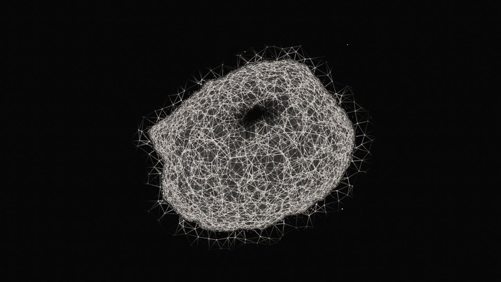 **01** לכידה (Mesh Body, ‏Bone, **מהמנוע**) | 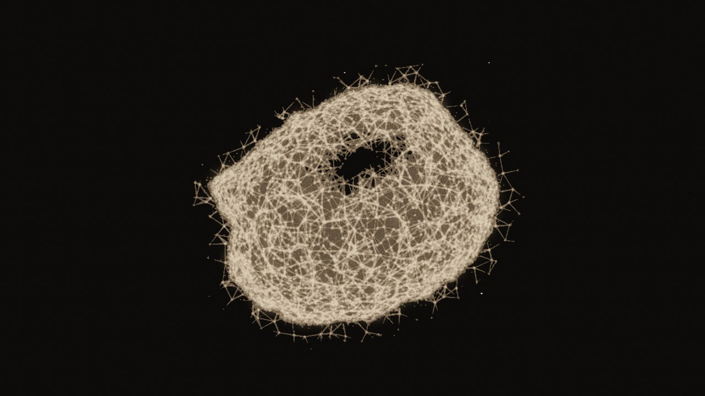 **02** היזכרות 2: רכות, והצבע נסחף ל-Nitrate | 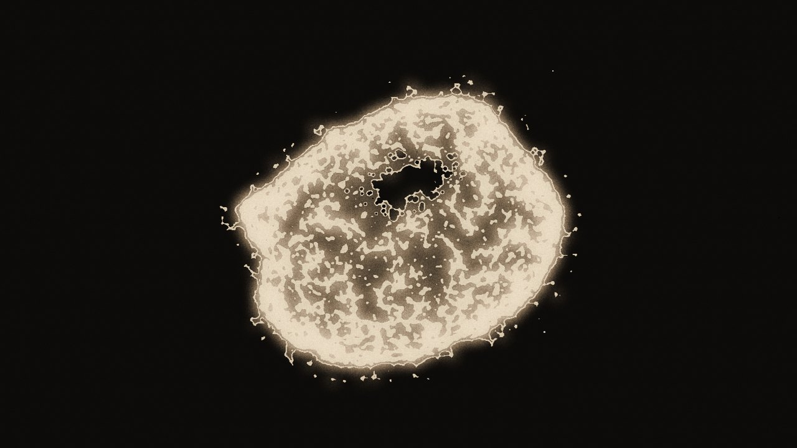 **03** היזכרות 5: חורים במקומות קבועים (Basinski) |
| 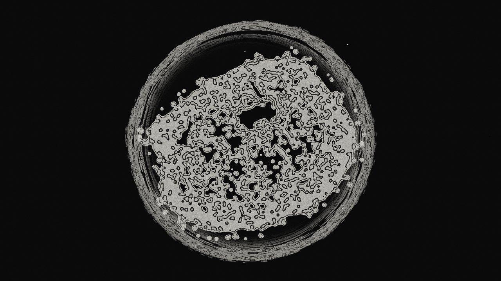 **04** היזכרות 9: התקשות ומשיכה לטבעת | 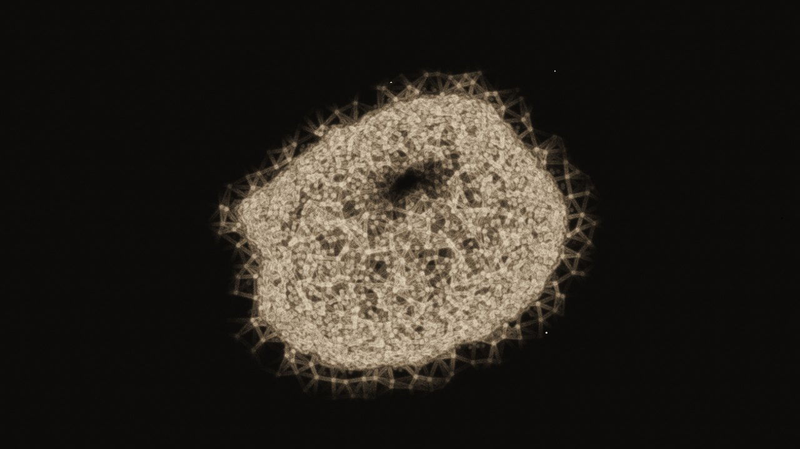 **05** "keeps the outline" | 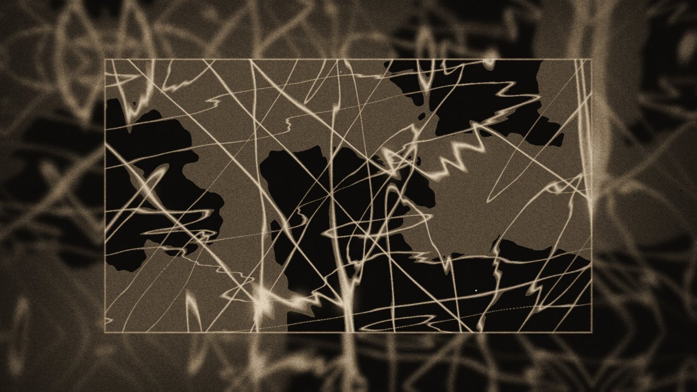 **06** "the edge of itself": המסגרת מתכווצת והסביבה נבראת |
| 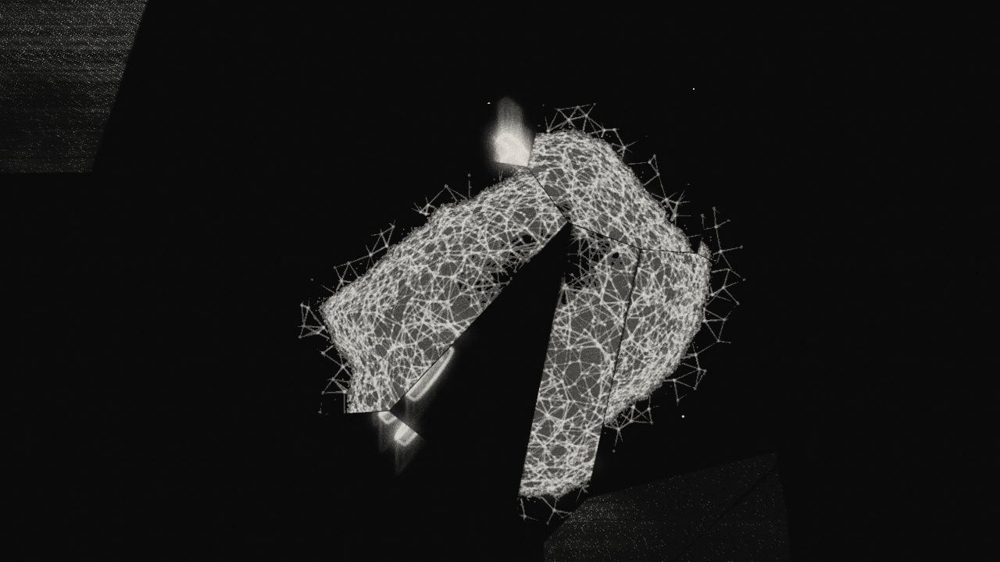 **07** "It creates": צירוף של שברי זיכרון | 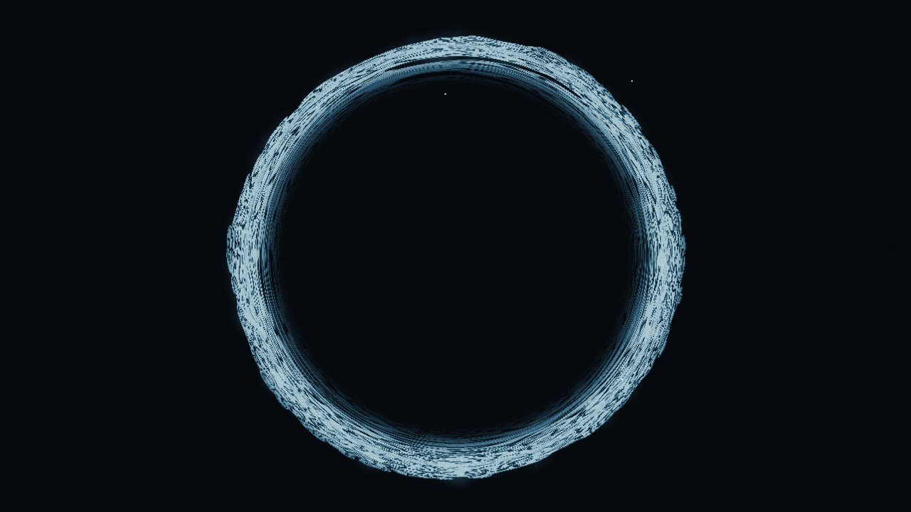 **08** הסימן: כל הזיכרונות בטבעת אחת | 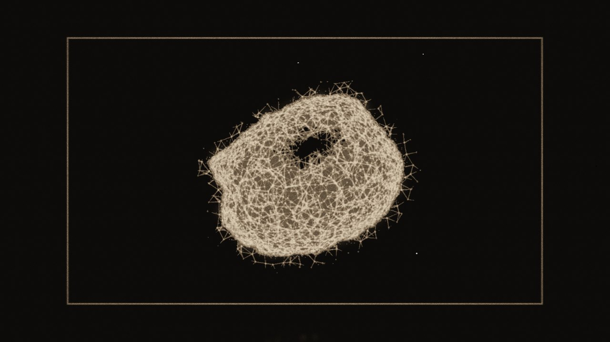 **06א** אותו רגע על Mesh Body |

- **רפרנסים:**
  - [Lucier, *I Am Sitting in a Room*](https://www.moma.org/explore/inside_out/2015/01/20/collecting-alvin-luciers-i-am-sitting-in-a-room/)
  - [Basinski, *The Disintegration Loops*](https://www.soundonsound.com/techniques/classic-tracks-william-basinski-disintegration-loops)
  - [Kentridge](https://harvardfilmarchive.org/programs/the-animated-films-of-william-kentridge)
  - [Marker, *Sans Soleil*, "the Zone"](https://rhizomes.net/issue8/tryon.htm)
  - [Langlois et al. 2021](https://www.pnas.org/doi/10.1073/pnas.2012938118)

  כולם [search].
- **סיכונים:**
  1. **צריך קוד.** בשביל MemoryBank (M). הגידור: גרסת v0 מתמונות מרונדרות מראש, שעובדת היום.
  2. **ההחזרות חייבות להיות קריאות לקהל.** אם הלכידות לא בולטות, לא יזהו שהן חוזרות. הפתרון: 4-6 לכידות בלבד, כל אחת מסצנה שונה, ואף אחת לא "סתם".
  3. **סכנה של "אפקט וידאו".** להתחייב לכלל: **היזכרות היא אירוע נדיר.** לכל היותר אחת בכל 16 תיבות.

### כיוון 2: "אור מוכר" / A Familiar Light

- **בשורה אחת:** המסך הוא לא תמונה אלא מקור אור, ויש לו צורה אחת שהקהל לומד לזהות.
- **המטאפורה:** מגדלור ואופק. בדומה ל-*Disappearance at Sea* של Tacita Dean: האור שאמור להדריך הופך לנושא.
- **השפה החזותית:**
  - **שחור:** 88-97%.
  - **פלטות:** Ash ‏(`#0A0A0A / #6B6A66 / #EDEBE4`) לקו. Tungsten ‏(`#070504 / #86461F / #FFD9A8`) להבזקי הזיכרון ולשדה הצלליות. Cyanotype לשמיים של הסיום.
  - **האור עצמו:** קו אופק דק ברבע העליון, **שבהיר יותר בשוליים** ודועך מאחורי מרכז הבמה.
  - **תנועה:** כמעט אין. נשימה של 8-16 שניות.
- **הרקדנים:** המסך מאיר אותם **מאחור**.
  - ברוב הזמן הוא שחור מאחורי הגוף, והרקדנים מוארים מהצד.
  - ב-1-3 רגעים מוצהרים הוא הופך לשדה חם, והרקדנים הופכים לצלליות: "the shadow of itself".
- **המסלול לאורך הערב:**
  - הקו מופיע.
  - אחר כך הוא נעלם, וחוזר בשלושה מקומות לא צפויים: נקודת אור חמה בשוליים, קצה של טבעת, פס אנכי.
  - אחר כך יש שדה צלליות.
  - בסיום, **השמיים**.
- **הסיום ב-"Because":**
  - הטבעת נסגרת לאט, בערך כמו הקו של McCall שמשרטט עיגול במשך 30 דקות.
  - בבית השמיים נפתח **שדה כחול רך**.
  - בסוף, קאט לשחור אחרי 20-30 שניות של טבעת יציבה. **צופים רבים יראו טבעת כהה "צרובה" בעין** (afterimage), כלומר "a shape inside us" פשוטו כמשמעו. זה מעבר יחיד ולא הבזק, אבל חייבים לבדוק את זה באולם.
- **תמונות:**

| | | |
|---|---|---|
| 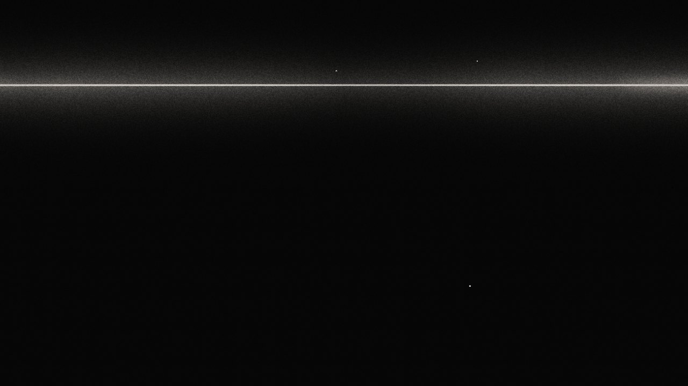 **01** האופק (סקיצה) | 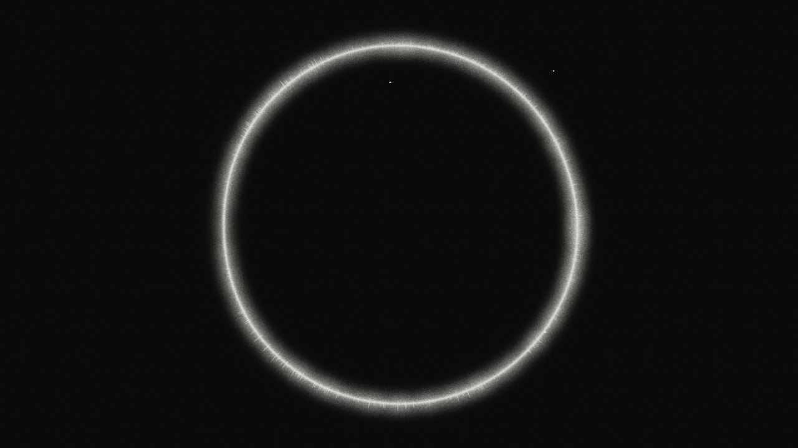 **02** Halo Ring ענקית: חור שממסגר את הרקדנים (**מהמנוע**) | 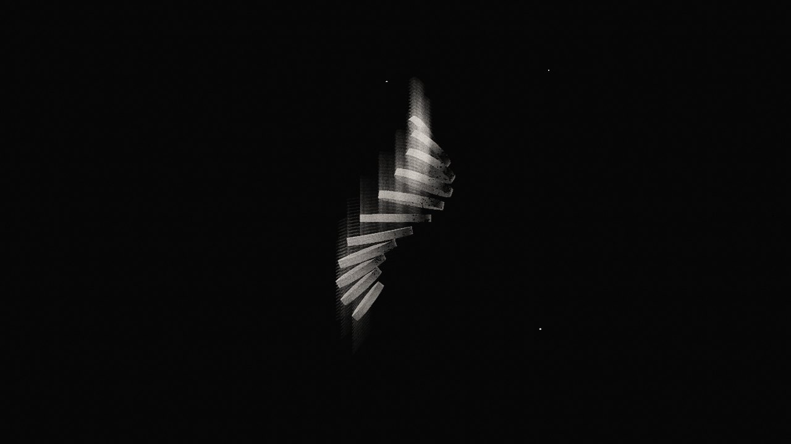 **03** Emergence: פסי אור אנכיים (**מהמנוע**) |
| 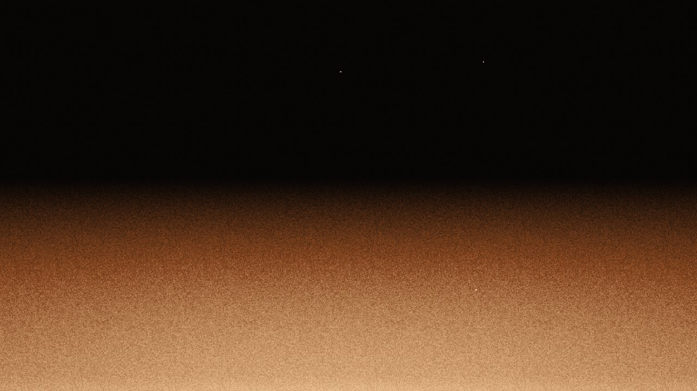 **04** שדה צלליות, Tungsten (סקיצה) | 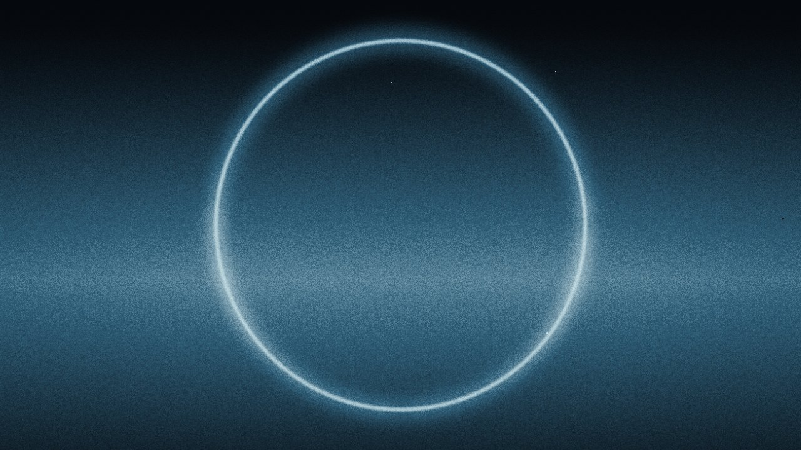 **05** השמיים הכחולים עם הטבעת (סקיצה) | 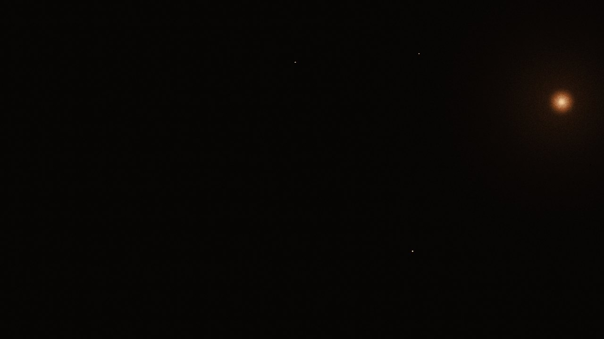 **06** "A familiar light": נקודה חמה בשוליים (סקיצה) |

- **רפרנסים:**
  - [Akram Khan / Anish Kapoor, *Kaash*](https://www.akramkhancompany.net/productions/kaash-2002/)
  - [McCall, *Line Describing a Cone*](https://www.tate.org.uk/art/artworks/mccall-line-describing-a-cone-t12031)
  - [Tacita Dean](https://www.mariangoodman.com/artists/39-tacita-dean/works/39446/)
  - [Crystal Pite, *Light of Passage*](https://www.gramilano.com/2022/10/review-crystal-pite-light-of-passage/)
  - [Tim Hecker בחושך](https://www.clashmusic.com/live/tim-hecker-live-at-st-giles-in-the-fields-london/)

  כולם [search].
- **סיכונים:**
  1. **מינימליזם של ערב שלם** עלול להיות חדגוני.
  2. **תלות גבוהה במעצב/ת התאורה.**
  3. **ה-afterimage** תלוי בבהירות המקרן. אם הוא לא עובד, הרגע האחרון נחלש.

### כיוון 3: "מזג אוויר של זיכרון" / Memory Weather

- **בשורה אחת:** המסך הוא אוויר: חלקיקים וקווים שמתעבים לצורה ומתפזרים, כמו זיכרון, וכמו התנועה של הרקדנים.
- **המטאפורה:** ענן. בדומה ל-*Le mouvement de l'air* של Adrien M & Claire B: המסך כמזג אוויר שמסתיר וחושף.
- **השפה החזותית:**
  - **פלטות:** Ash, ‏Nitrate, ‏Cyanotype.
  - **מרקם:** גרעין דק, אבק, פלקסוס.
  - **תנועה:** סחף מתמיד, איטי.
  - **שחור:** 55-75%.
- **הרקדנים:** צפיפות האוויר היא הכלי הדרמטי. ענן צפוף כשהם שקטים, אוויר צלול כשהם זזים.
- **המסלול לאורך הערב:** ערפל, ואז צורה שמתעבה, נשחקת ונזרעת (Morphogen). אחר כך ענן, ובסוף ענן שמתכנס לטבעת.
- **הסיום ב-"Because":** האבק של הערב מתקבץ לטבעת פרוותית. "הרוח" פורמת אותה. בשמיים היא כחולה, ובסוף מתפזרת ומשאירה אבק.
- **תמונות** (כולן **מהמנוע**):

| | | |
|---|---|---|
| 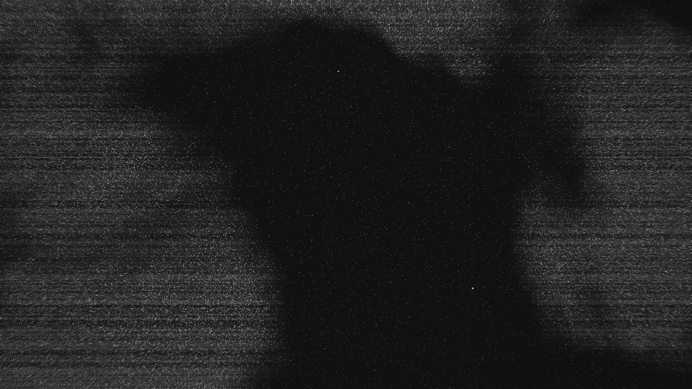 **01** Signal Fog, ‏Ash | 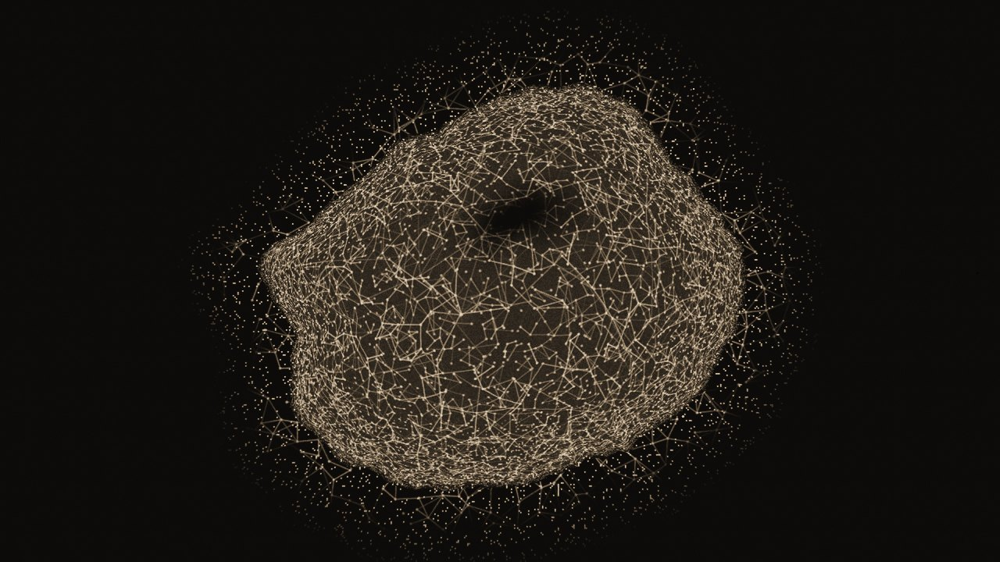 **02** Mesh Body נשחק (build) | 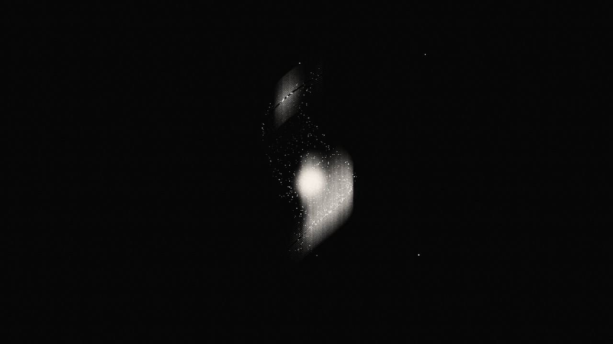 **03** Emergence מתפרקת לאבק |
| 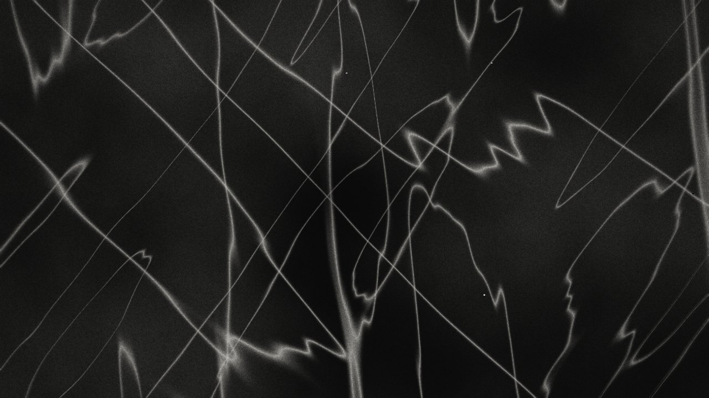 **04** Fibers דליל | 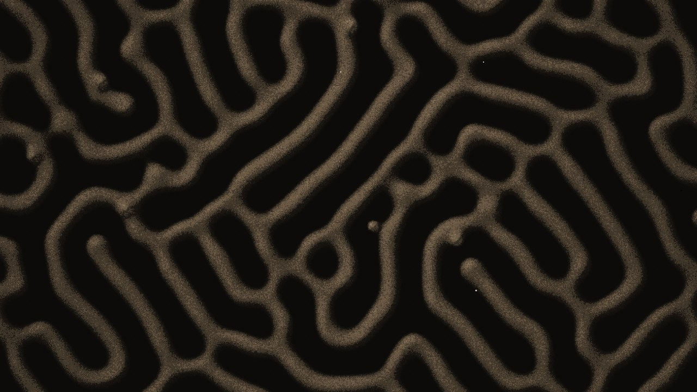 **05** Morphogen כ"פריחת ניטרט" | 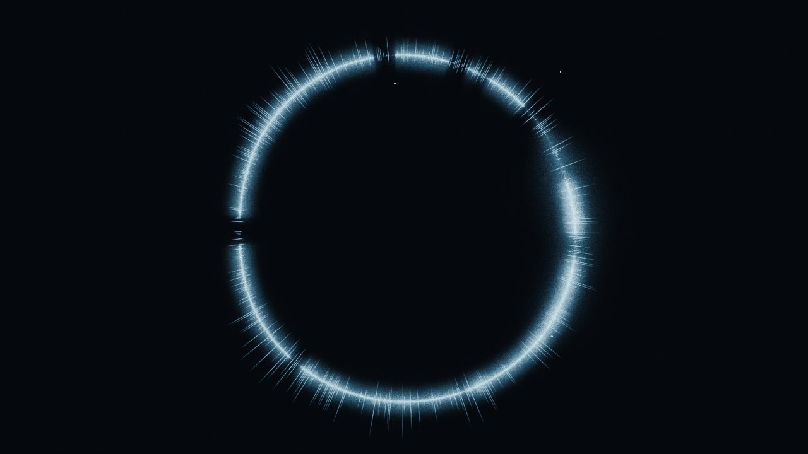 **06** טבעת ענן, Cyanotype |

- **רפרנסים:**
  - [Adrien M & Claire B](https://www.am-cb.net/archives/le-mouvement-de-l-air)
  - [Ulf Langheinrich, *Waveform B*](https://www.ulflangheinrich.com/waveform-b)
  - [McGregor / Random International, *FAR*](https://waynemcgregor.com/productions/far)
  - [Bill Morrison, *Decasia*](https://www.moma.org/calendar/events/512)

  כולם [search].
- **סיכונים:**
  1. **זה המצב הטבעי של הכלי שלך.** בלי מחשבה נוספת הוא עלול להיראות כמו שומר מסך אמביינט.
  2. **הוא לא אומר את מה שהטקסט אומר.** הטקסט עוסק בשכתוב ובסימן, לא באווירה.
  3. **כמה מהסצנות בהירות מדי** למחול, כמו Morphogen ‏(18% APL) ו-Hot Blobs ‏(13%).

### ההמלצה שלי: כיוון 1, עם שני דברים מכיוון 2

**למה כיוון 1:**
- הוא היחיד שעושה את מה **שהטקסט טוען**, ולא רק מאייר את מצב הרוח שלו. הזיכרון נכתב מחדש בכל פעם, ובנקודת המפנה הוא מפסיק לשחזר ומתחיל לברוא.
- **המנוע הגנרטיבי שלך מתאים לזה במיוחד:** הוא יכול לזכור את התמונות *של עצמו*, בלי לצלם אף אחד.
- **החולשה שלו היא עבודת קוד, והיא מגודרת:** יש גרסת v0 בלי קוד (סעיף 5), ו-MemoryBank עולה S-M על ה-Iris Xe.

**מה לוקחים מכיוון 2:**
- את **האור המוכר**, שלוש פעמים בערב.
- את **כלל הצלליות** בחלק 7.
- את **ה-afterimage** כסיום אפשרי, בכפוף לבדיקה באולם.

**למה לא כיוון 3:**
- זה ברירת המחדל של הכלי. הוא יעבוד, אבל הוא לא יגיד כלום שהטקסט אומר.
- החלקים הטובים שלו (Signal Fog, ‏Mesh Body, ‏Emergence) הם בכל מקרה חומר הגלם של כיוון 1.

---

## 4. מפת המופע לפי חלקים

**עדיין לא ידועים:** רשימת החלקים בפועל, אורך המופע, וזמני ה-BPM. הטבלה למטה היא **שלד דרמטורגי לפי הטקסט**, לא לוח זמנים. ממלאים את עמודות המוזיקה והזמן איתך ועם הכוריאוגרפית, ואז מריצים `analyze_wav` על כל קובץ בפועל (יש קבצים? תגיד לי איפה, וארוץ את זה בסבב הבא).

| # | חלק (הצעה) | תנועת טקסט | פריסט | פלטה / LOOK | תגובה: מה מגיב ומה לא | קיו / חי | תקציב בהירות |
|---|---|---|---|---|---|---|---|
| 0 | **פתיחה** | — | שחור, ואז WAIT דולק לאט | Ash, ‏Blacks=0 | שום דבר; רק Drift איטי | קיו: fade-in 8-16 ש' | ≤3% |
| 1 | **WAIT** | 1: "They wait. Quietly." | WAIT (Emergence שקטה) | Ash | Level בלבד (presence), ‏Reactivity 0.2 | קיו לתחילת החלק; **4-6 לכידות MemoryBank** נשתלות כאן | ≤5% |
| 2 | **LEAVE** | 2: "Movement disappears" | LEAVE (Mesh Body) | Nitrate | kick→erosion (build), ‏hat→hair | חי: Impact על הקורג | ≤8% |
| 3 | **REPLAY** | 3: "We slow it down. We replay it." | REPLAY (Corridor/Terminal + Hold) | Nitrate | kick→Hold events בלבד; שום קשר לרמה | חי: Freeze/Reverse על הקורג | ≤10% |
| 4 | **REWRITE** | 4: "keeps the outline… colors slowly change" | REWRITE (זיכרונות v0/MemoryBank) | Bone→Nitrate מורף | לא מגיב לקצב; רק HIT מקדם היזכרות | קיו: HIT ידני בכל היזכרות | ≤10%, שיא 20% לזמן קצר |
| 5 | **CREATE** | 5: "it no longer recalls. It creates." | CREATE (Morphogen נזרע) | Nitrate | kick→seed; build→boundary | קיו למעבר | ≤15% |
| 6 | **DRIFT** | 6: "Memory is a cloud… A familiar light." | DRIFT (Signal Fog) + Glimpse | Ash | presence→focus; שום דבר אחר | חי; Glimpse על HIT/pad יעודי | ≤5%, נקודת האור עד 4% שטח |
| 7 | **SHADOW** | 7: "the shadow of itself… paradise… hell" | SHADOW (שדה אור, Hot Blobs כ-glow) | Tungsten↔Ember | level→בהירות השדה, מוגבל | **קיו משותף עם תאורה**; 1-3 רגעים בלבד | 30-60% מאחורי הרקדנים, מוצהר |
| 8 | **CARRY** | 8-9: "the memory carries us… where we begin" | CARRY (Fibers דליל + Residue) | Ash | build→density | קיו; Convergence עולה 1%/תיבה | ≤12% |
| 9 | **MARK / Because** | 10: "Only a mark" | MARK (Halo Ring כטבעת סיום) | Ash→Cyanotype→Ash | ראו סעיף 7 | חי, אבל קיו-לוקד לחלוטין | 8%→25%→3% |
| — | **סוף** | — | Residue בלבד, ואז שחור | Ash | — | קיו: תריס מכני | ≤3%, דועך ל-0 |

**כללים שחוזרים בכל שורה:**
- **כל חלק נפתח באיפוס אוטומציה מלא**: פריסט, מאקרו, LOOK, פלטה, REACT TO, ‏CALM=off. ‏(`docs/before-it-disappears/research/C-stage-craft.md`‏ §7.)
- **הקצב (kick) לא נוגע ב-Speed בשום חלק.** זה כבר החוק במנוע (`Motion.h`), ואנחנו רק מקפידים לא לשבור אותו בפריסטים חדשים.
- **Cut Rate = off בכל המופע.** שום מעבר סצנה אוטומטי; רק קיוז.

---

## 5. פריסטים למופע

12 פריסטים, בשמות שאומרים למפעיל **מה קורה לזיכרון**, לא איך זה נראה. תת-סעיף א (9 פריסטים) בונים היום, בלי שורת קוד: `build_instrument_presets.py`, פלטות וסנאפשוטים. תת-סעיף ב (3) צריכים MemoryBank.

### 5א. הגדרות של סצנות קיימות (JSON + פלטה, בלי שיידר חדש)

לכל פריסט: תפקיד דרמטורגי, בסיס, ברירות מחדל של מאקרו, פלטה, LOOK/FILM, REACT TO, ותוכנית סנאפשוט.

**1. WAIT** — *תפקיד: המצב הרדום שממנו הערב מתחיל.*
- בסיס: **Emergence** (12). מאקרו: `visible=0.15, scale=0.55, streak=0.1, erode=0.05`.
- פלטה **Ash**. LOOK: ‏Grain 0.3, ‏Crush 0.1, כל השאר 0. FILM: ‏Halation 0.2, ‏Weave 0.3, ‏Dust 0.3, ‏Blacks **0** (הבמה מרימה את השחור בעצמה, ר' `research/C-stage-craft.md` §2).
- REACT TO: **Level בלבד**. Reactivity 0.2.
- Snapshot A: המצב הזה. מורף 16 תיבות אליו מכל מקום אחר במופע (חזרה ל"מנוחה").
- עלות GPU: S (קיים).

**2. LEAVE** — *"Movement disappears before we can hold it."*
- בסיס: **Mesh Body** (09). מאקרו: `scale=0.55, erode=0.15→ (build) , detail=0.6`.
- פלטה **Nitrate**. LOOK: ‏Grain 0.35, ‏Trails 0.15. FILM: כבסיס.
- REACT TO: **Kick, Bass, Level**. Snare/Hat כבויים (אין "קישוט" קצבי).
- עלות: S.

**3. REPLAY** — *"We slow it down. We replay it. We give it names."*
- בסיס: **Terminal** (06), עם `Freeze` זמין לקונטרולר. מאקרו: `scale=0.6, form=0.7 (background), erode=0.3`.
- פלטה **Nitrate**. LOOK: ‏Symbols 0.15 (המילים "given names" - גליפים, לא טקסט קריא).
- REACT TO: **Kick בלבד** (jump), שום דבר אחר.
- **חי:** Freeze ו-Reverse על הקורג (כבר פרמטרים של Live, `Motion.h`).
- עלות: S.

**4. REWRITE** — *"It keeps the outline... The colors slowly change."*
- בסיס: **Dot Relief** (02) על תיקיית תמונות זיכרון (זו **גרסת v0** של MemoryBank, ר' סעיף 6.1). מאקרו: `scale=0.7, erode=0.4`.
- פלטה: מורף **Bone → Nitrate** על 16 תיבות (סעיף §6.1 ב-`RESEARCH-REPORT.md`, "מורפינג פלטה על הביט").
- REACT TO: **כלום**. הפריסט מתקדם רק ב-HIT ידני (זו ה"היזכרות" שהמפעיל מכריז עליה בקיו).
- עלות: S (קיים כבר, כי `source.folder` הוא פיצ'ר קיים).

**5. CREATE** — *נקודת המפנה: "it no longer recalls. It creates."*
- בסיס: **Morphogen** (10). מאקרו: `pattern=0.5, seed_amt→(env.drop), relief=0.7`.
- פלטה **Nitrate**. `transition.historyOnEnter: "keep"` (קיים כבר בפריסט - הצמיחה ממשיכה מבלי לאתחל).
- REACT TO: **Kick** (זריעה), **Level** (build→boundary).
- עלות: S (קיים).

**6. DRIFT** — *"Memory is a cloud... Suspended between presence and absence."*
- בסיס: **Signal Fog** (08). מאקרו: `focus→(build), haze=0.3, density=0.15`.
- פלטה **Ash**. LOOK: הכל נמוך, ‏Reactivity 0.15.
- REACT TO: **Level בלבד**.
- עלות: S (קיים).

**7. SHADOW** — *"every memory becomes the shadow of itself... paradise... hell."*
- בסיס: **Hot Blobs** (01) כשדה אור אחיד למטה מהמסך (לא כ"בלוב" נראה - `scale` גבוה מאוד, `threshold` נמוך, כך שהוא הופך לשדה רך). מאקרו: `intensity=0.5 (level), viscosity=0.8`.
- פלטה: **Tungsten** (paradise) או **Ember** (hell), נבחר מראש לפי הקיו. LOOK: ‏Crush גבוה יותר בגרסת ה-hell.
- REACT TO: **Level בלבד**, מוגבל בטווח קטן (זהו שדה אור, לא ויזואל "פעיל").
- **קיו משותף עם התאורה**: הרקדנים מוארים ב-≤50 lux צד בלבד, ‏(`research/C-stage-craft.md` §3).
- עלות: S (קיים, אבל דורש בדיקת ה-`threshold` על המסך האמיתי).

**8. CARRY** — *"we no longer carry the memory. The memory carries us."*
- בסיס: **Fibers** (05), דליל מאוד וממלא את כל הפריים. מאקרו: `detail=0.15, intensity=0.35, scale=0.75`.
- פלטה **Ash**. LOOK: ‏Trails 0.2 (השאריות המצטברות, גרסה קיימת חלשה יותר מ-Residue המלא בסעיף 6.3).
- REACT TO: **Build בלבד**.
- עלות: S (קיים).

**9. SEAM** *(פריסט תמיכה לכיוון 2, לא לחלק שלם)* — *"A familiar light."*
- בסיס: **Halo Ring** (11) עם `radius` נמוך מאוד ו-`wobble=0`, כך שהיא קרובה לקו אופק ולא לעיגול. מאקרו: `scale=0.15, intensity=0.3`.
- פלטה **Tungsten**. מופיע רק דרך Snapshot ‏D, ‏STORE-ed מראש, שנקרא ב"פאד" יעודי (הצעה: pad יחיד בקורג, לא כפתור בין 8, כדי שלא ילחץ עליו בטעות).
- עלות: S (קיים).

### 5ב. סצנות חדשות (שיידר חדש)

**10. MARK (סצנת סיום)** — הרחבה של Halo Ring שמאפשרת `arcProgress` (0→1 לאורך 5 דקות, לא לופ) ו-`ringDither` (טבעת נסגרת מקטע-מקטע במקום כמעגל שלם). GPU: S. מפורט בסעיף 7.

**11. Membrane** (מוצע במחקר הקודם, `docs/REVIEW-2026-09-24-HE.md` §4C) — משטח ענן נקודות עם עומק שדה, קרובה ל-Mesh Body ו-Signal Fog. **לא נחוצה לגרסה הראשונה** של המופע הזה; משאירים לעתיד.

### 5ג. תכונות מנוע חדשות שהמופע צריך

מפורטות בסעיף 6. בקצרה: MemoryBank (M), Residue (S), Cue Bank (M), מסכת מסך ובטיחות (S).

---

## 6. תכונות מנוע חדשות, מדורגות

כל תכונה: מה היא, למה המופע צריך אותה, איך היא מתנהגת, איפה היא יושבת בארכיטקטורה, עלות GPU, מאמץ ו-סיכון. המקור המדעי/אמנותי לכל אחת ב-`research/A-memory-science.md` ו-`research/B2-memory-decay-references.md`.

### 6.1 MemoryBank — "זיכרון המופע" *(הדירוג הגבוה ביותר)*

**מה זה:** 8 משבצות זיכרון בפורמט R8, ברזולוציה רבעית, ששורדות **מעבר בין סצנות** (בניגוד ל-Trails, ש-`PresetManager.cpp:234` מנקה על כל החלפה). כל משבצת נלכדת בקיו, ונכתבת-מחדש בכל היזכרות.

**למה המופע צריך את זה:** זה התרגום הישיר של "The story is rewritten every time it is remembered" למנגנון תמונה. בלעדיו כיוון 1 הוא רק מטאפורה מדוברת.

**איך זה מתנהג (משולב משלוש רעיונות מ-`research/A-memory-science.md`, מדורגים שם #1-#3):**
1. **לכידה:** `glBlitFramebuffer` מהסצנה לפני שרשרת הפילם, לתמונה 480×270 R8.
2. **היזכרות #n (אירוע, לא כל פריים):** blur (רדיוס גדל), quantise (פחות רמות), קוונטיזציה לחורים קבועים (`hash(slot)`, כמו Basinski: אותם מקומות נשברים בכל פעם), ומ-n=5 - unsharp mask שהופך את הטשטוש להתקשות (Talarico & Rubin: "הזיכרון הישן הכי חד, אבל הכי לא נאמן").
3. **התכנסות (מ-n≈6):** הזיכרון נמשך לעבר שדה-מטרה קבוע לכל הערב - **טבעת אחת** (לא שתי נקודות - זה ייקרא כעיניים). עד היזכרות 12-14 הזיכרון הוא בעיקר הטבעת: זה ה"סימן" בסוף.
- **דגמים ומדידה:** ראו את 4 הצילומים הראשונים ב-[`stills/d1-archive/`](stills/d1-archive/), שמדגימים בדיוק את הרצף הזה (הופקו ב-Python מחוץ למנוע - סעיף 8 מסביר את המעבר לקוד אמיתי).

**שער נדירות (ממצא #2 ב-`research/A-memory-science.md`):** ההיזכרות משנה חזק רק כשההווה **שונה** מהזיכרון (Sevenster 2013: "prediction error"). מדידת ה-diff בין הזיכרון לתמונה החיה קובעת את חוזק הכתיבה. זה מה ששומר על "אירועים נדירים ומתואמים" - הטעם שלך - במקום כתיבה קבועה.

**איפה בארכיטקטורה:** מחלקה חדשה `MemoryBank`, ליד `LookPass`. משולבת ב-final shader **לפני** ‏Crush/Palette, כך שגרעין ואבק נופלים גם על הזיכרונות.

**עלות GPU:** S. פס אחד ברזולוציה רבעית, רק באירוע היזכרות. ~1MB VRAM ל-8 משבצות.
**מאמץ:** M (כיתה חדשה + שילוב ב-LookPass + 2-3 פרמטרים חדשים ב-JSON).
**סיכון:** בינוני-נמוך. תלוי בכיול חוזק הכתיבה כך שהשינוי ייראה אבל לא יישחק מהר מדי.

### 6.2 Cue Bank — בסיס לכל השאר

**מה זה:** בנק של עד 32 "מצבים" (פריסט + מאקרו + LOOK + פלטה + REACT TO), שנקראים מהטיימליין (Ableton Arrangement) בפרמטר אחד, עם מורפינג מוזיקלי. **הרחבה ישירה** של מנגנון ה-Snapshots הקיים (4 משבצות היום, `PluginProcessor.h`).

**למה המופע צריך את זה:** יש 9+ חלקים, וב-4 סנאפשוטים בלבד המפעיל יצטרך לבנות ולפרק מצבים בזמן אמת. מופע קיו-לוקד צריך **מצב מוגדר לכל קיו**, לא רק ל-4 "אבנים" חוזרות.

**איך זה מתנהג:** בדיוק כמו Snapshot היום (macros/LOOK/palette, מורף Cut/beat/bar/4bar/16bar), רק שהאחסון עובר מ-4 ל-32, ונוסף פרמטר `cueIndex` שאפשר לאוטומט בטיימליין (בדיוק כמו `preset` היום).

**איפה:** `PluginProcessor.cpp` (מבנה `Morph` קיים, מורחב), state tree גדל.
**עלות GPU:** אפס (זה שכבת בקרה, לא רינדור).
**מאמץ:** S-M. בעיקר עבודת state/UI, לא גרפיקה.
**סיכון:** נמוך.

### 6.3 Residue — הסימן המצטבר

**מה זה:** buffer בודד (R16F) שרק דועך, ולא מתאפס בין סצנות: `res = max(res * d, edge(frame) * k)`, עם `d≈0.9995` (מחצית חיים ~23 שניות) עד `d≈0.99995` (~4 דקות) לפי החלק.

**למה המופע צריך את זה:** זה "the quiet mark left by everything that ever moved us" - פשוטו כמשמעו. גם Dust הופך למצטבר (Paik, ‏`research/B2` #14) כדי שהחלקיקים שנחתו יישארו.

**איפה:** פס נוסף ב-LookPass, מורכב מתחת לתמונה החיה בגין נמוך.
**עלות GPU:** S. פס אחד, buffer אחד.
**מאמץ:** S.
**סיכון:** נמוך.

### 6.4 מסכת מסך, אזור גוף ובטיחות מאוחדת

**מה זה:** שלושה תיקונים קטנים שסעיף 9 (עבודת במה) מחייב:
1. **מסכה/corner-pin** בפס האחרון של המנוע (כדי לא להריץ אפליקציה שנייה על ה-Iris Xe).
2. **הגבלת הבזק מאוחדת**: היום Flash ו-kick-cut נספרים בנפרד (`LookPass.cpp:455`, `PresetManager.cpp:376`), וביחד יכולים לתת עד 6 מעברי בהירות בשנייה. `research/C-stage-craft.md` §8 ממליץ על מונה אחד, ≤2/שנייה ו-≤6 ב-5 שניות, בלי אדום רווי מלא-פריים, ובלי ה-20Hz של `corridor.fs:83`.
3. **State resend אחרי קריסה**: המנגנון כבר קיים (`controlsNeverSent` שולח הכל מחדש כל שנייה, `AnalysisWorker.cpp:337`) - צריך רק לוודא שהוא באמת משחזר preset+macros+look+palette במלואם אחרי הפעלה מחדש של המנוע (בדיקה, לא בהכרח קוד).

**עלות GPU:** S (המסכה: פס אחד).
**מאמץ:** S.
**סיכון:** נמוך, אבל **קריטי לבטיחות** - זה לא אופציונלי.

### דירוג כולל

| # | תכונה | עלות | מאמץ | דוחק |
|---|---|---|---|---|
| 1 | בטיחות: מגביל הבזק מאוחד + מסכה | S | S | **גבוה** (בטיחות) |
| 2 | MemoryBank | S | M | **גבוה** (כיוון 1 תלוי בזה) |
| 3 | Cue Bank | ≈0 | S-M | גבוה (הפעלה מעשית) |
| 4 | Residue | S | S | בינוני |
| 5 | Membrane (סצנה חדשה) | M | L | נמוך, לא לגרסה הראשונה |

---

## 7. הפינאלה: "Because" בפירוט

**תזכורת:** מילות השיר לא מופיעות כאן. התיאור הוא פרפרזה: שיר יסודי על עגלגלות העולם, הרוח והשמיים הכחולים, עם גשר על אהבה.

### 7.1 עובדות מאומתות (ומה שנשאר אגדה)

מ-WebSearch בלבד (חלקן [search], אף עמוד לא נפתח במלואו - צריך לוודא לפני שמצטטים כלפי חוץ):

- **המקור:** לפי הסיפור המוכר, ג'ון לנון ביקש מיוקו אונו לנגן את "אור ירח" של בטהובן, ואז ביקש שתנגן את **האקורדים לאחור**. מוזיקולוגים בודקים את הטענה ש"Because" היא ממש "אור ירח" מנוגנת אחורה, **ולא** מוצאים שהיא עומדת בבדיקה קפדנית. [search: Snopes, לא נפתח]. **מסקנה: הסיפור על ההשראה - כן; "מנוגן פשוטו כמשמעו לאחור" - לא מאומת ונשמע כאגדה.**
- **ההקלטה:** הרמוני עם צ'מבלו חשמלי (ג'ורג' מרטין) וגיטרה של לנון שמכפילה אותו דרך רמקול Leslie. ג'ורג' הריסון מנגן **Moog** בגשר הקצר ובסיום - אחד ההקלטות הבודדות של הביטלס עם סינתיסייזר. [search]
- **הקול:** הרמוניה משולשת של לנון, מקרטני והריסון, **מוכפלת פי שתיים** (overdub), כלומר תשע שכבות קול במצטבר. [search]
- **מקום באלבום:** *Abbey Road* (1969), לפני "You Never Give Me Your Money" בצד השני.
- **גרסת A cappella (Anthology 3 / Love, 2006):** מוזכרת בתוצאות החיפוש כגרסה שמסירה את הכלים ומשאירה רק את שכבות הקול - שווה לבדוק כרפרנס להאזנה, אך לא אומתה כאן במלואה.
- **האורך:** ההקלטה המקורית קצרה משלוש דקות. **את שלכם מ-5 דקות טרם בררנו** (סעיף 12): כיסוי מקורי (cover), עיבוד שלך, או time-stretch (Paulstretch-style) על ההקלטה המקורית.

### 7.2 מה זה נותן לתמונה

| עובדה | עיקרון תמונה |
|---|---|
| האקורדים "לאחור" (גם אם לא מדויק כעובדה, זה חלק מהסיפור שהלהקה עצמה סיפרה) | **ריפליי לאחור** של זיכרונות המופע - בדיוק המנגנון שבנינו ב-MemoryBank |
| הרמוניה בת 9 קולות, מוכפלת | **שכבות** - הזיכרונות המצטברים של הערב, כולם מתנגנים יחד |
| "העולם עגול" | **Halo Ring** - יש לנו את זה כבר |
| "השמיים כחולים" | **הרגע הכחול היחיד בערב** (Cyanotype), אחרי שכל המופע היה חום/אפור |
| Moog בקצה השיר | רגע שבו קול "לא-אנושי" נכנס - מתאים לרגע שהתמונה **בורא** ולא רק **נזכרת** |

**אלה רק רמזים, לא הוראות.** את הקישור לסונטה עוד לא בדקתי מספיק כדי להתחייב עליו כלפי חוץ (תוכנייה, ראיון) - לבדוק את Snopes ומקור ראשוני לפני שמצטטים אותו בפומבי.

### 7.3 מה תפקיד הסיום בקשת הכוללת?

הטקסט מסתיים ב"סימן", לא בהיעלמות. שלוש אפשרויות, וההמלצה:

1. **"הסימן"** - כל הפינאלה היא ההתכנסות של הזיכרונות לטבעת אחת. **זו ההמלצה שלי**, כי היא ממשיכה ישירות את מנגנון ה-MemoryBank מסעיף 6.1, ואת קריאת הטקסט מסעיף 2.4 (השורה האחרונה).
2. **"שחרור"** - שיא בהיר וקתרטי. **לא מומלץ**: זה סותר את "not a place we return to… only a mark", ומסוכן ללוגיסטיקת הבהירות (אסור שיא ארוך על תקציב 25%+).
3. **"התמונה הראשונה הברורה של הערב"** - הפוך מ-1: פתיחה של תמונה נקייה. **מעניין אך לא מומלץ כרעיון יחיד**: זה סותר "not because they remained untouched". אפשר לשלב כרגע קצר (20-30 שניות) של Halo Ring נקייה **בתוך** התכנסות ה"סימן", לא כתחליף לה.

### 7.4 תוכנית דקה-דקה (~5 דקות, placeholder עד שנדע את אורך הגרסה האמיתית)

| זמן | מה קורה במוזיקה (לפי המבנה הידוע של השיר) | תמונה |
|---|---|---|
| 0:00-0:40 | פתיחה: צ'מבלו/הרמוניה נכנסת | קאט (לא הבזק) מ-CARRY ל-MARK. Halo Ring בקוטר קטן, שחור 90%+. Trails דולק |
| 0:40-1:30 | בית ראשון, "העולם עגול" | הטבעת מתחילה להיסגר לאט: `arcProgress` עולה מ-0. שכבות MemoryBank מתחילות ריפליי **לאחור**, בעוצמה נמוכה, בשוליים |
| 1:30-2:10 | בית שני, "הרוח גבוהה" | הטבעת פרוותית - `hair`/`fray` עולים (Halo Ring כבר תומך בזה). המרקם "נושב" |
| 2:10-2:50 | הגשר, "האהבה" - הרמוניה שיא, Moog נכנס | רגע ה-CREATE חוזר לרגע: זרעי Morphogen קטנים בתוך הטבעת (לא מחוץ לה) |
| 2:50-3:40 | בית שלישי, "השמיים כחולים" | **הפלטה עוברת ל-Cyanotype** - הכחול היחיד בערב. מורף 8 תיבות |
| 3:40-4:30 | סיום מוזיקלי, ההרמוניה דועכת | הטבעת מתייצבת ב-`arcProgress=1`. MemoryBank בהיזכרות האחרונה, כמעט רק הטבעת נשארת (התכנסות מלאה) |
| 4:30-5:00 | שקט | דעיכת בהירות ל-3%. Residue נשאר גלוי בעוצמה נמוכה מאוד. **תריס מכני סוגר בקיו האחרון**, לא BLACKOUT של המנוע לבדו (`research/C-stage-craft.md` §2) |

**כל שלב הוא קיו נפרד בטיימליין**, לא אוטומציה רציפה - כדי שהמופע יהיה זהה בכל ערב (הבריף §2.2: "המופע צריך להיראות אותו הדבר בלילה 1 ולילה 10").

### 7.5 זכויות

**דגל למפיק, לא ייעוץ משפטי:** ביצוע פומבי של יצירה של הביטלס דורש רישיון. בישראל, בדרך כלל מעורבים:
- **אקו"ם (ACUM)** - זכויות היוצרים על הלחן והמילים.
- אם נעשה שימוש **בהקלטה המקורית** (ולא בכיסוי/הקלטה עצמאית) - נדרשות גם זכויות ההקלטה (מהחברה שמחזיקה במאסטר, בדרך כלל Universal/Apple Corps).
- אם ההקלטה **מעובדת** (מואטת, נערכת) - זה עשוי לדרוש הרשאה נוספת מעבר לביצוע רגיל.

**זה לא ייעוץ משפטי.** לוודא מול אקו"ם ועם עורך דין לפני שממשיכים עם ההקלטה המקורית.

---

## 8. תוכנית שליטה חיה

### 8.1 מה הטיימליין מאוטומט (הרוב)

כל חלק: `preset`, 8 המאקרו, 13 נובי LOOK, פלטה, REACT TO, ‏CALM. עם ה-**Cue Bank** (סעיף 6.2), כל קיו הוא ערך אחד בפרמטר `cueIndex` שמאוטומט ב-Arrangement, ומופעל עם מורף מוזיקלי (1 תיבה בד"כ, לפעמים 4-16).

### 8.2 מה נשאר חי, על הקורג

לפי הכלל מ-`docs/REVIEW-2026-09-24-HE.md` §5: "כל נוב עושה משהו גלוי, תמיד באותו כיוון".

| בקר | מיפוי מוצע | שימוש במופע הזה |
|---|---|---|
| פיידר 1 | **Speed** (macro 1) | האטה נוספת מעבר למתוכנן, לחלקי REPLAY |
| פיידר 2 | **Impact** (macro 4) | חוזק התגובה ל-Kick בחלקים עם קצב |
| פיידר 3 | **Reactivity** | לעמעם תגובה כשמשהו לא הולך כמתוכנן |
| פיידר 4 | **Glide** (macro 6) | אינרציה - "לרכך" מעבר בזמן אמת |
| כפתור 1 | **HIT** | מפעיל היזכרות ב-REWRITE, זריעה ב-CREATE |
| כפתור 2 | **Freeze** | להקפיא ב-REPLAY |
| כפתור 3 | **CALM** | בטיחות: מרגיע הכל תוך תיבה |
| כפתור 4 | **BLACKOUT** | פאניקה |
| Pad ייעודי | **Glimpse / SEAM snapshot** | "אור מוכר" - להישאר תחת שליטה ידנית, לא אוטומציה, כי הוא "מקום שלא ציפינו" |

### 8.3 כפתורי פאניקה (3 בלבד, נגישים תמיד)

**BLACKOUT, CALM, Reactivity→0.** שלושתם כבר פרמטרים של Live היום. שום דבר אחר לא "קריטי-חי" - אם משהו נופל, הטיימליין ממשיך והתמונה נשארת סבירה.

---

## 9. במה וטכני

### 9.1 תקציב בהירות ואזור הגוף

תרשים ממחיש (סקיצה, על גבי Halo Ring):

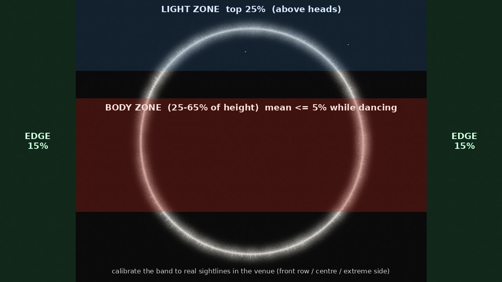

- **אזור הגוף** (בערך 25-65% מגובה המסך, מאחורי הפלג העליון של הרקדנים): **≤5% בהירות ממוצעת** בזמן ריקוד.
- **אזור האור**: הרבע העליון (מעל הראש) והשוליים הצדדיים (15% מכל צד). שם האור **מותר לשבת**.
- **המספרים האלה הם הצעה**, שצריך לכייל מול קווי הראייה האמיתיים באולם (שורה ראשונה, מרכז, צד קיצוני) - `research/C-stage-craft.md` §3.

### 9.2 מה שהמחקר גילה שמשנה את הכלי (תמצית מ-`research/C-stage-craft.md`)

1. **"שחור" הוא לא שחור.** האור על הבמה, לא המקרן, קובע את השחור בזמן שיש תאורה. **מסקנה מעשית: Blacks=0 במופע** - הבמה מרימה את זה בעצמה, וה-floor הקיים (0.02-0.06) הוא בשביל מסכים חשוכים, לא בשביל אולם.
2. **תריס DMX או תריס מקרן, לא BLACKOUT לבד.** ה-BLACKOUT של המנוע משאיר מלבן אפור דולק.
3. **מקרן: מחלקת 7,000-10,000 לומן (לייזר), עדיף עם lens shift.** נוסחה: `לומן ≈ בהירות(nits) × π × שטח / gain-של-המסך`.
4. **מסך RP אפור** (למשל Rosco Grey, gain 0.9) הוא ברירת המחדל - שחורים טובים, זווית צפייה 120°.
5. **עשן לא יראה קרן הקרנה** בהקרנה אחורית - הקרן מאחורי המסך. "הענן" שלנו נבנה **בתוך** התמונה (Signal Fog וכו'), לא באוויר.
6. **צבע:** המקרן מכויל ל-6500K, האור הבימתי לתאורת טונגסטן סביב 3200K. או לכייל את המקרן חם יותר, או להטות את פלטת ה"אור" (`c2`) חם יותר.
7. **תקרת פליקר בטיחותית מאוחדת**: הבריף כבר קבע 3 הבזקים/שנייה. המחקר מוצא שזה **לא מספיק** לבד: Flash ו-kick-cut נספרים בנפרד היום, ומגיעים יחד לכ-6/שנייה. **המלצה: מונה אחד, ≤2/שנייה ו-≤6 ב-5 שניות, בלי אדום מלא-פריים, בלי ה-20Hz הקבוע ב-`corridor.fs`.** להריץ כלי כמו [EA IRIS](https://github.com/electronicarts/IRIS) (קוד פתוח) על הקלטה של כל חלק, ולהדפיס אזהרה אם נשאר הבזק.
8. **חדר החזרות**: מקרן קטן או טלוויזיה גדולה מאחורי הרקדנים, מהשבוע הראשון, כדי שהכוריאוגרפית תראה גוף מול תמונה מוקדם ככל האפשר.

### 9.3 רשימת שאלות למעצב/ת התאורה

1. את/ה גם מאיר/ה את המסך (cyc floods) מלפנים או מאחור, או שהוא "וידאו בלבד"?
2. תאורת רקדנים: כמה לוקס, ואיזו זווית (צד/חזית)? אפשר לשמור 1.8-2.4 מ' נקיים מול המסך?
3. חום הצבע של הפיקסצ'רים (טונגסטן ~3200K או LED מתכוונן)?
4. אפשר לתקתק תריס DMX מהדסק שלך, ומי מפעיל אותו?
5. עשן: אילו מצבים, איזו צפיפות, איזה נוזל?
6. רגעי SHADOW (חלק 7): תוכל/י לתת לי רקדנים חשוכים מול מסך בהיר (≤50 לוקס צד) ב-1-3 רגעים מוסכמים?

### 9.4 רשימת שאלות לאולם

1. מידות הבמה, ובעיקר **העומק הנקי מאחורי המסך** (זה קובע עדשה קצרת-זריקה מול רגילה).
2. יש מסך/cyc קבוע באולם? חומר וגודל?
3. מקרן קיים: דגם, לומן, עדשות, תריס?
4. פריסת קהל: זוויות צד קיצוניות ומרחק שורה ראשונה.
5. מדיניות עשן, בידוד גלאים, וסידורי כיבוי אש.
6. שעות גישה: focus call בחושך, cue-to-cue, dress runs.

### 9.5 גיבוי ותרגול

- **כל חלק מוקלט מראש כ"לופ החזקה"** (מצב רגוע, בלי מכות) של 10 דקות, למקרה קריסה.
- **מתג HDMI** (למשל ATEM Mini): כניסה 1 = ראשי, 2 = גיבוי, 3 = שחור.
- **בקריסה, בסדר הזה:** מעבר למתג לגיבוי/שחור → המוזיקה ממשיכה (תהליך נפרד מהמנוע) → הפעלה מחדש של המנוע → קפיצה לקיו הבא → חזרה לראשי בגבול חלק.

---

## 10. קופי

### 10.1 מערכת השמות

**עברית לתוכנייה, אנגלית על הפלאגין** (כי כל שאר הממשק - מאקרו, LOOK - כבר באנגלית, `research/RESEARCH-REPORT.md` המקורי כבר קבע את זה).

| פריסט | שם עברי | שם באנגלית (בפלאגין) |
|---|---|---|
| 1 | ממתין | WAIT |
| 2 | עוזב | LEAVE |
| 3 | מתנגן שוב | REPLAY |
| 4 | נכתב מחדש | REWRITE |
| 5 | בורא | CREATE |
| 6 | נסחף | DRIFT |
| 7 | צל | SHADOW |
| 8 | נושא | CARRY |
| 9 (סיום) | הסימן | MARK |

### 10.2 הרעיון בשורה אחת

**עברית:** "המסך זוכר את הערב, וכל היזכרות משנה אותו."
**English:** "The screen remembers the evening, and every recall changes it."

### 10.3 הצהרה חזותית (כ-120 מילה, לתוכנייה ולבקשות מענק)

**עברית:**
> *Before It Disappears* עוסק בזיכרון כתהליך של יצירה, לא של שימור. הווידאו ארט במופע נבנה כמנוע גנרטיבי שאינו מציג תמונה כלשהי אלא בונה אותה מחדש בזמן אמת, לפי המוזיקה ותנועת הרקדנים. במהלך הערב הוא "לוכד" רגעים משלו, ומחזיר אותם מאוחר יותר - קצת אחרים בכל פעם, בדיוק כפי שזיכרון אנושי נכתב מחדש בכל היזכרות. אין כאן צילום של הרקדנים ואין דמויות: הכל נוצר בזמן אמת, בגרעין ובקווים דקים, בפלטה כמעט מונוכרומית שבה האור יושב בשוליים והמרכז נשאר כהה. בסיום, כל מה שהמסך אגר לאורך הערב מתכנס לצורה אחת - סימן שקט, שנשאר גם אחרי שהמוזיקה נגמרת.

**English:**
> *Before It Disappears* treats memory as an act of creation, not preservation. The evening's video art is a generative engine that never plays back an image; it builds one in real time, following the music and the dancers' movement. Across the show it captures moments of its own and returns them later, each time slightly changed, the way a human memory is rewritten by every recall. Nothing on screen is footage of the dancers, and no figure appears: everything is generated live, in grain and fine lines, in an almost monochrome palette where light sits at the edges and the centre stays dark. By the end, everything the screen has gathered across the evening converges into one shape — a quiet mark that remains after the music has stopped.

### 10.4 כותרות חלקים (עברית / אנגלית)

1. ממתין / Wait
2. עוזב / Leave
3. מתנגן שוב / Replay
4. נכתב מחדש / Rewrite
5. בורא / Create
6. נסחף / Drift
7. צל / Shadow
8. נושא / Carry
9. הסימן (Because) / The Mark (Because)

### 10.5 טקסט על המסך: המלצה

**לא.** לא מומלץ להקרין קטעים מהטקסט של הכוריאוגרפית על המסך, משלוש סיבות:
1. הטקסט עצמו אומר שמילים נכשלות: "We give it names. / But the moment itself never returns." להקרין את המילים זה בדיוק הכישלון שהטקסט מתאר.
2. סכנת איור: מילה על מסך ליד תנועה מאיירת את הריקוד, בניגוד לעיקרון של הבריף ("המסך הוא שדה, לא איור").
3. הכלי כבר תומך בטקסט כמקור לצורה (Terminal, Symbols) - אבל שם זה **גליפים**, לא מילים קריאות. זה ההבדל בין "לתת שם" ל"להראות שם".

**מה כן:** **הכותרות** של החלקים יכולות להופיע בתוכנייה בלבד (סעיף 10.4), לא על המסך.

---

## 11. ספריית רפרנסים (88 פריטים)

**המחקר המלא, עם תיאור מלא, מה לוקחים ומה נמנע, לכל פריט:**
- **מחול והקרנה חיה, AV ותאורה:** [`research/B1-dance-av-references.md`](research/B1-dance-av-references.md) - 38 פריטים, 6 קבוצות (מחול-גנרטיבי חי, יסודות היסטוריים, תאורה-קודם, ערפל ואור מוצק, קונצרטי AV, ישראל).
- **זיכרון ושחיקה באמנות, קולנוע וסאונד:** [`research/B2-memory-decay-references.md`](research/B2-memory-decay-references.md) - 44 פריטים, 6 קבוצות (זמן חזותי, חומר שנשחק, האטה, סאונד כשכתוב, שכבות, היעדר וצל).
- **מדע הזיכרון כתהליכי תמונה:** [`research/A-memory-science.md`](research/A-memory-science.md) - 17 רעיונות מדורגים.

**כל מקור מתחת מסומן [search]: הכתוב מגיע מתוצאת חיפוש, לא מעמוד שנפתח.** לפני שימוש כלפי חוץ - ללחוץ ולוודא.

| # | עבודה | קישור | מה לוקחים | חלק בטקסט |
|---|---|---|---|---|
| B1-A1 | Klaus Obermaier with Ars Electronica Futurelab, *Apparition* | [ars.electronica.art/futurelab/en/proje…](https://ars.electronica.art/futurelab/en/projects-apparition/) | the idea that the *field* bends in response, so the screen reads as space rather than as | *The memory carries us.* The field that holds the dancers |
| B1-A2 | Chunky Move (Gideon Obarzanek) with Frieder Weiss, *Glow* | [chunkymove.com/works/glow/…](https://chunkymove.com/works/glow/) | the delayed, smudged trail, a residue that catches up seconds later. That is our line | *Movement disappears before we can hold it.* Also movement 10, *Only a |
| B1-A3 | Chunky Move with Frieder Weiss and Robin Fox, *Mortal Engine* | [cmarchive.net/list-of-works/mortal-eng…](https://cmarchive.net/list-of-works/mortal-engine) | a darkness-first luminance budget, where the screen is off until the music or a cue asks | *every memory becomes / the shadow of itself.* |
| B1-A4 | Adrien M & Claire B, *Hakanaï* | [www.artechouse.com/program/hakanai/…](https://www.artechouse.com/program/hakanai/) | the live visual interpreter model, which matches our one operator. Take the white | *Suspended between presence / and absence.* |
| B1-A5 | Adrien M & Claire B, *Le mouvement de l'air* | [www.am-cb.net/archives/le-mouvement-de…](https://www.am-cb.net/archives/le-mouvement-de-l-air) | this is the nearest precedent to our brief of "screen = field / memory / weather". Take the | *Memory is a cloud. / Always changing. / Always drifting.* |
| B1-A6 | Mourad Merzouki (Cie Käfig) with Adrien M & Claire B, *Pixel* | [vimeo.com/114767889…](https://vimeo.com/114767889) | proof that dot fields scale to a full company and a full evening. Take the *density* | *It keeps the outline, / never the whole story.* This is |
| B1-A7 | Hiroaki Umeda, *Holistic Strata* | [hiroakiumeda.com/…](http://hiroakiumeda.com/) | the sudden correlated event: one sound, one total change of field. That is our "rare | *it no longer recalls. / It creates.* |
| B1-A8 | Rhizomatiks (Daito Manabe, Motoi Ishibashi) × ELEVENPLAY (MIKIKO) × Kyle McDonald, *discrete figures* | [rhizomatiks.com/en/work/discrete-figur…](https://rhizomatiks.com/en/work/discrete-figures/) | only the *data-as-trace* idea, where movement becomes a point cloud or lines. Our Mesh | *Beyond that, // it no longer recalls.* Used as a warning. |
| B1-A9 | Alexander Whitley and Memo Akten, *Pattern Recognition* | [www.memo.tv/works/pattern-recognition/…](https://www.memo.tv/works/pattern-recognition/) | the idea that the image *learns and remembers*. Section by section, the screen could | *Maybe memory / is what transforms us.* |
| B1-A10 | Troika Ranch (Dawn Stoppiello, Mark Coniglio), *loopdiver* | [contactquarterly.com/cq/unbound/view/l…](https://contactquarterly.com/cq/unbound/view/loopdiver) | a literal model for movement 3. The image repeats a gesture, and each pass degrades it a | *We slow it down. / We replay it.* |
| B1-B1 | Merce Cunningham with Paul Kaiser and Shelley Eshkar, *BIPED* | [www.mercecunningham.org/the-work/chore…](https://www.mercecunningham.org/the-work/choreography/biped/) | the hand-drawn line quality, and the idea of a trace that notates without | *A memory lives inside a frame. / It keeps the outline.* |
| B1-B2 | Trisha Brown with Robert Rauschenberg and Laurie Anderson, *Set and Reset* | [trishabrowncompany.org/repertory/set-a…](https://trishabrowncompany.org/repertory/set-and-reset.html) | independence. The screen does not illustrate; it runs on its own clock. Take the | *Life keeps moving.* Also 3: *We give it names.* (inference: a structu |
| B1-B3 | Lucinda Childs with Philip Glass and Sol LeWitt, *Dance* | [www.walkerart.org/reader/sol-lewitts-e…](https://www.walkerart.org/reader/sol-lewitts-expanding-grid/) | the grid as a memory container, and the idea that image and live dance share a tempo | *We replay it.* Also 9: *where the moment ends, / and where we begin.* |
| B1-B4 | William Forsythe with ZKM, *Improvisation Technologies* | [zkm.de/en/media/videos/william-forsyth…](https://zkm.de/en/media/videos/william-forsythe-improvisation-technologies-1999) | this is the grammar of our fine plexus lines, justified choreographically. One white | *Only a mark. // The quiet mark // left // by everything // that ever |
| B1-B5 | William Forsythe, Maria Palazzi and Norah Zuniga Shaw, *Synchronous Objects for One Flat Thing, reproduced* | [synchronousobjects.osu.edu/…](https://synchronousobjects.osu.edu/) | the idea of *cue lines*, which are visible connections between events. A plexus line that | *We give it names.* |
| B1-C1 | Wayne McGregor with Random International, *FAR* | [waynemcgregor.com/productions/far…](https://waynemcgregor.com/productions/far) | almost everything. A coarse dot matrix on black (a few thousand points) that reads as | *They wait. // Quietly.* The dormant field. Also 6. |
| B1-C2 | Wayne McGregor, *Atomos* (a cautionary reference) | [waynemcgregor.com/productions/atomos…](https://waynemcgregor.com/productions/atomos) | the music. A Winged Victory for the Sullen is ambient and neo-classical, the same world as | none directly. It is a warning for movements 3–4 (the risk of *We give |
| B1-C3 | Wayne McGregor, *Autobiography* | [waynemcgregor.com/productions/autobiog…](https://waynemcgregor.com/productions/autobiography) | a dramaturgical model for reconsolidation. The same material is recalled in a different | *The story is rewritten / every time it is remembered.* |
| B1-C4 | Wayne McGregor, *Deepstaria* | [waynemcgregor.com/productions/deepstar…](https://waynemcgregor.com/productions/deepstaria) | confirmation that a current major company chooses near-total black and haze. Our lifted | *Like silence.* |
| B1-C5 | Russell Maliphant and Michael Hulls, *AfterLight (Part One)* | [www.michaelhulls.com/afterlight…](https://www.michaelhulls.com/afterlight) | a direct compositional rule. When dancers spin or travel, the field drifts the other way | *where the moment ends, // and where we begin.* |
| B1-C6 | Akram Khan with Anish Kapoor, *Kaash* | [www.akramkhancompany.net/productions/k…](https://www.akramkhancompany.net/productions/kaash-2002/) | a near-literal template for our field. Keep a central dark mass behind the dancers, with a | *The edges begin to soften.* |
| B1-C7 | Crystal Pite, *Flight Pattern* and *Light of Passage* | [en.wikipedia.org/wiki/Flight_Pattern…](https://en.wikipedia.org/wiki/Flight_Pattern) | the best model for our "Because" finale: a slowed recording, stacked voices, one long | *Not a place / we return to.* |
| B1-C8 | Aurélien Bory (Compagnie 111) for Kaori Ito, *Plexus* | [www.kaoriito.com/en/projet/plexus/…](https://www.kaoriito.com/en/projet/plexus/) | this is the physical twin of our plexus aesthetic. Fine vertical line fields with a light | *They wait.* Also 6: *settling in places / we never expect.* |
| B1-C9 | Gisèle Vienne, *Crowd* | [www.g-v.fr/en/shows/crowd/…](https://www.g-v.fr/en/shows/crowd/) | in our percussive sections, the image should also be allowed to stay slow while the | *We slow it down.* |
| B1-C10 | Anne Teresa De Keersmaeker (Rosas) with Ann Veronica Janssens, *Keeping Still – part 1* and *The Song* | [www.rosas.be/en/productions/368-keepin…](https://www.rosas.be/en/productions/368-keeping-still---part-1) | the perceptual approach, in which the screen's job is to change how the space feels, | *A familiar light.* |
| B1-D1 | Anthony McCall, *Line Describing a Cone* | [www.tate.org.uk/art/artworks/mccall-li…](https://www.tate.org.uk/art/artworks/mccall-line-describing-a-cone-t12031) | one line, slowly completing over minutes. It is a perfect structure for a long, | *The quiet mark.* The finale ring completes as the mark. |
| B1-D2 | Ann Veronica Janssens, *yellowbluepink* | [wellcomecollection.org/exhibitions/ann…](https://wellcomecollection.org/exhibitions/ann-veronica-janssens--yellowbluepink) | very slow palette drift across a section (pink to yellow to blue over minutes). In our | *Suspended between presence / and absence.* |
| B1-D3 | Kurt Hentschläger, *ZEE* | [www.epidemic.net/en/art/hentschlager/p…](http://www.epidemic.net/en/art/hentschlager/proj/zee.html) | the "paradise / hell" split in movement 7. The same field can feel heavenly or hellish by | *Sometimes that shadow / feels like paradise. // Sometimes it feels / |
| B1-D4 | Kurt Hentschläger, *FEED* | [digicult.it/digimag/issue-026/feed-vis…](https://digicult.it/digimag/issue-026/feed-visible-space-collapse/) | structurally, this is movement 5 into 6: a traced image hands over to pure atmosphere. | *It creates.* then *Memory is a cloud.* |
| B1-D5 | Ulf Langheinrich, *Waveform B* (and the Granular Synthesis background) | [www.ulflangheinrich.com/waveform-b…](https://www.ulflangheinrich.com/waveform-b) | probably the closest single reference to the owner's taste in this strand, a Kohlberger | *We think memories fade. // They don't. // They wait.* |
| B1-D6 | Tim Hecker, concerts in darkness and fog | [www.clashmusic.com/live/tim-hecker-liv…](https://www.clashmusic.com/live/tim-hecker-live-at-st-giles-in-the-fields-london/) | permission to switch the screen almost off. In the sparsest musical passages the | *Quietly. // Like silence.* Also *Silence comes and goes.* |
| B1-E1 | Robert Henke, *Lumière* (I–III) | [www.ableton.com/en/blog/robert-henke-l…](https://www.ableton.com/en/blog/robert-henke-lumiere-lasers-interview/) | this is our reaction rule, stated by an Ableton co-founder. Divide the score into | *We give it names.* Naming, in the sense of one sound for one shape. |
| B1-E2 | Nonotak (Noemi Schipfer, Takami Nakamoto), *Daydream* | [www.nonotak.com/_daydream-v-2…](https://www.nonotak.com/_daydream-v-2) | line-geometry in monochrome that reads as depth on a flat surface. Good for the | *We reach for it anyway.* |
| B1-E3 | Murcof with Simon Geilfus (AntiVJ) | [vimeo.com/7844683…](https://vimeo.com/7844683) | proof that the owner's genre works live with real-time particles on a translucent | *Always drifting.* |
| B1-E4 | Dumb Type (Teiji Furuhashi; later Shiro Takatani with Ryoji Ikeda), *Lovers* and *OR* | [www.mot-art-museum.jp/en/exhibitions/d…](https://www.mot-art-museum.jp/en/exhibitions/dumb-type-actions-reflections/) | the dissolving-into-darkness timing, and the moral weight: this is work about loss | *With time, / every memory becomes / the shadow of itself.* |
| B1-F1 | Sharon Eyal and Gai Behar (L-E-V / S-E-D), *OCD Love*, *Love Chapter 2* | [www.teatromunicipaldoporto.pt/en/progr…](https://www.teatromunicipaldoporto.pt/en/programa/sharon-eyal-gai-behar-l-e-v-ocd-love/) | the local benchmark for darkness plus a techno pulse. If our percussive sections | *Life keeps moving.* |
| B1-F2 | Hofesh Shechter, *Political Mother* and *Grand Finale* | [hofesh.co.uk/productions/repertoire/po…](https://hofesh.co.uk/productions/repertoire/political-mother/) | the haze level an Israeli-trained choreographer's audience accepts. Tom Visser also lit | *like hell.* |
| B1-F3 | Batsheva Dance Company (Ohad Naharin), lighting by Avi Yona "Bambi" Bueno: *Sadeh21*, *Last Work*, *2019* | [archive.batsheva.co.il/en/repertoire/s…](https://archive.batsheva.co.il/en/repertoire/sadeh21-ohad-naharin/) | a counter-reference. The most influential Israeli company proves the body alone | *Every moment is already leaving / while we are still living inside it |
| B1-F4 | Vertigo Dance Company (Noa Wertheim), *Liba* (video-art exhibit) | [vertigo.org.il/en/last-posts/…](https://vertigo.org.il/en/last-posts/) | the site-specific idea that the surface (rock) changes the image. | *The memory carries us.* Here the rock carries the dance. |
| B1-F5 | Yasmeen Godder, *See Her Change* | [www.hebbel-am-ufer.de/en/programme/pde…](https://www.hebbel-am-ufer.de/en/programme/pdetail/godder-see-her-change) | Yochai Matos is a possible local contact for stage and video design in Israeli | unknown. |
| B1-F6 | Roy Efrat, *Passing* and *Lights Out* | [royefrat.com/PASSING…](https://royefrat.com/PASSING) | layering a *still* ground (a painted-looking grain or texture plate) under slow motion. | *A memory lives inside a frame.* |
| B1-F7 | Daniel Landau, *One Dimensional Man* (cautionary) | [en.wikipedia.org/wiki/Daniel_Landau…](https://en.wikipedia.org/wiki/Daniel_Landau) | — | — |
| B1-F8 | Kibbutz Contemporary Dance Company (Rami Be'er) and Inbal Pinto & Avshalom Pollak: no verified projection found | [www.kcdc.co.il/en/artistic-director/…](https://www.kcdc.co.il/en/artistic-director/) | — | — |
| B2-? | Engine vocabulary used below (defined once) | — | — | — |
| B2-1 | Hiroshi Sugimoto, *Theaters* (series begun 1978) | [fraenkelgallery.com/portfolios/hiroshi…](https://fraenkelgallery.com/portfolios/hiroshi-sugimoto-theaters) | accumulation as a form. A whole section, or the whole night, can sum into one image. | M4, A memory lives inside a frame. / It keeps the outline, / never the |
| B2-2 | Hiroshi Sugimoto, *Seascapes* (1980→) | [fraenkelgallery.com/portfolios/hiroshi…](https://fraenkelgallery.com/portfolios/hiroshi-sugimoto-seascapes) | a single horizon line as the calmest possible state of the screen. There are two | M1, They wait. / Quietly. / Like silence. |
| B2-3 | Chris Marker, *La Jetée* (1962) | [sf-encyclopedia.com/entry/jetee_la…](https://sf-encyclopedia.com/entry/jetee_la) | a grammar of held frames. Freeze the generative image, cross-dissolve between | M3, We slow it down. / We replay it., and M2, Movement disappears befo |
| B2-4 | Chris Marker, *Sans Soleil* (1983, year not confirmed in my results): "the Zone" | [rhizomes.net/issue8/tryon.htm…](https://rhizomes.net/issue8/tryon.htm) | this is our manifesto's precedent. A machine that remembers by *transforming* is | M5, it no longer recalls. / It creates. |
| B2-5 | Hollis Frampton, *(nostalgia)* (1971) | [bombmagazine.org/articles/2006/10/01/h…](https://bombmagazine.org/articles/2006/10/01/hollis-framptons-nostalgia/) | (a) destruction that starts from the edge inward as a slow, beautiful event, and | M8, Perhaps we remember / the last time / we remembered it. |
| B2-6 | Andrei Tarkovsky, *Mirror* (1975) | [www.bfi.org.uk/film/97341aa7-c937-57bf…](https://www.bfi.org.uk/film/97341aa7-c937-57bf-9011-99bb084472b9/mirror) | impossible weather as memory: two contradictory elements in the same frame (rising | M6, Memory is a cloud. / Always changing. / Always drifting. |
| B2-7 | Jonas Mekas, *Reminiscences of a Journey to Lithuania* (1972) | [mubi.com/en/us/films/reminiscences-of-…](https://mubi.com/en/us/films/reminiscences-of-a-journey-to-lithuania) | short bursts (2–12 frames) of overexposure as the rhythm of involuntary memory, | M6, A voice. / A scent. / A familiar light. |
| B2-8 | Tacita Dean, *Disappearance at Sea* (1996) | [artlyst.com/features/tacita-dean-disap…](https://artlyst.com/features/tacita-dean-disappearance-at-sea-1996-significant-works-sue-hubbard/) | a rotating beam that sweeps a dark frame and lights only what it passes: a | M6, A familiar light., and M1, waiting. |
| B2-9 | Bill Morrison, *Decasia* (2002) | [www.moma.org/calendar/events/512…](https://www.moma.org/calendar/events/512) | decay as an active, spreading, beautiful process: organic blooms that grow from | M4, The edges begin to soften. / The colours slowly change. |
| B2-10 | Bill Morrison, *Light Is Calling* (2004) | [michaelgordonmusic.com/music/light-is-…](https://michaelgordonmusic.com/music/light-is-calling/) | proof that decay can be radiant, not sad. It is a model for the "paradise" side of | M7, Sometimes that shadow / feels like paradise. |
| B2-11 | Bill Morrison, *Dawson City: Frozen Time* (2016) | [wexarts.org/blog/bill-morrison-dawson-…](https://wexarts.org/blog/bill-morrison-dawson-city-frozen-time) | "They don't [fade]. / They wait." This is the most literal real-world case of M1. Also | M1, We think memories fade. / They don't. / They wait. |
| B2-12 | Jürgen Reble, *Instabile Materie* (1995) / *Materia Obscura* (2009) | [filmalchemist.de/films/instabile_mater…](https://filmalchemist.de/films/instabile_materie.html) | the closest analogue precedent to our generative stance. Abstract matter, | M5, It creates., and M9, transformation. |
| B2-13 | Stan Brakhage, *Mothlight* (1963) | [www.artforum.com/features/j-hoberman-o…](https://www.artforum.com/features/j-hoberman-on-stan-brakhages-mothlight-200839/) | translucency: forms that exist only because light passes through them. Fine veined | M10, The quiet mark / left / by everything / that ever / moved us. |
| B2-14 | Nam June Paik, *Zen for Film* (1964) | [www.eai.org/titles/zen-for-film…](https://www.eai.org/titles/zen-for-film) | the dust layer as memory. Our Dust should *accumulate* over the night, not be | M10, Only a mark., and M8, every time we remember, / we leave a part o |
| B2-15 | Peter Tscherkassky, *Outer Space* (1999) | [expcinema.org/site/en/wiki/work/outer-…](https://expcinema.org/site/en/wiki/work/outer-space) | multiple time-offset exposures of our own scene composited additively (5–7 layers, | M4, The story is rewritten / every time it is remembered. |
| B2-16 | Tony Conrad, *Yellow Movies* (1972–73) | [www.moma.org/collection/works/108075…](https://www.moma.org/collection/works/108075) | the palette itself should age across the night, too slowly to notice in any one | M4, The colours slowly change. |
| B2-17 | Paul Sharits, *Shutter Interface* (1975) | [www.metmuseum.org/art/collection/searc…](https://www.metmuseum.org/art/collection/search/623288) | loops of unequal length (phasing), so combinations never repeat exactly. This is a | M3, We replay it. |
| B2-18 | Gustav Metzger, *Liquid Crystal Environment* (1965–66; with Cream, The Who, The Move at the Roundhouse, 1966) | [www.lifa-research.org/en/artworks/liqu…](https://www.lifa-research.org/en/artworks/liquid-crystal-environment/) | the explicit pairing of auto-destructive and auto-creative is exactly the text's | M5, It no longer recalls. / It creates. |
| B2-19 | Bill Viola, *The Reflecting Pool* (1977–79) | [www.moma.org/collection/works/120413…](https://www.moma.org/collection/works/120413) | split time: one element of the frame holds (the "outline") while a second layer | M2, Every moment is already leaving / while we are still living inside |
| B2-20 | Bill Viola, *The Passing* (1991) | [www.moma.org/collection/works/118326…](https://www.moma.org/collection/works/118326) | "black" as a living low-light field: very low luma with coarse sensor noise, never | M1, Quietly. / Like silence., and M9, where the moment ends, / and whe |
| B2-21 | Bill Viola, *Emergence* (2002) | [www.getty.edu/art/collection/object/10…](https://www.getty.edu/art/collection/object/108VM9) | a rise held for minutes, with one slow overflow. The slow form of our Emergence | M3, We slow it down., and the Because finale. |
| B2-22 | Douglas Gordon, *24 Hour Psycho* (1993) | [gagosian.com/news/museum-exhibitions/d…](https://gagosian.com/news/museum-exhibitions/douglas-gordon-24-hour-psycho/) | recognition without narrative. Also the forward/reverse pairing, relevant to the | M3, We slow it down., and But the moment itself never returns. |
| B2-23 | Paul Nasca, *Paulstretch* (algorithm, 2006) and Shamantis, *U Smile 800% Slower* (2010) | [www.npr.org/sections/therecord/2010/08…](https://www.npr.org/sections/therecord/2010/08/18/129283985/the-art-of-a-time-stretch) | the key model for the finale, a slowed "Because". Time-stretch keeps the *light* of | M3, We slow it down., then M9, Until we can no longer tell / where the |
| B2-24 | William Basinski, *The Disintegration Loops* (2002–03) | [www.soundonsound.com/techniques/classi…](https://www.soundonsound.com/techniques/classic-tracks-william-basinski-disintegration-loops) | the central mechanism of M3–M4 in one sentence: *every replay costs something*. A | M3, We replay it., and M4, The story is rewritten / every time it is r |
| B2-25 | Alvin Lucier, *I Am Sitting in a Room* (1969) | [www.moma.org/explore/inside_out/2015/0…](https://www.moma.org/explore/inside_out/2015/01/20/collecting-alvin-luciers-i-am-sitting-in-a-room/) | the most precise model of M8: "Perhaps we remember / the last time / we remembered it." | M8 and M10, can still leave a shape / inside us. |
| B2-26 | The Caretaker (Leyland James Kirby), *Everywhere at the End of Time* (2016–19), with Ivan Seal's covers | [www.thewire.co.uk/news/54374/final-rel…](https://www.thewire.co.uk/news/54374/final-release-for-the-caretaker-project-after-20-years) | staging: decay as a sequence of distinct states (not a smooth fade), each | M4 through M5, and M7, Sometimes it feels / like hell. |
| B2-27 | Leyland Kirby, *Sadly, the Future Is No Longer What It Was* (2009) | [ra.co/reviews/6970…](https://ra.co/reviews/6970) | duration and patience: 10+ minute states that change almost imperceptibly. It suits | M6, Suspended between presence / and absence. |
| B2-28 | Gavin Bryars, *The Sinking of the Titanic* (1969→) | [gavinbryars.com/post/the-sinking-of-th…](https://gavinbryars.com/post/the-sinking-of-the-titanic-compositions) | depth as low-pass: the further back a memory, the fewer high frequencies (edges, | M4, The edges begin to soften., and the finale. |
| B2-29 | Stephan Mathieu, *A Static Place* (12k, 2011) | [12kmusic.bandcamp.com/album/a-static-p…](https://12kmusic.bandcamp.com/album/a-static-place) | memory as a chain of transfers, each leaving its tint. Our film chain can be framed | M8, the last time / we remembered it. |
| B2-30 | Tim Hecker, *Ravedeath, 1972* (Kranky, 2011) | [timhecker.bandcamp.com/album/ravedeath…](https://timhecker.bandcamp.com/album/ravedeath-1972) | loudness and fullness can come from *crushed* texture rather than brightness. A way to | M7, Sometimes it feels / like hell. |
| B2-31 | Philip Jeck, *Vinyl Requiem* (1993, with Lol Sargent) | [www.factmag.com/2013/10/23/waxwork-phi…](https://www.factmag.com/2013/10/23/waxwork-philip-jeck-on-his-landmark-turntable-piece-vinyl-requiem/) | a precedent for live AV where the image surface and the sound source are the same | M8, The memory carries us. |
| B2-32 | Idris Khan, *every… William Turner postcard from Tate Britain* (2004) and *Struggling to Hear… After Ludwig van Beethoven Sonatas* (2005) | [www.victoria-miro.com/artists/14-idris…](https://www.victoria-miro.com/artists/14-idris-khan/works/artworks4643/) | stacking our own frames, so recurring structure darkens and firms up while the | M4, The story is rewritten / every time it is remembered., and M9. |
| B2-33 | Jason Salavon, amalgamations: *The Class of 1988* (year not confirmed) and *Every Playboy Centerfold* series | [salavon.com/work/Figure1EveryPlayboyCe…](http://salavon.com/work/Figure1EveryPlayboyCenterfold/) | only the math. Mean versus median versus max over a set of generated frames gives | M6, Suspended between presence / and absence. |
| B2-34 | William Kentridge, charcoal "stone-age" animation (1989→; series names and dates not confirmed in my results) | [harvardfilmarchive.org/programs/the-an…](https://harvardfilmarchive.org/programs/the-animated-films-of-william-kentridge) | the single most usable mechanism for the ending. Every movement leaves grey | M10, and M8, every time we remember, / we leave a part of ourselves be |
| B2-35 | Hito Steyerl, "In Defense of the Poor Image" (e-flux journal #10, November 2009) | [www.e-flux.com/journal/10/61362/in-def…](https://www.e-flux.com/journal/10/61362/in-defense-of-the-poor-image) | a theory of generation loss as value. Recall = re-encode: blockiness, banding and | M4, The story is rewritten / every time it is remembered. |
| B2-36 | Gerhard Richter, blurred photo-paintings (e.g. *Onkel Rudi*, 1965) | [engelsbergideas.com/reviews/gerhard-ri…](https://engelsbergideas.com/reviews/gerhard-richter-between-past-and-present/) | directional (horizontal) blur as a sign of memory. Our Smear control is already | M4, It keeps the outline, / never the whole story. |
| B2-37 | Roman Opałka, *1965/1 – ∞* (1965–2011) | [www.dailyartmagazine.com/roman-opalka/…](https://www.dailyartmagazine.com/roman-opalka/) | a show-long monotonic drift of the ground toward the marks: in the finale, figure | M9, Until we can no longer tell / where the moment ends, / and where w |
| B2-38 | Christian Boltanski, *Théâtre d'ombres* (1984–97) and *Monument* (1986) | [www.jupiterartland.org/art/christian-b…](https://www.jupiterartland.org/art/christian-boltanski-theatre-dombres/) | (a) the shadow is larger and softer than its source, and it breathes; the focus | M7, every memory becomes / the shadow of itself. |
| B2-39 | Rachel Whiteread, *House* (1993) | [www.tate.org.uk/art/artists/rachel-whi…](https://www.tate.org.uk/art/artists/rachel-whiteread-2319/five-things-know-rachel-whiteread) | the text's own final image: "even what is gone / can still leave a shape / inside | M8 and M10, can still leave a shape / inside us. |
| B2-40 | Felix Gonzalez-Torres, *"Untitled" (Portrait of Ross in L.A.)* (1991) | [en.wikipedia.org/wiki/%22Untitled%22_(…](https://en.wikipedia.org/wiki/%22Untitled%22_(Portrait_of_Ross_in_L.A.) | quantity as memory. A finite particle count that the show "spends" (each event | M8, every time we remember, / we leave a part of ourselves behind. |
| B2-41 | Chiharu Shiota, *The Key in the Hand* (Venice Biennale, Japan Pavilion, 2015) | [www.designboom.com/art/chiharu-shiota-…](https://www.designboom.com/art/chiharu-shiota-venice-art-biennale-the-key-in-the-hand-05-06-2015/) | the dense line web as a volume, close to The Noise Diary's plexus and our Mesh Body. | M6, It follows us quietly, and M8. |
| B2-42 | Uta Barth, *Ground* (1992–97) and *Field* series | [www.getty.edu/art/exhibitions/barth/ex…](https://www.getty.edu/art/exhibitions/barth/explore.html) | the backdrop without the portrait. Our screen is literally the backdrop to the | M6, Suspended between presence / and absence. |
| B2-43 | Anthony McCall, *Line Describing a Cone* (1973) | [www.tate.org.uk/research/tate-papers/0…](https://www.tate.org.uk/research/tate-papers/08/anthony-mccall-line-describing-a-cone) | the circle drawn slowly over 30 min is a perfect long arc for one section, and | M3, We give it names (the line describes), and M10, one line only. |
| B2-44 | Ann Veronica Janssens, *yellowbluepink* (Wellcome Collection, 15 Oct 2015 – 3 Jan 2016); Olafur Eliasson, *The weather project* (Tate Modern, 2003); James Turrell, *Aten Reign* (Guggenheim, 2013) | [wellcomecollection.org/exhibitions/ann…](https://wellcomecollection.org/exhibitions/ann-veronica-janssens--yellowbluepink) | the cloud without an image: a whole section can be a field of slightly varying | M6, Memory is a cloud. / Always changing. / Always drifting. |

## 12. החלטות שמחכות לך ולכוריאוגרפית

לכל החלטה: **ההמלצה שלי**, ולמה.

### ממך

1. **קבצי אודיו של המופע.** בלעדיהם לא רץ `analyze_wav`, וסעיף 4 (מפת המופע) נשאר שלד. **המלצה:** לשלוח תיקייה עם קבצי wav מסודרים לפי חלק, גם אם זו טיוטה.
2. **כיוון קריאייטיב.** **המלצה: כיוון 1 (ארכיון שנכתב מחדש), עם שני אלמנטים מכיוון 2** (סעיף 3).
3. **סדר בנייה.** **המלצה:** קודם בטיחות (S), אחר כך MemoryBank (M, כי כיוון 1 תלוי בו), במקביל Cue Bank (S-M, כי בלעדיו קשה להפעיל את הערב). Residue אחרון.
4. **"Because" - איזו גרסה, ואיך ההאטה נעשתה.** זה משנה את כל סעיף 7.4: אם הגובה יורד (רה-סמפול), התמונה יכולה להאט **יחד עם** הצליל (speed מוזל בהתאמה). אם זה time-stretch עם גובה קבוע (Paulstretch-style), יש הצדקה ישירה ל-PHASE scramble (`research/B2-memory-decay-references.md` #23) - שמירה על האור, איבוד המתאר. **המלצה: לספר לי, ואבנה את סעיף 7.4 מחדש בסבב הבא.**
5. **זכויות "Because".** **המלצה: לפתוח מול אקו"ם עכשיו**, לא לחכות לתאריך המופע.
6. **דגם הקונטרולר (הקורג).** בלי הדגם המדויק אי אפשר לבנות מיפוי אמיתי (סעיף 8.2 הוא הצעה גנרית).

### מהכוריאוגרפית

7. **שם המופע בעברית**, אם יש, ושם/שמה לקרדיטים.
8. **מספר רקדנים, אורך המופע הכולל, ותאריך בכורה.**
9. **אישור על קריאת הטקסט (סעיף 2).** אני קורא את הטקסט כמניפסט נגד שכחה, לא כאבל. אם זו לא הכוונה - כל סעיף 3 (הכיוונים) צריך להיבנות אחרת.
10. **רגעי SHADOW (חלק 7).** האם יש לה/לו רגעים ספציפיים בכוריאוגרפיה שמתאימים לצלליות מוצהרות (סעיף 5א, פריסט 7)?
11. **רפרנסים משלה/ו, ו"לא-בשום-אופן".** מעבר לפנים/גולגולות/מסכות (שכבר ידוע), יש עוד משהו שהיא/הוא לא רוצה לראות?
12. **כמה המסך צריך להוביל מול ללוות?** הבריף (§2.7) שאל את זה ועוד לא נענה. זה קובע כמה "אמירה" מותר למסך בסעיפים כמו CREATE, לעומת כמה הוא צריך להישאר ברקע.

---

## 13. תוכנית בנייה

**שלב 0 - היום, בלי קוד (v0 של כיוון 1):**
- 9 הפריסטים מ-5א: קבצי JSON + פלטות + סנאפשוטים, ב-`build_instrument_presets.py`.
- **גרסת v0 ל-MemoryBank:** מרנדרים מראש 6-8 "זיכרונות" בדרגות שחיקה שונות (בדיוק כמו ב-[`stills/d1-archive/`](stills/d1-archive/)), שומרים כ-PNG בתיקיית `Images/Memory`, ומזינים ל-Dot Relief/Emergence עם `source.folder` (פיצ'ר קיים). זה לא באמת נכתב-מחדש בזמן אמת, אבל **זה עובד באימון הראשון** ונותן לכוריאוגרפית לראות את הרעיון על הבמה.
- לפני הכל: להריץ `analyze_wav` על המוזיקה בפועל ברגע שהיא זמינה.

**שלב 1 - בטיחות (S, לפני כל חזרה על במה אמיתית):**
- מגביל הבזק מאוחד. מסכה/corner-pin בפס האחרון. אימות ש-state resend אחרי קריסה עובד בפועל.

**שלב 2 - Cue Bank (S-M):**
- הרחבת Snapshots מ-4 ל-32 משבצות, פרמטר `cueIndex` לאוטומציה.

**שלב 3 - MemoryBank (M):**
- הכיתה, הלכידה, שער הנדירות (prediction error), ההתכנסות לטבעת. זה הופך את v0 לגרסה האמיתית: כתיבה-מחדש חיה, לא תמונות קפואות.

**שלב 4 - Residue (S):**
- ה-buffer המצטבר. משתלב עם MemoryBank (המשבצות "מזינות" את השאריות כשהן מתפוגגות).

**שלב 5 - MARK, סצנת הסיום (S, הרחבת Halo Ring):**
- `arcProgress` ו-`ringDither`.

**מתי לרוץ במקביל:** שלבים 1-2 בלתי תלויים זה בזה, ואפשר להריץ סוכנים במקביל. שלב 3 תלוי בשלב 1 (המסכה חייבת לעטוף גם את הזיכרונות). שלב 5 יכול לרוץ בכל שלב, כי הוא לא תלוי ב-MemoryBank (אפשר לבנות MARK גנרית לפני שהזיכרונות האמיתיים מוכנים, ולחבר אותם מאוחר יותר).

**מתי הראשונה - v0 - מספיקה:** לחזרה הראשונה עם הכוריאוגרפית, ולבדיקת הקריאה של סעיף 3 מולה, v0 מספיקה. MemoryBank האמיתי צריך להיות מוכן **לפני** תחילת ה-tech week, כי אז השחיקה חייבת להיות באמת רציפה ולא סדרת תמונות.

---

## 14. מקורות

**כל מה שנקרא במלואו ב-Bash/Read (`[opened]`, קוד וקבצי הפרויקט):**
`USAGE.md`, `docs/QUICKSTART-HE.md`, `docs/REFERENCE-LIBRARY.md`, `docs/RESEARCH-REPORT.md`, `docs/RESEARCH-BRIEF-COMPETITORS.md`, `docs/REVIEW-2026-09-24-HE.md`, `docs/before-it-disappears/ART-DIRECTOR-BRIEF.md`, `docs/before-it-disappears/choreographer-text.md`, `engine/tools/build_instrument_presets.py`, `engine/Presets/*.json`, `engine/Shaders/Instrument/*.fs` (כל 13), `engine/Shaders/Instrument/common.glsl`, `engine/Source/LookPass.{h,cpp}`, `engine/Source/FinishPass.{h,cpp}`, `engine/Source/Signals.{h,cpp}`, `engine/Source/Modulation.{h,cpp}`, `engine/Source/Motion.h`, `engine/Source/SourceLibrary.h`, `engine/Source/PresetV2.{h,cpp}`, `engine/Source/PresetInstance.{h,cpp}`, `engine/Source/PresetManager.cpp`, `engine/Source/ISFShader.cpp`, `plugin/Source/PluginProcessor.{h,cpp}`.

**ווב, ישיר (WebSearch, [search], "Because" בלבד - סעיף 7.1):**
- [Because | The Beatles Wiki](https://beatles.fandom.com/wiki/Because)
- [Songfacts: Because](https://www.songfacts.com/facts/the-beatles/because)
- [Is Beatles' Because Beethoven's Moonlight Sonata Played Backwards? - Snopes](https://www.snopes.com/fact-check/because/)
- [Classic FM: this John Lennon song is based on Beethoven's Moonlight Sonata](https://www.classicfm.com/composers/beethoven/guides/beatles-because-beethoven-moonlight-sonata/)

**ווב, ארבעת אסטרטגיות המחקר המקבילות (כל אחד [search] בלבד, אף עמוד לא נפתח - חסימת רשת בסביבת העבודה):**
- `research/A-memory-science.md` - 17 ראשי פרקים, כל אחד עם מקורות; 42 URLs בסך הכל.
- `research/B1-dance-av-references.md` - 38 פריטים; 88 URLs.
- `research/B2-memory-decay-references.md` - 44 פריטים; ~95 URLs.
- `research/C-stage-craft.md` - 9 נושאים; 60+ URLs.

**מגבלת המחקר החשובה ביותר:** בסביבת העבודה הזו `WebFetch` נחסם לכל דומיין שניסינו (ויקיפדיה, Snopes, PubMed, Ofcom, Rosco ועוד). **כל מקור ברשת במסמך הזה, ללא יוצא מן הכלל, מבוסס על תוצאת חיפוש (snippet) ולא על עמוד שנפתח.** לפני כל שימוש כלפי חוץ - תוכנייה, בקשת מענק, עיתונות, או כל טענה על זכויות - **חובה** ללחוץ על הקישור ולוודא את הטענה במקור.

**כלי הסטילס** ([`tools/`](tools/)) קרא ישירות את קוד השיידרים ואת מקורות ה-post-processing מ-`engine/Source/LookPass.cpp` ו-`engine/Source/FinishPass.cpp`, כך שהתמונות המסומנות "מהמנוע" הן תוצאה אמיתית של הקוד הקיים, לא חיקוי.
