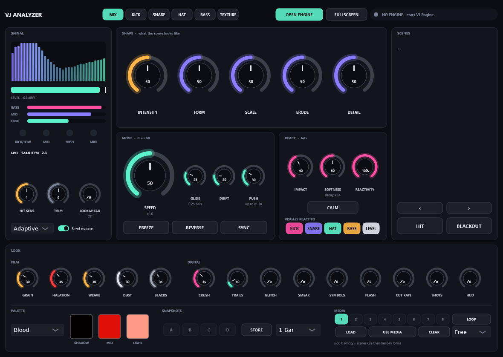

# VJ Analyzer: UI design dossier

> **החלטות הבעלים (26.9.2026), גוברות על ההמלצות למטה:**
> - במסך PLAY יוצגו **8 הכפתורים**, לא 4.
> - החלפת סצנה ב**בחירה ואז GO**, ללא החלפה אוטומטית וללא כפתור "חתוך עכשיו". כבר מומש בפלאגין הנוכחי.
> - **פיילוט למוצר שיימכר.**
> - **אין שם עדיין.** SAFELIGHT נדחה, ואין עבודה על לוגו או מיתוג עד גרסה מאושרת.
> - **המסך של הבעלים:** 1920x1080 ב-Scaling של 125%, כלומר 1536x864 לוגי.
> - `CLAUDE-DESIGN-PROMPT.md` עודכן בהתאם. ה-wireframes עדיין מראים 4 כפתורים ושם SAFELIGHT; הטקסט של הפרומפט גובר.

*26 September 2026. Written for the owner, and for Claude Design (or any designer) who has never seen the project. The handoff prompt is in [CLAUDE-DESIGN-PROMPT.md](CLAUDE-DESIGN-PROMPT.md). The wireframes are [wireframe-basic.svg](wireframe-basic.svg), [wireframe-expanded.svg](wireframe-expanded.svg) and [wireframe-source-and-states.svg](wireframe-source-and-states.svg). The current UI is in [current-ui.png](current-ui.png).*

---

## תקציר מנהלים

**האבחנה.** הבעיה היא לא שיש יותר מדי נובים. הבעיה היא שכל ה-57 בקרים מוצגים באותו משקל, באותו מסך ובלי היררכיה. כך אי אפשר לדעת מה חשוב עכשיו, מה מגדירים פעם אחת ומה לא נוגעים בו בכלל. מצאתי 14 בלבולים קונקרטיים. הבולטים:

- **חמישה מושגים שונים של "כמה הסאונד משפיע":** Hit Sens, Reactivity, Impact, Push ו-VISUALS REACT TO.
- **כפתורי התפקיד** (MIX/KICK/SNARE…) נראים בדיוק כמו כפתורי REACT TO, אבל הם עושים משהו אחר לגמרי.
- **הצבעים לא אומרים כלום.** מג'נטה היא גם Impact, גם KICK, גם BASS וגם HIT.
- **14 נובי LOOK באותו גודל.** "50" על כל נוב לא מסביר מה הוא עושה.
- **אין שום משוב כשלוחצים על סצנה**, כי המעבר מחכה לביט הבא.
- **החלון גדול מדי (1180x838)** בשביל לפטופ, ואי אפשר לשנות את הגודל שלו.

**ההמלצה: כיוון "Darkroom Deck", כלומר קודם הסצנה.** שני מצבים באותו חלון:

1. **PLAY** (בערך 760x460): מה שנוגעים בו בהופעה ושום דבר אחר.
   - רשת של 16 סצנות עם תמונה קטנה לכל אחת. לחיצה על סצנה מסמנת אותה כ-**CUED** בכתום-טונגסטן, עם ספירה לאחור של ביטים עד המעבר. אחרי המעבר היא מסומנת **LIVE** באדום.
   - ארבעה נובים גדולים: Intensity, Speed, Impact ו-Erode.
   - שורת **LISTEN TO**, שבה כל נורית מהבהבת כשהערוץ שלה מכה, ואותה נורית היא גם המתג שלו.
   - HIT, CALM, FREEZE, ו-4 רגעים שמורים (A-D) במקום "סנאפשוטים".
   - BLACKOUT בפינה, רחוק מ-HIT.
2. **EDIT:** לחיצה על EDIT פותחת מגירה של 420 פיקסלים מימין. ה-PLAY לא זז ממקומו.
   - במגירה 7 לשוניות: SHAPE, MOTION, LISTEN, LOOK, COLOUR, MEDIA, SETUP.
   - בתחתית המגירה שורת הסבר קבועה על מה שהעכבר מעליו.
3. **SOURCE** (בערך 360x220): כל מופע שאינו ה-MIX, למשל KICK על ערוץ הקיק, מציג רק מה שרלוונטי אליו. כלומר תפקיד, מד, רגישות ו-Trim, ושורה שאומרת "השליטה נמצאת במופע הראשי".

**שפה ויזואלית: "חדר חושך" (darkroom).**
- **צבעים:** שחור חם, טקסט בצבע עצם, ואדום אחד בלבד. האדום מסמן "חי" או "יוצא לקהל", כמו נורת אדומה בחדר חושך.
- **כתום-טונגסטן:** רק למצב "ממתין" (CUED, STORE, טעינה).
- **ציאן:** רק ל"זז מ-MIDI או מאוטומציה".
- **גופנים:** IBM Plex Sans Condensed ו-IBM Plex Mono (רישיון OFL, חינם).
- **גרפיקה:** קווי שיער דקים, סימני חיתוך של פריים וצלבים בסגנון ה-HUD מהרייל של un_source.
- **בלי:** ניאון, זוהר או גרדיאנטים. הצבע של הממשק מגיע מהאמנות עצמה.

**שם עבודה מוצע: SAFELIGHT** (נורת הביטחון האדומה של חדר החושך). אלטרנטיבות: Halation, Gate, Emulsion. **לא נבדק סימן מסחרי.**

**מה דורש קוד חדש (לא רק עיצוב):**
- תמונות ממוזערות של הסצנות.
- מצב CUED עם ספירה לאחור.
- זיהוי אוטומטי של שם הערוץ (Live 10.1.2 תומך בזה).
- חלון שאפשר לשנות את הגודל שלו.
- שמות לרגעים השמורים.
- אופציונלי: "חיתוך מיידי" עם Shift.

**5 שאלות אליך** נמצאות בסוף המסמך.

---

## Contents

1. [Context in one page](#1-context-in-one-page)
2. [Audit of the current UI](#2-audit-of-the-current-ui)
3. [Research: patterns from pro plug-ins and VJ tools](#3-research-patterns-from-pro-plug-ins-and-vj-tools)
4. [Information architecture](#4-information-architecture)
5. [Visual language](#5-visual-language)
6. [Handoff specification](#6-handoff-specification)
7. [What needs code, and in what order](#7-what-needs-code-and-in-what-order)
8. [Open questions for the owner](#8-open-questions-for-the-owner)
9. [Sources](#9-sources)

---

## 1. Context in one page

- **The product.** A VST3 audio effect in Ableton Live 10 on Windows (Intel Iris Xe laptop). It analyses audio and sends OSC to a separate VJ Engine window, which renders 16 generative GLSL scenes: Hot Blobs, Dot Relief, One Bit, Corridor, Fibers, Terminal, Ink, Signal Fog, Mesh Body, Morphogen, Halo Ring, Emergence, Negative, Media Negative, Media Lines and Membrane.
- **Instances.** There is one plug-in instance per track, each with a role (MIX, KICK, SNARE, HAT, BASS, TEXTURE).
  - Only the instance with **Send macros** on sends the knobs, look and scene. That is normally the MIX instance on the Master track.
  - The other instances only feed analysis to the engine.
- **The user.** An artist-performer, not an engineer. His taste is ambient and downtempo, 35mm grain, red monochrome, The Noise Diary, phs.wrk and the un_source reel.
  - He plays music and visuals alone from one Live set, including a contemporary dance show, *Before It Disappears*.
  - He maps a Korg controller through Live's MIDI Map mode.
- **The complaint.** He does not understand what does what. There are many knobs that are not always needed, and he feels lost inside the plug-in. The scenes are fine. The shell is the problem.
- **Constraints.**
  - JUCE 8.0.14 (verified in the local JUCE checkout), using a custom `LookAndFeel_V4`.
  - The plug-in UI shares the integrated GPU with the engine, which already runs near its limit (adaptive render scale).
  - The editor runs a 30 Hz timer.
  - The plug-in exposes **56 host parameters** (counted in `PluginProcessor.cpp`). IDs must never change, or saved sets and MIDI maps break.

---

## 2. Audit of the current UI

### 2.1 First impression (current-ui.png, 1180 x 838)

- **Eight panels with equal visual weight** and about 60 interactive things on one screen. Nothing says "start here".
- **The largest objects on screen are SHAPE knobs.** They matter, but the most-used live action, *choosing a scene*, is a narrow text list in the right column.
  - With the engine off that list is **empty**, showing only a "-" and no explanation. The first thing a new user sees is a blank.
- **Colour is decorative, not semantic.**
  - Mint means: selected role, Speed, Drift, Push, HIGH band, the HAT chip and the Open Engine button.
  - Magenta means: Impact, Softness, Reactivity, the KICK chip, the BASS bar and HIT.
  - Violet means: Form, Scale, Erode, Detail, the SNARE chip, Reverse and snapshots.
  - Nothing can be learned from colour.
- **The mint, magenta and violet neon on navy is the generic "plug-in 2020" look.** It is the opposite of the owner's art: warm black, bone, blood red, grain.
- **The number in each knob is a raw 0-100.** Speed shows "50" when it means x1.00. Push shows "30" when it means "up to x1.30".
- **The window is fixed at 1180 x 838.** On a 1920 x 1080 laptop at 150 % Windows scaling (a common default; the owner's setting is unknown), Live's VST3 auto-scaling would make it about 1770 x 1257 physical pixels, which is taller than the screen.

### 2.2 Full control inventory

Frequency tiers:
- **A** = always (touched every song).
- **S** = sometimes (a few times a set).
- **U** = setup (once per set, show or song).
- **X** = expert (rarely, deliberately).

"Name" is judged from the owner's point of view: is the meaning clear without reading a manual?

| # | Control (host parameter) | Today | What it really does | Tier | Name clear? | New home |
|---|---|---|---|---|---|---|
| 1 | Role MIX…TEXTURE (`role`) | Header, 6 big buttons | What is on *this* track | U | No: looks like REACT TO | Role chip (PLAY header) + SETUP |
| 2 | OPEN / SHOW ENGINE | Header | Launch or focus engine window | U | Yes | Engine pill + NOW empty state |
| 3 | FULLSCREEN | Header | Engine fullscreen | U | Yes | Engine pill menu |
| 4 | Status pill | Header | Connection, fps, BPM, render % | A (glance) | Partly | Engine pill (kept, clearer) |
| 5 | Spectrum 32 bands | SIGNAL | Diagnostic | X | n/a | SETUP only |
| 6 | Level bar + dBFS | SIGNAL | Diagnostic | S | OK | PLAY "SOUND" strip (thin) |
| 7 | BASS/MID/HIGH bars | SIGNAL | Diagnostic | X | Vocabulary clash | SETUP |
| 8 | Lamps KICK/LOW, MID, HIGH, MIDI | SIGNAL | Onset detected on this instance | S | Clash with REACT TO names | Merged into LISTEN lamp-toggles; full set in SETUP |
| 9 | Status line LIVE/CALIBRATING/SILENT, BPM, bar.beat | SIGNAL | Health | S | OK | Engine pill + SOUND strip |
| 10 | Hit Sens (`sensitivity`) | SIGNAL | Onset threshold for this instance | U | No ("Sens" of what?) | SETUP > "Detect" |
| 11 | Trim (`trim`) | SIGNAL | Analysis input gain | U | OK | SETUP |
| 12 | Lookahead (`lookahead`) | SIGNAL | Adds plug-in latency so visuals land early | U, risky live | No | SETUP, with a warning |
| 13 | Adaptive/Locked (`normalizer`) | SIGNAL, unlabeled dropdown | Normaliser mode | U | No label at all | SETUP > "Level: Auto / Fixed" |
| 14 | Send macros (`sendControls`) | SIGNAL toggle | This instance leads the visuals | U | No (jargon) | "LEAD" in role chip / SETUP |
| 15 | Intensity (`macro1`) | SHAPE | Light and energy | A | OK | PLAY hero knob |
| 16 | Form (`macro3`) | SHAPE | Scene's character (different per scene) | S | Only with sub-label | EDIT > SHAPE |
| 17 | Scale (`macro4`) | SHAPE | Bigger | S | Yes | EDIT > SHAPE |
| 18 | Erode (`macro6`) | SHAPE | Pristine → worn → dust | A/S | Yes, poetic | PLAY 4th knob (default) + SHAPE |
| 19 | Detail (`macro8`) | SHAPE | Density, fineness | S | OK | EDIT > SHAPE |
| 20 | Speed (`macro2`) | MOVE | Global scene clock; 0 = frozen | A | Yes | PLAY hero knob |
| 21 | Glide (`macro7`) | MOVE | Inertia of speed changes, 0-4 bars | X | Synth word, OK | EDIT > MOTION |
| 22 | Drift (`drift`) | MOVE | Slow camera | S | Vague | EDIT > MOTION, sub-label "camera" |
| 23 | Push (`push`) | MOVE | Music speeds motion up to x2 | X | No | EDIT > MOTION, "Music push" |
| 24 | FREEZE (`freeze`) | MOVE | Stop motion, grain keeps running | A | Yes | PLAY action |
| 25 | REVERSE (`reverse`) | MOVE | Motion backwards | S | Yes | EDIT > MOTION |
| 26 | SYNC (`sync`) | MOVE | Speeds follow tempo | U | Ambiguous | EDIT > MOTION, "Tempo-lock speed" |
| 27 | Impact (`macro5`) | REACT | Strength of every hit reaction | A | OK | PLAY hero knob |
| 28 | Softness (`softness`) | REACT | Hit decay length x0.5-x4 | S | No (soft what?) | EDIT > LISTEN, "Decay" |
| 29 | Reactivity (`reactivity`) | REACT | Master amount of all audio-driven movement | S | Clashes with 4 other concepts | EDIT > LISTEN, "Listen amount" |
| 30 | CALM (`calm`) | REACT | Fade all reactions out over 1 bar | A | Yes | PLAY action |
| 31-35 | React to KICK/SNARE/HAT/BASS/LEVEL (`reactKick`…) | REACT chips | Global gates on what drives the picture | S | Clash with roles | PLAY "LISTEN TO" lamp-toggles |
| 36 | Scene name + description | SCENES | Now playing | A | Yes | PLAY NOW card (bigger, with thumbnail) |
| 37 | Scene list (`preset`) | SCENES | Select scene (quantised to beat) | A | Yes, but gives no feedback | PLAY scene grid with thumbnails + CUED state |
| 38 | < > (`scenePrev`/`sceneNext`) | SCENES | Step scene | S | Tiny | PLAY grid header |
| 39 | HIT (`hit`) | SCENES | Manual hit | A | Yes | PLAY biggest button |
| 40 | BLACKOUT (`blackout`) | SCENES, next to HIT | Output to black | A (emergency) | Yes | PLAY header, top-right, isolated |
| 41-45 | Grain, Halation, Weave, Dust, Blacks | LOOK FILM | 35mm chain | U (look design) | Blacks, Weave unclear | EDIT > LOOK > FILM ("Film base", "Gate weave") |
| 46-47 | Crush, Trails | LOOK DIGITAL | Threshold / frame memory | S | OK | EDIT > LOOK > DIGITAL |
| 48-50 | Glitch, Smear, Symbols | LOOK DIGITAL | Disturbances | X | Symbols = braille glyphs | EDIT > LOOK > DIGITAL ("Glyphs") |
| 51 | Flash (`flash`) | LOOK DIGITAL | Chance a kick drops a black / colour frame | S | Probability hidden | EDIT > LOOK > CUTS |
| 52 | Cut Rate (`cutRate`) | LOOK DIGITAL (knob) | Auto scene cuts: off / 16 / 8 / 4 / 2 / 1 beats / kick | S | Stepped choice shown as a knob | EDIT > LOOK > CUTS, segmented control |
| 53 | Shots (`shots`) | LOOK DIGITAL | Hit-driven cut grammar | S | Needs sub-label | EDIT > LOOK > CUTS |
| 54 | HUD (`hud`) | LOOK DIGITAL | Instrument overlay | S | OK | EDIT > LOOK > CUTS |
| 55 | Palette (`palette`) | PALETTE dropdown, 14 names | 3-colour gradient map | S | Names only, no preview | EDIT > COLOUR (swatch grid); current palette chip in PLAY optional |
| 56-58 | Shadow/Mid/Light swatches | PALETTE | Custom colours | U | OK | EDIT > COLOUR |
| 59-62 | Snapshots A-D (`snap1-4`) | SNAPSHOTS | Recall with morph | A | "Snapshot" is technical | PLAY "MOMENTS" row |
| 63 | STORE | SNAPSHOTS | Invisible arming mode | U | Hidden two-step | "SAVE…" + right-click "Save here" |
| 64 | Morph time (`morphTime`) | SNAPSHOTS | Cut / 1 beat … 16 bars | S | Unlabeled dropdown ("1 Bar") | PLAY Moments header, labelled "morph over" |
| 65-72 | Media slots 1-8 (`mediaSlot`) | MEDIA | Which image or clip scenes show | S | Numbers without content | EDIT > MEDIA slot thumbnails; NOW card shows the active one |
| 73 | LOAD / CLEAR | MEDIA | File into / out of slot | U | Yes | EDIT > MEDIA (+ drag and drop) |
| 74 | USE MEDIA (`useMedia`) | MEDIA | Put media into every image-capable scene | S | Unclear scope | EDIT > MEDIA "Use in all IMG scenes" |
| 75 | LOOP / PING-PONG (`clipMode`) | MEDIA | Clip loop mode | U | Yes | EDIT > MEDIA |
| 76 | Free / 1 Beat … (`clipSync`) | MEDIA, unlabeled | Clip length locked to tempo | U | No label | EDIT > MEDIA "Clip length" |
| 77 | Media info line (10.5 px) | MEDIA | Status and hints | S | Too small | NOW card + MEDIA tab |

**Totals.** About 77 visible elements, 57 of them interactive.
- The PLAY view keeps **17 interactive things**: 16 scene tiles counted as one grid, 4 knobs, 5 listen toggles, HIT, CALM, FREEZE, BLACKOUT, 4 moments, SAVE, EDIT, role chip and engine pill.
- Everything else moves to EDIT, where only one tab is visible at a time (at most 14 controls, grouped).

### 2.3 The confusions, concretely

1. **Five "how much does sound matter" concepts** with no shared language:
   - Hit Sens (detection, per instance)
   - Reactivity (master amount)
   - Impact (hit strength)
   - Push (music → speed)
   - VISUALS REACT TO (which channels)

   A performer who wants "less reaction" has five candidates. **Fix:** one mental model, *Listen*:
   - **Listen to** = which channels (PLAY).
   - **Listen amount** = master (EDIT > LISTEN).
   - **Impact** = how hard hits land (PLAY).
   - **Decay** = how long they linger (EDIT).
   - Detection moves to SETUP, per instance, and is called **Detect**.
2. **Two rows of drum-name buttons that mean different things.** The header role buttons (what is on this track) and the REACT TO chips (what the picture follows) share names and shape. The quickstart needs a paragraph to explain the difference. **Fix:** the role becomes a single chip ("LEAD · MIX · Master"), and REACT TO becomes LISTEN TO lamp-toggles that light on hits.
3. **Three band vocabularies:**
   - lamps KICK/LOW, MID, HIGH, MIDI
   - bars BASS, MID, HIGH
   - chips KICK, SNARE, HAT, BASS, LEVEL

   **Fix:** PLAY speaks only KICK / SNARE / HAT / BASS / LEVEL. Raw bands live in SETUP.
4. **Colour means nothing** (see 2.1). **Fix:** one accent with one meaning (live / output), one "pending" colour and one "remote" colour (section 5).
5. **14 LOOK knobs with equal weight and a raw number.**
   - Five of the seven digital knobs default to 0 and show "0", so nothing tells you what they would do.
   - Cut Rate is a 7-step choice disguised as a knob.
   - Shots and HUD are cut grammar, not "digital disturbance".

   **Fix:** a LOOK tab with FILM / DIGITAL / CUTS sub-groups, "off" instead of "0", a segmented Auto-cut, and a hover info bar.
6. **Knob centres show 0-100 for everything.** **Fix:** always the real unit (x1.00, FROZEN, 2 bars, 35 %, off).
7. **"Send macros"** is jargon, and when it is off, 60 % of the UI silently dims to 35 % alpha with no explanation. **Fix:** non-lead instances show the SOURCE view instead, with a sentence saying where the controls are.
8. **Unlabeled dropdowns** (Adaptive, 1 Bar, Free). **Fix:** every selector gets a caption that says what it chooses.
9. **Lookahead sits next to the live meters**, but it is a latency setting that makes live-played instruments late. **Fix:** SETUP only, with a warning line.
10. **STORE is an invisible mode.** You arm it, then the next A-D click saves, with no visible state beyond one button. **Fix:** SAVE… puts the Moments row in a tungsten "armed" state with a sentence ("Click a moment to save. Esc cancels."). Right-click on a moment offers Save here / Rename / Clear.
11. **MEDIA has three concepts on one row:** selected slot, LOAD, and USE MEDIA. The explanation is a 10.5 px line. **Fix:** slot thumbnails with file names, and a "shown by" line listing which scenes display it (the IMG badge already exists in the list).
12. **Clicking a scene gives no feedback**, because switching waits for the next beat (the known issue). **Fix:** a CUED state on the tile and in the NOW card, with a beat countdown (section 4.6).
13. **HIT and BLACKOUT are equal-size neighbours.** A mis-click turns the show black. **Fix:** BLACKOUT moves to the top-right corner, is outlined in signal red, and is far from HIT.
14. **No empty or onboarding states.** Engine off means an empty list and a grey pill. **Fix:** the NOW card becomes a "Start engine" call to action (states sheet, B1-B3).

### 2.4 Visual audit summary

| Aspect | Today | Problem |
|---|---|---|
| Palette | Navy #0B0D12 + mint / magenta / violet / amber neon | Generic; clashes with warm-black film art; no semantics |
| Type | Segoe UI bold, 10-12 px, all caps everywhere | Low hierarchy; 10 px captions in dim grey (#7A8194 on #12151C ≈ 4.4:1) |
| Shape | 10 px rounded panels, 7 px rounded buttons, glowing arcs | "App" softness; glow halo on every knob competes with the picture |
| Density | 8 panels, 1 flat level | No focal point |
| Size | 1180 x 838 fixed | Too big for a laptop next to Live; not resizable |
| Motion | Lamps and meters at 30 Hz; knob rings | Good raw material, badly placed (lamps far from the LISTEN toggles they explain) |

What is **worth keeping**:
- the per-scene sub-labels under knobs ("FORM · ripples")
- the outer **modulation ring** on each knob (sound → knob)
- the hover tooltips' plain-English content
- the IMG badge on scenes
- the auto-switch to a media scene
- the momentary host parameters for MIDI

These are good product ideas trapped in a flat layout.

---

## 3. Research: patterns from pro plug-ins and VJ tools

Only pages I actually opened are cited (full list in section 9). "(search)" marks a claim seen only in a search-result snippet.

### 3.1 Simple face + advanced page

| Product | What they do | Source | What we take |
|---|---|---|---|
| **Output Portal** | Main page = XY control that moves two macros at once, macros, preset browser, dry/wet. An advanced page holds the granular engine. The help page lists XY, macros, preset browser, reverse toggle, dry/wet and a value readout on the main page. CDM: "just modify a couple of parameters for some major sonic effects. But dig in deeper…"; "mouse over the labels for descriptions or numerical feedback" | support.output.com main page; cdm.link Portal article | A small "play" surface with a handful of meaningful macros. Hover descriptions. A value readout panel instead of numbers inside every control. |
| **Minimal Audio Rift** | Two views, **Play** and **Advanced**, switched at the bottom centre. Play = macros, preset browser, drive / output / mix, a central oscilloscope. Advanced adds filter, feedback and modulation. SOS: "Advanced View has a steeper learning curve." | soundonsound.com Rift review | The explicit Play/Advanced naming. A *visualiser at the centre of the simple view*: the thing that shows what the sound is doing. |
| **NI Massive X** | **Play view** = browser + Macros 1-8 + **Morpher** (a square field that morphs between four macro snapshots; the cursor's distance to each corner sets the values) + Animator. The full synth is only in the Editor. | docs.native-instruments.com Massive X play view | Four snapshots are a natural fit for our A-D. A morph field is a strong "one gesture" idea (Concept B). |
| **Arturia Efx Fragments** | An **Advanced** button in the top toolbar opens a panel with modulation (macros, function generators, envelope follower, sequencer). The main view keeps Intensity and FX macros and a visualiser. | arturia.com Fragments overview; soundonsound.com Fragments review | The Advanced toggle lives in the header and *adds* a panel; the main layout stays put. |
| **FabFilter (Pro-G expert mode)** | A button under the level display: "the interface will become larger, offering you additional options" (side-chain filtering, routing, wet/dry). | fabfilter.com Pro-G help, expert mode | Expanding the *same window* rather than switching pages keeps spatial memory. This is the model for our EDIT drawer. |
| **Ableton Racks** | Up to 16 macros, 8 shown by default; a macro takes the name of a single mapped parameter; **Macro Variations** store and recall macro states; Rand; a Rack can fold "as slim as possible". (The current manual describes Live 12. Per the parallel competitor report, Macro Variations arrived in Live 11, and Live 10 racks have 8 macros, so the owner's Live 10 has neither Variations nor 16 macros.) | ableton.com manual, Racks chapter | "Moments" = our own macro variations, which Live 10 lacks. Fold to minimal. Name controls by what they do. |
| **Ableton Roar** | The Modulation Matrix expands from a toggle in the device header; LEDs coloured per modulation source show activity without opening the matrix. | Ableton Live 12 manual, Roar (via the Ableton Knowledge tool) | Colour-per-source LEDs as ambient feedback, which is what our LISTEN lamps should be. |
| **Resolume Dashboard** | "Like a car's instrument panel": drag any parameter onto a dial, rename it, and combine several parameters on one dial, at clip / layer / composition level. The focus is on "the important ones, the ones you use a lot". | resolume.com/support/en/dashboard | A PLAY surface of a few named dials. A later option: let the owner choose the 4th hero knob. |
| **VDMX Control Surface** | Custom layout "consolidating a set of master UI elements"; can mirror a physical controller layout; browser remote. | docs.vidvox.net VDMX plugins | Optional "controller mirror" page in SETUP that matches the Korg layout. |
| **Teenage Engineering OP-1** | Four colour-coded encoders; "A green graphical element or text hints that the green encoder will change its value" | teenage.engineering OP-1 guide, layout | **Colour must mean something.** If we colour anything, colour = which hand control moves it. |
| **u-he Diva** | "Resizable UI from 70% to 200%"; five main layouts; works on displays "as small as 1000 × 600". | u-he.com Diva page | Resizable at fixed steps. Design at 100 % for a small laptop. |
| **Soundtoys Decapitator** | Few controls + one dramatic **Punish** button. | soundtoys.com Decapitator page | One big, obviously-physical performance button (our HIT). |
| **Valhalla** | "Self-documenting": hovering shows what a control does (search). Supermassive's Mode is its most powerful control (search). | valhalladsp.com pages returned 403; search only | Hover info bar (we open it permanently at the bottom of EDIT). |
| **Elektron Digitakt** | Five parameter pages; on-screen positions match the physical knobs A-H. | Digitakt manual (search only) | Pages of up to 8 controls laid out like the hardware. Relevant for Concept C. |
| **Baby Audio Crystalline** | Light/dark toggle; tooltips as beginner help (search). No separate simple mode found. | search only | Tooltips are not enough on their own; we need structure. |

### 3.2 VJ tools

| Tool | Pattern | Source | Take |
|---|---|---|---|
| **Synesthesia** | Control panel = **Scene Controls** (per scene) + **Meta Controls** (global over everything, incl. media). Scene library panel. Presets can mute channels (scene / meta / media). Controls pipeline rebuilt so UI interaction does not hurt scene FPS. | synesthesia.live/docs/faq (opened); changelog claims (search) | Our split is the same: SHAPE (scene-specific meaning) vs LOOK / COLOUR (global "meta"). Label which is which. Keep the UI cheap so it never costs engine FPS. |
| **NestDrop** | "Live preview and static thumbnails of presets"; active preset marked with an animated dashed line; 5-colour star favourites; queue windows; auto-change on beat detection. | nestimmersion.ca/nestdrop.php | Static thumbnails first, live preview later. A clear active-preset marker. Favourites or queue = our cue. |
| **Resolume** | Clips as thumbnail grids in rows (search); Dashboard (above). | resolume.com dashboard (opened) | The thumbnail grid is the universal VJ mental model. |
| **Videosync (Showsync)** | Visuals live in Live's own device chain, racks, macros and automation. A **Video Monitor** device shows the signal on any track. | showsync.com/videosync | Lean on Live: moments and macros stay host parameters. A small monitor thumbnail is expected. |
| **Envelop for Live** | Many **Source Panner** devices on tracks feed one **Master Bus** device. The small per-track devices each have one job. | github.com/EnvelopSound/EnvelopForLive wiki, Source Panner | **The same topology as ours** (role instances → MIX lead), so non-lead instances should get a small, single-purpose UI. |
| **Photism** | 20 scenes, 24 palettes, a thumbnail per scene on the scenes page; "easy, fast, and stunning visuals that anyone can use". | photism.app | The closest competitor presents *scenes as pictures*, not names. |

### 3.3 Host facts that shape the design (Ableton manual, via the Ableton Knowledge tool)

- **A VST UI cannot sit inside Live's device view.**
  - Live shows its own panel of horizontal sliders for plug-ins with up to 64 parameters.
  - The plug-in's own UI opens in a *separate floating window*.
  - So the "compact" view means a *small floating window*, not something docked in the device strip.
- **Our 56 parameters all appear as Live sliders in that panel**, in creation order. That is itself a second, unstructured UI. It can be curated with **Configure** mode, and a Rack can save a configured selection.
- **Live has an X-Y field in that panel** that can drive any two plug-in parameters.
- **Window preferences:** *Multiple Plug-In Windows* lets several instance windows stay open. *Auto-Hide Plug-In Windows* shows only the selected track's windows. There is a show/hide-all shortcut (Ctrl+Alt+P).
- **Live 10.1.2 added VST3 `IInfoListener`** (track name, index, colour).
  - JUCE forwards it as `AudioProcessor::updateTrackProperties` (verified in the local JUCE source).
  - Live 10.1.2 also added a per-plug-in "Auto-Scale Plug-in Window" option for HiDPI.

### 3.4 Visual identities that fit the owner

- **The Noise Diary** (thenoisediary.com): a light, gallery-like site with generous whitespace. The art carries the colour: warm earth tones against neutral type. The tone is contemplative ("sounds form, erode, collide and reassemble").
  - *Take:* restraint. The chrome is quiet so the picture speaks.
- **raster** (raster-media.net, Carsten Nicolai's platform): austere black and white, a strict grid, content over decoration.
  - *Take:* grid discipline and small tracked type.
- **un_source reel** (local reference `references/un_source/quad.png`): hairline crosshairs, small squares linked by thin lines, and large faint circles over black particle forms.
  - *Take:* **this is the iconography.** The product already renders this HUD (the `hud` look), so the UI borrowing it makes the plug-in and the picture one language.
- **The owner's own stills** (`docs/before-it-disappears/stills/audit/show-variants.jpg`, `docs/images/negative-storm-blood.png`): warm near-black (not blue-black), bone / sepia highlights, blood red with salmon edges, grain everywhere.
  - *Take:* the colour tokens in section 5 are sampled from this family, and the palettes Ember, Nitrate and Ash already exist in the engine.

---

## 4. Information architecture

### 4.1 Principles

1. **The picture first.** The most important live question is "what is on screen and what comes next". It gets the biggest area.
2. **One screen, two depths.** PLAY is complete for a show. EDIT *adds* a drawer and never rearranges PLAY, so muscle memory survives.
3. **Every control says what it does in words and real units.** No bare 0-100.
4. **Colour carries state, never decoration.** Red = live / output. Tungsten = pending. Cyan = moved by MIDI or automation. Bone = everything else.
5. **Pending is visible.** Anything quantised or armed shows it is waiting and how long it will wait.
6. **Each instance shows only its own job.** The lead plays; sources listen.
7. **Nothing changes identity.** Parameter IDs, names in Live and MIDI mappings stay stable. Display labels may be friendlier than host names, but the info bar always shows the host name.

### 4.2 Three concept directions

#### Concept A: "Darkroom Deck" (scene-first performer). RECOMMENDED

*Layout:*
- A NOW card (large thumbnail + name + description + cue line).
- A 4 x 4 scene grid with small thumbnails.
- Four hero knobs.
- A LISTEN TO lamp strip.
- HIT / CALM / FREEZE.
- A row of four Moments.
- An EDIT drawer to the right with seven tabs.

| Pros | Cons |
|---|---|
| Matches what a VJ actually does most (pick scenes, ride 3-4 things, hit) | Needs scene thumbnails (static images, cheap to produce from the existing regression snapshots) |
| Solves the "clicked, nothing happened" problem structurally (the CUED state has a home) | Fewer hero knobs, so the owner must accept that Form, Scale and Detail live one click away |
| The NestDrop / Resolume / Photism mental model, so it is learnable in minutes | The 4th knob choice is a judgement call (see question 2) |
| EDIT drawer = FabFilter / Arturia expand pattern; PLAY never moves | |

#### Concept B: "One Gesture" (hero dial + morph field)

*Layout:*
- One large **ENERGY** dial (Intensity + Impact + Speed on curated curves).
- A square **morph field** whose four corners are Moments A-D, in the Massive X Morpher model.
- Scene name with prev / next arrows.
- HIT, BLACKOUT.

| Pros | Cons |
|---|---|
| The most expressive and the most "instrument"; one hand controls the whole state | Empty on first use: needs four stored moments before it does anything |
| Maps well to one XY pad or two faders on the Korg | Interpolating palettes, scene-specific macros and stepped params (cut rate) through a 2D field can give mush and discontinuities |
| Very small window (about 420 x 360) | Scene choice becomes secondary, yet it is the owner's main action |

#### Concept C: "Console" (instrument panel mirroring the controller)

*Layout:*
- Eight knobs + eight faders + button rows laid out exactly like the Korg.
- Elektron-style pages (SHAPE / MOTION / LISTEN / LOOK) re-assign the same 16 controls.

| Pros | Cons |
|---|---|
| 1:1 with hardware; the screen is a map of the hands | Still a wall of equal knobs, which is the current problem in a new shape |
| Great for the dance show's repeatable cues | Depends on a Korg model that is still unknown |
| | Pages hide state: you cannot see LOOK while on SHAPE |

**Recommendation: Concept A**, borrowing two things:
- from **B**, the Moments row, and optionally, in a later version, a morph field between Moments inside EDIT > MOTION
- from **C**, a "Controller map" page in SETUP that mirrors the Korg once its model is known

### 4.3 PLAY view (Basic), spec

See [wireframe-basic.svg](wireframe-basic.svg). Size **760 x 460 logical px at 100 %**, scalable to 75 / 100 / 125 / 150 %.

| Zone | Content | Notes |
|---|---|---|
| Header (44 px) | Wordmark · **role chip** ("LEAD · MIX · Master", with the track name from the host) · **engine pill** (dot, fps, BPM, bar.beat; click = show engine, menu = fullscreen / locate exe) · **EDIT ▸** · **BLACKOUT** (top-right, outlined red, isolated) | The engine pill turns into a CTA when disconnected |
| NOW card | Thumbnail 200 x 112 (static still of the live scene, tinted with the current palette) · scene name 20 px · one-line description · LIVE tag · **cue line** (NEXT ▸ name, "switches on the next beat", 4-segment beat countdown) | Empty, loading, blackout and media variants in the states sheet |
| Scenes | 4 x 4 grid of 107 x 30 tiles (thumb 40 x 26 + name + IMG badge) · ◂ ▸ · caption "click = cue on next beat" | 16 scenes fit without scrolling. If more are added: 5 rows, or scroll by row |
| Hero knobs (2 x 2) | **INTENSITY**, **SPEED** (centre shows x1.00 / FROZEN / reverse), **IMPACT**, **ERODE** (default 4th) | Sub-label = what it does in this scene (already sent by the engine). Outer halation ring = modulation (existing `/v2/macroActivity`) |
| Listen to | 5 lamp-toggles: KICK SNARE HAT BASS LEVEL. The lamp flashes on each hit of that channel. Off = dashed outline, hollow lamp, grey text | Replaces both the REACT TO chips and the SIGNAL lamps |
| Actions | **HIT** (largest button, 130 x 92) · CALM (with "reactions fade out · 1 bar") · FREEZE (with "motion stops, grain lives") | Toggles show state in a bone fill; CALM and FREEZE could get a tungsten edge while their 1-bar fade is in progress |
| Moments | A B C D tiles (letter + optional name; empty = dashed) · "recall = morph over [1 BAR ▾]" · SAVE… | Morph progress bar inside the tile while recalling |
| Sound strip | One level bar + LIVE / CALIBRATING / SILENT | Diagnostics beyond this are in SETUP |

**Not on PLAY:** role buttons, the spectrum, band bars, Hit Sens, Trim, Adaptive, Lookahead, Send macros, Form, Scale, Detail, Glide, Drift, Push, Reverse, Sync, Decay, Listen amount, the 14 LOOK controls, palette, custom colours, the 8 media slots, Load, Clear, Use Media, Clip Mode and Clip Sync.

### 4.4 EDIT view (Expanded), spec

See [wireframe-expanded.svg](wireframe-expanded.svg).
- **1180 x 460** = PLAY unchanged + a **420 px drawer** on the right.
- The drawer has a vertical tab rail (64 px) with hairline icons and a 324 px content area.
- A persistent **info bar** at the bottom of the drawer (about 40 px) shows the hovered control's name, value, one-sentence explanation and host parameter name (Portal's hover-descriptions pattern, but always in the same place).
- Tab and drawer state are remembered per instance.

| Tab | Controls (display name → host parameter) | Grouping notes |
|---|---|---|
| **SHAPE** · "this scene" | Intensity (`macro1`), Form (`macro3`), Scale (`macro4`), Erode (`macro6`), Detail (`macro8`); scene description | Every sub-label is scene-specific. A small "THIS SCENE" tag explains why the words change |
| **MOTION** | Speed (`macro2`), Glide (`macro7`), Camera drift (`drift`), Music push (`push`); toggles Freeze, Reverse, Tempo-lock (`sync`) | Future: morph field between Moments (Concept B) |
| **LISTEN** | Impact (`macro5`), Decay (`softness`), Listen amount (`reactivity`), Calm; Listen-to toggles repeated with per-channel activity meters | One sentence at the top: "What the picture follows, and how much." |
| **LOOK** | FILM: Grain, Halation, Gate weave (`weave`), Dust, Film base (`blacks`). DIGITAL: Crush, Trails, Glitch, Smear, Glyphs (`symbols`). CUTS: Auto-cut as a segmented control OFF / 16 / 8 / 4 / 2 / 1 / KICK (`cutRate`), Flash, Shots, HUD | Zero shows "off". Defaults marked with a tiny tick on the track. "Reset look to ambient" in the tab's menu |
| **COLOUR** | Palette grid: 14 swatch cards (3 stripes each + name), including Split and Scene Colours as special cards; the Shadow / Mid / Light custom chips | Picking a card changes the NOW thumbnail tint immediately (instant visual confirmation) |
| **MEDIA** | 8 slot cards (thumbnail or first frame, file name, WxH, "loading" bar); Load (+ drop files onto a card); Clear; "Use in all IMG scenes" (`useMedia`); Clip: Loop / Ping-pong; Clip length Free / 1 beat … 8 bars (`clipSync`); line "Shown by: Media Negative, Media Lines (+ Dot Relief, One Bit, Emergence with Use in all)" | The existing auto-switch to Media Negative stays; the NOW card says so |
| **SETUP** | Role, Lead toggle (`sendControls`), Detect (`sensitivity`), Trim, Level Auto / Fixed (`normalizer`), Visual lookahead (`lookahead`, with a red-text warning "only for playback / DJ sets"), full signal diagnostics (spectrum, bands, lamps, MIDI in), engine exe location, UI size, "Show tips", and a **parameter list**: every host parameter with its Live name, for MIDI mapping and Configure | The parameter list directly answers "which slider in Live is this?" |

### 4.5 SOURCE view (non-lead instances)

See [wireframe-source-and-states.svg](wireframe-source-and-states.svg), panel A. Size **360 x 220**. It contains:
- a role segmented control
- a big lamp for the role's hit, with "last hit 0.4 s"
- a band meter with a visible **threshold line** (what Detect moves)
- Detect and Trim
- a MIDI-in lamp
- the footer sentence "Feeding the lead instance on 'Master'. Scenes, knobs and look are played there."
- a **MAKE LEAD** button

This is the Envelop Source-Panner / Master-Bus split. It removes the "why is everything dimmed" confusion entirely.

**Rule:** an instance with `sendControls` = on shows PLAY; with off, it shows SOURCE. A small "Show full UI" link in SETUP covers exceptions.

### 4.6 The CUED state (the known issue)

- **On click:**
  - the tile gets a **tungsten dashed outline** and a "CUED" badge
  - the NOW card's cue line reads "NEXT ▸ HALO RING · switches on the next beat"
  - a **4-segment countdown** fills with the host's beat position, computed from `ppqPosition` (the editor already reads transport)
- **On switch:** the tile turns LIVE (a signal-red left bar and outline). The NOW thumbnail cross-fades (150 ms) to the new still.
- **Click the cued tile again** to cancel.
- **Shift-click, or a small GO NOW button in the cue line**, means "cut now".
- **What the engine already does** (read in `engine/Source/PresetManager.cpp`, around lines 288-317):
  - It keeps a `pendingIndex` and prebuilds the next scene.
  - It waits for the **beat or the bar, per scene** (`transition.quantize`), but only while it follows Live's transport. With the transport stopped it switches at once.
  - A request that lands less than 0.1 s after the grid line switches immediately.
  - A `forceCut` path already exists, so "cut now" is mostly a matter of exposing it.
- The cue line must therefore say the right unit: "on the next beat" or "on the next bar". When Live is stopped it should say nothing (the switch is instant).
- **Engine support needed:** `/v2/status` should report `pending`, `beatsToGo` and the quantise unit (the parallel competitor report proposes the same fields). Then the plug-in shows the truth rather than guessing from its own transport.

### 4.7 "What is the sound doing to the picture right now?"

Three layers, from most glanceable to deepest:
1. **LISTEN lamps** flash per channel hit (KICK, SNARE, HAT, BASS) and LEVEL glows with loudness. A lamp that is off is ignored by the picture.
   - Today the lead instance only knows its *own* onsets. True per-role flashes (from KICK / SNARE instances) need the engine to echo events.
   - `/v2/status` at 5 Hz is too slow, so this needs a light event echo or a per-channel counter.
2. **Knob modulation rings** (existing) show how far sound moves each hero knob's targets.
3. **LISTEN tab meters**: per-channel activity bars next to each toggle, plus Listen amount.

### 4.8 MIDI mapping clarity

- A VST cannot read Live's MIDI mappings, so the UI cannot show which knob is mapped. What it *can* do:
  - **Remote tick:** when a parameter changes without a UI gesture (host automation or MIDI), draw a cyan tick on the control for 1 s. Implement by comparing against the editor's own drag gestures.
  - **Parameter list** in SETUP with the exact Live names, in the same order Live shows them.
  - **Printable map card** (a later deliverable): Korg layout → parameters.
  - **Recommend a curated Rack** with Configure for the device-view panel, so Live's own 56-slider panel stops being a second, messy UI.
- Stable IDs mean existing mappings survive the redesign. Changing *display* names is safe. Changing host parameter *names* is cosmetic but alters what Live shows, so keep them and put friendly names in the UI only.

### 4.9 Onboarding and empty states

- **First open** (no engine, no audio): the NOW card becomes a 3-step checklist.
  1. "Start the engine" (red button)
  2. "Play something in Live" (auto-ticks when audio arrives)
  3. "Pick a scene" (auto-ticks when one is chosen)

  It disappears for good once all three have happened.
- **Role suggestion:** from the host track name (`updateTrackProperties`), suggest the role. "Kick" → KICK; the Master track → MIX + LEAD. This is only a suggestion chip, never automatic.
- **Tips toggle** (SETUP): turns the hover info bar on or off in PLAY as a thin line under the header. It is on for the first sessions.

### 4.10 Sizes and scaling

| View | 100 % | 125 % | 150 % | Notes |
|---|---|---|---|---|
| PLAY | 760 x 460 | 950 x 575 | 1140 x 690 | Fits beside Live on a 1280 x 720-logical laptop |
| EDIT | 1180 x 460 | 1475 x 575 | 1770 x 690 | Same width as today, half the height |
| SOURCE | 360 x 220 | 450 x 275 | 540 x 330 | Several can stay open (Live's Multiple Plug-In Windows) |

- Use fixed scale steps (a menu in SETUP and on right-click), not free drag, so pixel-snapped hairlines stay crisp.
- Implement with `AudioProcessorEditor::setScaleFactor` or a transform, and respect Live's HiDPI auto-scale.

---

## 5. Visual language

### 5.1 Name and brand direction

| Name | Why | Risk |
|---|---|---|
| **SAFELIGHT** (recommended) | The red darkroom lamp you work under without fogging the film: red-mono, analogue film, a person working in the dark. A precise metaphor for a performer in a dark venue | Trademark and search collisions **not checked** |
| Halation | The red glow around highlights on film, already a knob in the product | A technical word; also a control name, which could confuse |
| Gate | The film gate; also "gate" in audio. Short, hardware-like | Generic, hard to search |
| Emulsion | Film material; pairs with "erode" | Soft, long |
| Latent | The latent image, fitting the show's memory theme | Reads as "latent space" (AI) |

*Tagline direction (not final):* "Light for the dark room." / "Visuals that listen."

The wordmark is set in tracked caps (IBM Plex Sans Condensed SemiBold, +300 tracking) with one **signal-red square** as the only mark: a safelight lamp, which also echoes the HUD squares.

### 5.2 Mood

- **Darkroom instrument**: warm black, paper-bone type, one red light, hairlines and registration marks.
- It feels like a measuring instrument lit by a safelight, not a gaming app.
- The UI is quieter than the picture. The only vivid things on screen are **live state** and **the thumbnails**.

### 5.3 Typography

All fonts below are licensable for embedding in an app:
- **IBM Plex Sans Condensed** (labels, names; SemiBold for caps labels, Regular for sentences). SIL OFL, per github.com/IBM/plex.
- **IBM Plex Mono** (all numbers: BPM, fps, bar.beat, x1.00, dB, ms). OFL. Mono numerals stop value jitter.
- **Hebrew:** IBM Plex Sans Hebrew exists (same repo), for future Hebrew tooltips or the quickstart overlay.
- **Premium alternative** (paid): **Söhne + Söhne Mono** (Klim Type Foundry, commercial "App" licence exists per klim.co.nz search results; not priced here).
- **Fallback free alternative:** Inter (OFL 1.1, has tabular figures; opened rsms.me/inter). JUCE 8.0.14 supports OpenType feature settings via `FontOptions::withFeatureEnabled` (verified in the local JUCE source), so `tnum` would work.

| Style | Font | Size @100 % | Tracking | Use |
|---|---|---|---|---|
| Wordmark | Plex Sans Cond SemiBold | 14 | +4 px | Header |
| Scene name | Plex Sans Cond SemiBold | 20 | 0 | NOW card |
| Label caps | Plex Sans Cond SemiBold | 9-10 | +1.2 px | Control names, section titles |
| Body | Plex Sans Cond Regular | 10-11 | 0 | Sub-labels, sentences, info bar |
| Value | Plex Mono Regular | 10 | 0 | Knob centres, pill, meters |
| Micro | Plex Mono | 8 | 0 | Badges (IMG, CUED, LIVE) |

- **Minimum size 9 px at 100 %.** Anything smaller becomes 11 px at 125 %.
- The current UI uses 10.5 px dim captions; raise contrast rather than size.

### 5.4 Colour tokens

Derived from the owner's stills and the engine's own palettes: lifted film-base blacks (#0B0605 in the style bible), bone / sepia (Nitrate #F3E6CE), Blood #E01008 / #FF9A86 and Halation salmon. Contrast is computed with the WCAG 2 formula.

| Token | Hex | Role | Contrast on ink-0 / ink-1 |
|---|---|---|---|
| `ink-0` | #0C0A09 | Window background (warm film base, never pure black) | n/a |
| `ink-1` | #151210 | Panels, drawer, tiles | n/a |
| `ink-2` | #1E1A17 | Raised / hover / toggled-on fill | n/a |
| `line` | #3A322C | Hairlines, knob tracks, idle outlines | 1.6 (decorative only) |
| `bone` | #ECE4D6 | Primary text, value arcs, active outlines | 15.6 / 14.8 |
| `ash` | #A89E90 | Secondary text, labels | 7.5 / 7.1 |
| `dust` | #8A7F73 | Tertiary text, disabled, hints | 5.1 / 4.8 |
| `signal` | #F0503F | **Live / output only**: LIVE tag, live tile, blackout, engine-on dot, hit lamp | 5.6 / 5.3 |
| `blood` | #B3160E | Large red fills behind bone text (bone on blood 5.5) | n/a |
| `halation` | #F2937F | Modulation rings, meters, morph progress | 8.7 / 8.2 |
| `tungsten` | #E9A450 | **Pending**: cued scene, SAVE armed, loading, calm/freeze fading | 9.3 / 8.8 |
| `remote` | #6FC3D6 | **Moved by MIDI / automation** tick; captions in design docs | 9.8 / 9.3 |

**Rules:**
- **`signal` is rationed.** At most three red things on screen in normal play: the engine dot, the LIVE tile and the LIVE tag. BLACKOUT is red-outlined and red-filled only when active.
- Small red text is always `signal` (5.3:1 or more), never `blood` (2.7:1 on ink-1).
- All body text is 4.5:1 or more; all UI outlines that carry meaning are 3:1 or more.
- `remote` cyan is the only cold colour. It deliberately echoes the Split palette's cyan fringe in the Negative scene.
- Colour is never the only carrier. CUED also has a dashed outline and a text badge; off toggles also have a dashed outline and a hollow lamp. This stays readable for colour-blind users and in bad venue light.
- **The thumbnails carry the palette.** Scene stills are stored greyscale and gradient-mapped in the plug-in with the current Shadow / Mid / Light colours, so the UI takes on the look of the show without its chrome changing colour.

### 5.5 Component styles

- **Knob (hero, 68 px; small, 36 px).**
  - A 270° track in `line` with a value arc in `bone`, both 3 px (2.5 px small) with round caps.
  - An outer 2 px `halation` modulation arc starts at the value and grows by the activity.
  - The centre disc is `ink-1` with a mono value.
  - No pointer line and no glow. The arc is the pointer.
  - Double-click = default. Alt-drag = fine.
  - The label is below in caps, with a sub-line in `dust`.
  - See the knob anatomy (states sheet D).
- **Button.**
  - 2 px corner radius (a film-frame corner, not a pill), with a 1 px outline.
  - Idle: `ink-1` / `line`. Hover: `ink-2` / `ash`. On: `ink-2` fill + `bone` outline + bone text.
  - Primary CTA: `signal` fill + ink text. Destructive or live (BLACKOUT): `signal` outline, `signal` fill when active.
- **Lamp-toggle (LISTEN).**
  - Chip with a 6 px lamp. When on, the lamp is `signal` on hit (200 ms decay), and LEVEL uses `halation` continuous.
  - Off = dashed outline + hollow lamp + `dust` text.
- **Segmented control** (Auto-cut, clip length, role): hairline cells; the selected cell is a `bone` fill with ink text.
- **Tile (scene):** thumbnail left, name right, badges on the thumbnail corner. The LIVE / CUED / hover / idle / no-engine / IMG states are in states sheet C.
- **Meters:** flat bars. `bone` for level, a `signal` threshold line. No gradients.
- **Panels:** no rounded "cards" inside cards. Separate zones with 1 px `line` hairlines and whitespace.
- **Texture:** optional, a static pre-rendered grain tile (128 x 128 PNG) at 3-4 % opacity on `ink-0` only. It never animates.
- **Registration marks:** the NOW thumbnail gets corner crop marks (HUD language). That is the only decorative flourish.

### 5.6 Iconography

- A 1 px hairline set on a 16 px grid, built from the HUD vocabulary: crosshair, small square, circle, and a line joining them.
- Proposed icons for the tabs:
  - SHAPE = circle with crosshair
  - MOTION = square with trailing line
  - LISTEN = concentric arcs
  - LOOK = grain dots in a frame
  - COLOUR = three stacked bars
  - MEDIA = frame with a corner fold
  - SETUP = square linked to a smaller square
- Icons are always paired with a text label (the tab rail shows both).

### 5.7 Motion and feedback rules

- **No idle motion** except live meters and lamps. The UI must not compete with the projection or burn GPU.
- **State changes last 150 ms or less** (ease-out). **Meters:** attack instant, release 300 ms. **Hit lamps:** 200 ms decay (as today).
- **Cue countdown** steps on each host beat; it does not tween.
- **Morph progress** is a linear bar over the actual morph time.
- **Blackout:** a steady 2 px `signal` frame around the whole window + "OUTPUT DARK" in the NOW card. **No blinking** (flashing red in a dark room is a strobe).
- **Remote tick:** appears instantly, fades over 1 s.
- **Repaints** only in dirty rectangles (see 6.5).

### 5.8 Dark-only, justified

- The plug-in is used in dark venues and dark studios next to a projection. A light UI would be the brightest object in the room and would ruin night vision (the logic of a safelight).
- Live 10's own themes are mostly dark.
- The art is black-dominant (60-80 % of the frame near black, per the reference library), and the thumbnails read best on warm black.
- A light theme doubles the QA surface for no user benefit. **Dark only**, with one accessibility option: "High contrast" (ash → bone, line → dust).

### 5.9 Do / Don't

| Do | Don't |
|---|---|
| Warm near-black, bone type, one red for "live" | Navy, neon mint / magenta / violet, glows, gradients |
| Real units in every control (x1.00, 2 bars, off) | Bare 0-100 numbers |
| Words for state (CUED, LIVE, OUTPUT DARK, SILENT) | Colour-only state |
| Hairlines, 2 px corners, crop marks, crosshairs | Rounded "app cards", drop shadows, skeuomorphic metal |
| Scene thumbnails tinted by the current palette | Generic icons for scenes |
| One sentence of help in a fixed info bar | Tooltips as the only documentation |
| BLACKOUT isolated in a corner | Destructive buttons next to performance buttons |
| Quiet UI, loud picture | Animated backgrounds, moving grain in the UI |
| Faces-free, abstract imagery (the owner hates masks and skulls; even two round holes read as eyes) | Mascots, eyes, faces in icons or splash |

---

## 6. Handoff specification

The ready-to-paste prompt is in [CLAUDE-DESIGN-PROMPT.md](CLAUDE-DESIGN-PROMPT.md). This section is the reference it points to.

### 6.1 Screen list

1. PLAY (lead), connected, scene LIVE, another CUED (wireframe-basic.svg)
2. PLAY, engine not running (first run, 3-step checklist)
3. PLAY, starting engine
4. PLAY, connected, silent (no audio), DEMO offered
5. PLAY, BLACKOUT active
6. PLAY, SAVE armed (Moments waiting for a slot)
7. PLAY, moment recalling (morph progress)
8. PLAY, media scene live (NOW card shows the slot file)
9. EDIT, one screen per tab: SHAPE, MOTION, LISTEN, LOOK (wireframe-expanded.svg), COLOUR, MEDIA, SETUP
10. SOURCE (non-lead), normal + no-audio + MIDI note arriving
11. Scale sheet: PLAY at 75 / 100 / 150 %

### 6.2 Component inventory

| Component | Variants / states |
|---|---|
| Header bar | lead / source |
| Wordmark | n/a |
| Role chip | lead, source, suggested-role hint |
| Engine pill | off, starting, connected, low-fps warning (render scale < 100 %), blackout |
| Button | idle, hover, pressed, on, disabled, primary (signal), destructive (blackout idle / active) |
| Hero knob 68 | idle, hover, dragging (value bubble), modulated ring, remote tick, disabled (no engine) |
| Small knob 36 | idle, hover (with info bar), off (value 0 shows "off"), remote tick |
| Segmented control | 3-7 cells |
| Lamp-toggle | on + idle, on + hit flash, off |
| Scene tile | idle, hover, LIVE, CUED, IMG badge, no engine, loading thumbnail |
| NOW card | LIVE, CUED, no engine, starting, silent, blackout, media |
| Moment tile | empty, stored, active, recalling (progress), save-armed target, renamed |
| Tab rail item | idle, hover, active |
| Info bar | empty ("hover a control"), control, warning |
| Palette card | preset, custom, Scene Colours, Split, selected |
| Media slot card | empty, loading (progress), image, clip (duration), active, error |
| Meters | level bar, band bar with threshold, spectrum (SETUP) |
| Toast / inline message | "Switched to Media Negative so your image shows" (auto-switch explanation) |
| Parameter list row | display name, Live name, value |

### 6.3 States matrix (what each global state changes)

| State | Header | NOW card | Scene grid | Knobs / toggles |
|---|---|---|---|---|
| Engine not running | pill "NO ENGINE", dust dot | 3-step checklist, START ENGINE | tiles in no-engine style (names still listed if cached) | usable (values still stored in the set), rings off |
| Starting (≤ 8 s) | pill "STARTING…", tungsten | tungsten progress hairline, "Locate exe" link after 8 s | as above | as above |
| Engine lost mid-show | pill "ENGINE LOST", signal dot | "Relaunch" button; the last scene is re-sent on reconnect (the plug-in already re-sends its state) | tiles keep their names | usable |
| Connected, silent | pill normal | "SILENT · play something in Live" + DEMO | normal | rings off |
| Calibrating | pill normal | small "calibrating (first seconds)" | normal | normal |
| Scene cued | normal | cue line tungsten + countdown | CUED tile | normal |
| Blackout | BLACKOUT filled red; red 2 px frame around window | "OUTPUT DARK" | normal | normal (everything keeps running) |
| Calm fading / active | n/a | small "CALM" tag | n/a | CALM on; rings shrink |
| Frozen | n/a | "FROZEN" in the Speed centre | n/a | FREEZE on |
| Save armed | n/a | n/a | n/a | Moments row tungsten, sentence, Esc cancels |
| Media loaded but live scene ignores it | n/a | line "Mesh Body doesn't show images · pick an IMG scene" + button | IMG tiles highlighted | n/a |
| Low fps (render scale < 100 %) | pill shows "76 %" in tungsten | n/a | n/a | n/a |
| Two leads (needs engine) | pill warning "2 instances are leading" | n/a | n/a | n/a |

### 6.4 Sizes

- Design at **100 %**: PLAY 760 x 460, EDIT 1180 x 460, SOURCE 360 x 220.
- Deliver at **1x and 2x**.
- Keep the 4 px base grid.
- Hit targets are at least 24 x 24 px at 100 % (the scene tile is 107 x 30, HIT is 130 x 92).

### 6.5 JUCE constraints for the designer

| Cheap in JUCE | Expensive / avoid |
|---|---|
| Solid fills, 1 px lines, paths and arcs (knobs), text with embedded fonts | Blur, drop shadows (`DropShadowEffect`, `GlowEffect`), live backdrop filters |
| Cached `juce::Image` (thumbnails, grain tile, icons) drawn with `drawImage` | Large gradients repainted every frame |
| Small dirty-rect repaints at 30 Hz (lamps, meters, rings) | Full-window repaints at 30 Hz |
| `setBufferedToImage(true)` on static zones (tab content, labels) | `setAlpha` on dozens of components every tick (the current code does this) |
| SVG icons converted to `juce::Path` once (`Drawable`) | Animated SVG, video in the UI |
| Fixed scale steps via `setScaleFactor` | Free resizing with reflowing layouts (possible, but more QA) |

- **Rendering:** JUCE 8 on Windows has a Direct2D renderer (files present in the local JUCE checkout), so 2D drawing is GPU-assisted. It still shares the Iris Xe with the engine, so keep it modest.
- **Custom LookAndFeel:** one `vjui::LookAndFeel` subclass. Override:
  - `drawRotarySlider`
  - `drawButtonBackground` / `drawButtonText`
  - `drawToggleButton`
  - `drawComboBox` and `drawPopupMenuItem` (menus must also be dark, warm and hairline)
  - `drawTooltip`
  - `drawScrollbar`
  - a custom tab rail component
- **Fonts:** embed the Plex TTFs via BinaryData and `Typeface::createSystemTypefaceFor`. Do not rely on installed fonts.
- **Thumbnails, v1:** 16 static PNG stills (e.g. 320 x 180, greyscale), rendered once by the engine's preset regression snapshot tool and shipped next to the engine presets. The plug-in loads them from the engine folder it already knows (`enginePath`) and gradient-maps them with the palette on palette change (a CPU pass over 16 small images is trivial).
- **Thumbnails, v2 (later):** a live preview of the output. Either the engine writes a small frame (e.g. 256 x 144 at 10 fps) to shared memory for the plug-in to blit, or an `OpenGLContext` attached to the thumbnail component. The JUCE docs note that the context "will float above the target component" and runs its own render thread. A second GL context on the same Iris Xe competes with the engine, so shared memory is the safer route.

---

## 7. What needs code, and in what order

Design-only changes (relabel, regroup, restyle) need no engine work. The items below need code:

| # | Item | Where | Size |
|---|---|---|---|
| 1 | New LookAndFeel, fonts, tokens; PLAY / EDIT / SOURCE layouts; drawer; info bar | Plug-in | M-L |
| 2 | CUED state with beat countdown | Plug-in (transport); engine should report pending index + quantise unit in `/v2/status` | S-M |
| 3 | Scene thumbnails (static) + palette tint | Engine tool + plug-in | S |
| 4 | SOURCE view for non-lead instances; MAKE LEAD | Plug-in | S |
| 5 | Remote-change tick (parameter changed without a UI gesture) | Plug-in | S |
| 6 | Track name / colour via `updateTrackProperties`; role suggestion | Plug-in | S |
| 7 | Scalable UI (75-150 %) | Plug-in | S |
| 8 | Moment names; SAVE armed state; right-click menu | Plug-in (state) | S |
| 9 | Per-channel hit echo for LISTEN lamps (true role events) | Engine → plug-in | M |
| 10 | Shift-click / GO NOW "cut now" (bypass quantise; a `forceCut` path already exists in the engine) | Engine (expose) + plug-in | S |
| 11 | Two-lead conflict warning | Engine counts senders | S |
| 12 | Optional: FILM master knob (one parameter scaling the 5 film knobs), if the owner wants it as the 4th hero knob | Plug-in + engine | S |
| 13 | Later: live preview thumbnail | Engine + plug-in | M |

**Suggested order:** 2 (fixes the live complaint now, even inside the old UI) → 1 + 4 + 7 → 3 → 5, 6, 8 → 9-13.

### 7.1 Cross-reference with COMPETITOR-WORKFLOW-RESEARCH.md

The parallel report ([COMPETITOR-WORKFLOW-RESEARCH.md](COMPETITOR-WORKFLOW-RESEARCH.md)) arrived as this dossier was finishing. It covers workflow, not styling.

**Where we agree** (independently):
- a PERFORM / PLAY default view with the rest moved to deeper pages
- static scene thumbnails from `preset_regression_test.py --keep`
- a visible cued state with a count-in, and a "GO NOW" escape
- small **Source** UIs for role instances
- automatic role from the track name via `updateTrackProperties`
  - That report cites a JUCE-forum note: in Live 10 VST3 a name change can arrive with a blank colour and vice versa, so treat the two independently.
- keeping host parameters at **64 or fewer**, so Live's panel does not go blank
- **no** open modulation matrix for the performer

**Where we differ, and how to reconcile:**

| Topic | That report | This dossier | Reconciliation |
|---|---|---|---|
| Knobs on the perform view | 8 (Intensity, Speed, Form, Scale, Erode, Detail, Impact, **Look Amount**) | 4 hero knobs | Keep 4 large on screen (the lost feeling is about visual weight). Adopt its **host-parameter order**: the first 8 parameters are the 8 performance knobs, so a Korg bank or Live's Configure panel gets 8 while the screen stays calm. The owner decides in question 2. |
| Scene click | Select, then **GO** fires (theatre model), with blinking NEXT | Click cues directly for the next beat | Default = click cues (fewest actions for gigs). SETUP option "Click selects, GO fires" for the dance show. The cue line carries a GO NOW button in both modes. |
| Safety | **SAFE** button (fade to a safe cue, digital LOOK to 0, CALM on); unified flash limiter with the WCAG red-flash rule; engine auto-relaunch banner | BLACKOUT isolated; no blinking UI | Add **SAFE** beside BLACKOUT in the header (tungsten outline, not red), and an "ENGINE LOST" state to the states matrix. The red-flash rule matters because the palettes are red: an engine item, not UI. |
| Look / React | Named **Look** selector + **Look Amount**; **React profiles** (Still, Breath, Pulse, Cut) | LOOK tab with 14 grouped controls; LISTEN tab | Complementary: put a "Look preset" and a "React profile" selector at the top of those EDIT tabs. If adopted, show their current names as small chips under the NOW card. A Look Amount knob = this dossier's optional FILM master (item 12). |
| Preview | Program thumbnail ~5-10 fps early, because the owner may not see the rear-projection screen | Static thumbnails v1, live preview v2 | Promote the live preview earlier if the owner answers "I can't see the screen" (their question 3). The NOW thumbnail slot is already sized for it. |
| Cue Bank (32 named states, GO / Back, one automatable parameter) | Medium-term big feature | Moments A-D | Moments is the v1 of a Cue Bank. The tile design scales to a scrollable row of named cues. |

---

## 8. Open questions for the owner

1. **Name:** is SAFELIGHT right, or is one of Halation, Gate or Emulsion better? And may we rename the product at all (it changes the plug-in name Live shows)?
2. **The 4th hero knob:** Erode (exists, visible in every scene), a new single FILM amount, or your own choice from a list?
3. **Screen:** what is your laptop resolution and Windows scaling (e.g. 1920 x 1080 at 150 %)? This decides whether PLAY at 760 x 460 is right.
4. **Korg model:** it decides whether a "controller map" page is worth building (Concept C pieces).
5. **Scene switching:** should a click always wait for the beat (with the CUED state), or do you also want an immediate cut (shift-click), or wait for the *bar*?

*Also useful later:*
- Should Moments have names?
- Do you want Hebrew help text?
- Should non-lead instances show the small SOURCE view by default?

---

## 9. Sources

**Opened pages:**
- https://support.output.com/en/articles/10297849-main-page (Output Portal main page)
- https://cdm.link/portal-output-granular-effects/ (Portal, CDM)
- https://www.soundonsound.com/reviews/minimal-audio-rift (Rift Play / Advanced views)
- https://docs.native-instruments.com/ni-tech-manuals/massive-x-manual/en/play-view (Massive X Play view, Morpher)
- https://www.arturia.com/products/software-effects/efx-fragments/overview (Efx Fragments)
- https://www.soundonsound.com/reviews/arturia-efx-fragments (Fragments Advanced panel)
- https://www.fabfilter.com/help/pro-g/using/expertmode (FabFilter expert mode)
- https://www.ableton.com/en/manual/instrument-drum-and-effect-racks/ (Rack macros, variations)
- https://resolume.com/support/en/dashboard (Resolume Dashboard)
- https://docs.vidvox.net/vdmx/vdmx_plugins (VDMX Control Surface)
- https://teenage.engineering/guides/op-1/original/layout (OP-1 colour-coded encoders)
- https://u-he.com/products/diva/ (Diva resizable UI, layouts)
- https://www.soundtoys.com/product/decapitator/ (Decapitator, Punish)
- https://synesthesia.live/docs/faq/ (Synesthesia control panel, library)
- https://nestimmersion.ca/nestdrop.php (NestDrop thumbnails, active marker)
- https://www.showsync.com/videosync (Videosync)
- https://github.com/EnvelopSound/EnvelopForLive/wiki/E4L-Source-Panner (Envelop Source Panner / Master Bus)
- https://photism.app/ (Photism)
- https://thenoisediary.com/ (The Noise Diary identity)
- https://raster-media.net/ (raster identity)
- https://github.com/IBM/plex (IBM Plex licence)
- https://www.jetbrains.com/lp/mono/ (JetBrains Mono, considered, not chosen)
- https://rsms.me/inter/ (Inter licence, tabular figures)
- https://docs.juce.com/master/classOpenGLContext.html (JUCE OpenGLContext)
- https://docs.juce.com/master/classLookAndFeel__V4.html (JUCE LookAndFeel_V4)

**Ableton manual (retrieved via the Ableton Knowledge tool):**
- https://www.ableton.com/en/manual/working-with-instruments-and-effects/ (plug-ins in the device view, 64-parameter panel, floating windows, Configure, X-Y field)
- https://www.ableton.com/en/release-notes/live-10/ (10.1.2: VST3 IInfoListener, auto-scale)
- https://www.ableton.com/en/manual/live-audio-effect-reference/ (Roar expanded matrix, LEDs)

**Search-snippet only (not opened):** Valhalla (valhalladsp.com returned 403), Elektron Digitakt manual, Baby Audio Crystalline, Klim Söhne licensing, Synesthesia changelog claims, Resolume clip thumbnails.

**Tried and failed:** minimal.audio (403), Klim retail page (404), Google Fonts Space Mono licence (empty page; Space Mono not recommended for that reason).

**Local sources:**
- `plugin/Source/PluginEditor.cpp/.h`, `PluginProcessor.cpp`, `AnalysisWorker.h`
- `USAGE.md`, `docs/QUICKSTART-HE.md`, `docs/REVIEW-2026-09-24-HE.md`, `docs/RESEARCH-REPORT.md`, `docs/REFERENCE-LIBRARY.md`
- `references/un_source/quad.png`, `docs/before-it-disappears/stills/audit/show-variants.jpg`, `docs/images/negative-storm-blood.png`
- the local JUCE 8.0.14 source (Direct2D renderer, `FontOptions` feature settings, `updateTrackProperties`)

**Not checked:** trademarks for any proposed name; the owner's screen scaling; Korg model.
